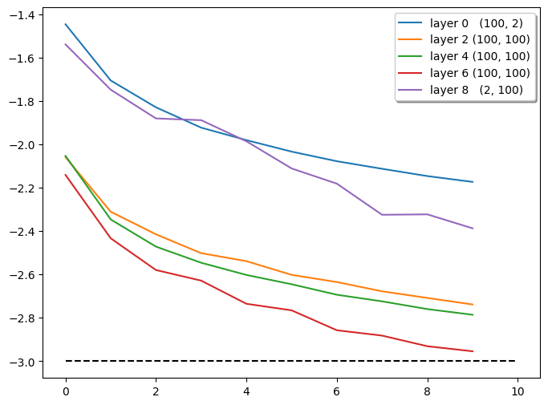

# 1. NLP基础与前沿实战：从线性回归到逻辑回归

## 1.1. 摘要

🚀 【从回归模型到智能革命】揭秘ChatGPT背后的数学基石

⭐️ 当全球为生成式AI狂欢时，你是否思考过：支撑大语言模型的底层逻辑，竟源自80年前的回归分析？本文以独特双重视角（机器学习vs统计学），带您穿越AI进化之路：

√ 揭秘Sigmoid函数的"逆袭"之路——从二战时的Probit生物检测，到ChatGPT激活函数的数学原理
√ 解密梯度下降黑魔法——Adam优化器如何成就百亿参数大模型
√ 深度拆解逻辑回归：二元分类的统计学解释，竟是BERT语义理解技术的雏形？
√ 过拟合解决方案"进化论"：正则化如何蜕变成大模型的Dropout与归一化层？
√ 手撕PyTorch反向传播代码：从线性回归到ResNet，复现完整的模型训练框架
√ 分布式训练深度实战：单机多卡与多机多卡配置，藏着GPT-4万亿参数训练的工程密码
√ 实战MNIST手写识别——用PyTorch Lightning重现Yann LeCun的初代CNN

🌸 当你在惊叹Deepseek的创造力时，是否意识到这不过是逻辑回归的迭代升级？从逻辑回归的起源，到PyTorch Lightning最新特性，本文全景呈现深度学习基础技术如何在AI革命中涅槃重生。

## 1.2. 目录

- [1. NLP基础与前沿实战：从线性回归到逻辑回归](#1-nlp基础与前沿实战从线性回归到逻辑回归)
  - [1.1. 摘要](#11-摘要)
  - [1.2. 目录](#12-目录)
  - [1.3. 线性回归理论基础](#13-线性回归理论基础)
    - [1.3.1. 线性回归的定义](#131-线性回归的定义)
    - [1.3.2. 机器学习视角下的线性回归](#132-机器学习视角下的线性回归)
    - [1.3.3. 统计学视角下的线性回归](#133-统计学视角下的线性回归)
    - [1.3.4. 过拟合的解决方法](#134-过拟合的解决方法)
      - [1.3.4.1. 机器学习视角](#1341-机器学习视角)
      - [1.3.4.2. 统计学视角](#1342-统计学视角)
  - [1.4. 逻辑回归理论基础](#14-逻辑回归理论基础)
    - [1.4.1. 二元分类问题中线性回归为何失效？](#141-二元分类问题中线性回归为何失效)
    - [1.4.2. 从线性到非线性](#142-从线性到非线性)
      - [1.4.2.1. 统计学视角](#1421-统计学视角)
        - [1.4.2.1.1. Probit回归](#14211-probit回归)
        - [1.4.2.1.2. 逻辑分布与sigmoid函数](#14212-逻辑分布与sigmoid函数)
        - [1.4.2.1.3. 从优势比到逻辑函数](#14213-从优势比到逻辑函数)
      - [1.4.2.2. 机器学习视角](#1422-机器学习视角)
    - [1.4.3. 预测结果](#143-预测结果)
    - [1.4.4. 评估指标](#144-评估指标)
      - [1.4.4.1. 混淆矩阵](#1441-混淆矩阵)
      - [1.4.4.2. ROC曲线与AUC](#1442-roc曲线与auc)
    - [1.4.5. 多元逻辑回归](#145-多元逻辑回归)
      - [1.4.5.1. Softmax函数的推导](#1451-softmax函数的推导)
        - [1.4.5.1.1. 直觉推理](#14511-直觉推理)
        - [1.4.5.1.2. 从Probit函数推导](#14512-从probit函数推导)
        - [1.4.5.1.3. 信息论视角](#14513-信息论视角)
  - [1.5. 梯度下降法理论基础](#15-梯度下降法理论基础)
    - [1.5.1. 算法优化](#151-算法优化)
      - [1.5.1.1. 随机梯度下降法](#1511-随机梯度下降法)
      - [1.5.1.2. 更好的优化器](#1512-更好的优化器)
        - [1.5.1.2.1. Momentum SGD](#15121-momentum-sgd)
        - [1.5.1.2.2. Adam](#15122-adam)
  - [1.6. 反向传播算法实现（autograd）](#16-反向传播算法实现autograd)
    - [1.6.1. 计算图](#161-计算图)
    - [1.6.2. 反向传播](#162-反向传播)
    - [1.6.3. 核心代码：线性回归](#163-核心代码线性回归)
  - [1.7. MLP](#17-mlp)
    - [1.7.1. Perceptron 代码实现](#171-perceptron-代码实现)
    - [1.7.2. 核心代码：逻辑回归](#172-核心代码逻辑回归)
  - [1.8. 训练优化](#18-训练优化)
    - [1.8.1. 不稳定的梯度](#181-不稳定的梯度)
    - [1.8.2. 激活函数过热的优化手段](#182-激活函数过热的优化手段)
      - [1.8.2.1. 监控指标](#1821-监控指标)
      - [1.8.2.2. 核心代码：监控指标可视化](#1822-核心代码监控指标可视化)
      - [1.8.2.3. 使用更好的激活函数：结果对比及分析](#1823-使用更好的激活函数结果对比及分析)
        - [1.8.2.3.1. 常见激活函数及优劣分析](#18231-常见激活函数及优劣分析)
      - [1.8.2.4. 使用归一化层：结果对比及分析](#1824-使用归一化层结果对比及分析)
    - [1.8.3. Dropout](#183-dropout)
  - [1.9. MNIST](#19-mnist)
    - [1.9.1. PyTorch 原生](#191-pytorch-原生)
      - [1.9.1.1. 训练框架](#1911-训练框架)
      - [1.9.1.2. 模型定义：MLP](#1912-模型定义mlp)
      - [1.9.1.3. 模型定义：CNN](#1913-模型定义cnn)
        - [1.9.1.3.1. 为什么残差连接有效？](#19131-为什么残差连接有效)
      - [1.9.1.4. 结果展示](#1914-结果展示)
      - [1.9.1.5. 分布式训练](#1915-分布式训练)
        - [1.9.1.5.1. 单机多卡](#19151-单机多卡)
        - [1.9.1.5.2. 多机多卡](#19152-多机多卡)
    - [1.9.2. PyTorch Lightning](#192-pytorch-lightning)
    - [1.9.3. TF 2.x](#193-tf-2x)
    - [1.9.4. Keras API](#194-keras-api)
      - [1.9.4.1. Keras vs. TensorFlow](#1941-keras-vs-tensorflow)

---

> 关于服务器部署和配置，可以参考[Docker+PyCharm远程调试&环境隔离解决方案](https://blog.csdn.net/IYXUAN/article/details/142362644)

(´∀｀)♡ 本文来源：[CSDN-Sylvan Ding](https://blog.csdn.net/IYXUAN)，版权归原作者所有，转载请注明出处。**如果您喜欢本文，欢迎点赞并收藏。**

---

## 1.3. 线性回归理论基础

### 1.3.1. 线性回归的定义

线性回归是一种用于建模因变量与一个或多个自变量之间线性关系的方法。它通过最小二乘法估计参数，目标是最小化预测值与实际值之间的平方误差和。

### 1.3.2. 机器学习视角下的线性回归

模型假设形式：

$$\hat{y}_{i}=ax_{i}+b$$

LAD（least absolute deviation）：

$$
L=\sum_i\left|y_i-\hat{y}_i\right|
$$

- 对异常值更稳定
- 但求解困难

OLS（ordinary least squares）：

$$
L=\sum_i\left(y_i-\hat{y}_i\right)^2
$$

- 数学基础更加扎实
- 求解简单

### 1.3.3. 统计学视角下的线性回归

x与y之间近似为线性关系，但变量y似乎又带有某种随机性。因此，站在统计学的角度出发，我们试图弄清楚变量y和x之间的数学关系。

  

于是假设

$$
y_i=a x_i+b+\varepsilon_i
$$

其中，$\varepsilon_i$ 表示随机误差项，服从正态分布，即

$$
\varepsilon_i \sim N(0, \sigma^2)
$$

且$\varepsilon_i$ 与$x_i$ 相互独立，$\varepsilon_i$ 之间相互独立。

根据正态分布（高斯分布）的概率密度函数，对于随机误差项 $\varepsilon_i \sim N(0, \sigma^2)$，其概率密度函数为：

$$
P(\varepsilon_i) = \frac{1}{\sqrt{2\pi\sigma^2}} \exp\left(-\frac{\varepsilon_i^2}{2\sigma^2}\right)
$$

由于 $y_i = ax_i + b + \varepsilon_i$，$a$、$b$、$x_i$ 是已知常数，所以 $\varepsilon_i = y_i - ax_i - b$，因此 $y_i$ 的条件概率密度函数为：

$$
P(y_i \mid a, b, x_i, \sigma^2) = \frac{1}{\sqrt{2\pi\sigma^2}} \exp\left(-\frac{(y_i - ax_i - b)^2}{2\sigma^2}\right)
$$

根据上述假设，由于y是随机变量，因此定义似然函数：

$$
L=P\left(Y \mid a, b, X, \sigma^2\right)
$$

由于$y_i$相互独立，所以

$$
L=\prod_{i=1}^n P\left(y_i \mid a, b, x_i, \sigma^2\right)
$$

目的是使似然函数$L$最大，即y的出现概率达到最大（maximum likelihood estimation，MLE）：

$$
(\hat{a},\hat {b})=\operatorname{argmax}_{a, b} L
$$

取对数：

$$
\ln L=\sum_{i=1}^n \ln P\left(y_i \mid a, b, x_i, \sigma^2\right)
$$

所以

$$
\ln L=-\frac{n}{2} \ln (2\pi\sigma^2)-\frac{1}{2\sigma^2}\sum_{i=1}^n (y_i - ax_i - b)^2
$$

因此可以得到

$$
(\hat{a},\hat {b})=\operatorname{argmin}_{a, b} \sum_{i=1}^n (y_i - ax_i - b)^2
$$

此时，优化公式和机器学习视角下的OLS优化公式一致。

### 1.3.4. 过拟合的解决方法

过拟合（Overfitting）是指模型在训练数据上表现很好，但在新数据上表现较差的现象。这通常发生在模型过于复杂，学习了训练数据中的噪声和随机波动，而不是数据的真实规律。

解决过拟合的常用方法：

1. 增加训练数据量
2. 使用正则化技术（如L1、L2正则化）
3. 简化模型结构
4. 使用交叉验证选择合适的模型复杂度
5. 早停法（Early Stopping）
6. 集成学习方法

#### 1.3.4.1. 机器学习视角

假设 $y=x+\varepsilon$ ，引入一个不相关的变量$z$，此时需要用$x$和$z$来预测$y$，那么假设的线性回归模型为

$$
y=ax+bz+c
$$

值得注意的是，真实情况下$b$和$c$都应当为0. 此时，损失函数定义为

$$
L=\sum_{i=1}^n (y_i - ax_i - bz_i - c)^2
$$

希望让不相关的变量$z$的系数$b$和$c$尽可能小，尽可能接近0，因此损失函数可以写为

$$
L=\frac{1}{2n}\sum_{i=1}^n (y_i - ax_i - bz_i - c)^2 + \lambda (|a|+|b|+|c|)）
$$

上述公式中的 $\frac{1}{2n}$ 是一个常见的缩放因子，它有几个作用：

1. **数值稳定性**：通过除以样本数量 $n$，可以使损失函数对样本数量不敏感，无论数据集大小如何，损失函数的数量级都保持相对稳定。

2. **梯度计算简化**：当对损失函数求导时，$\frac{1}{2}$ 系数可以消除平方项求导后产生的系数2，使梯度表达式更简洁。

3. **理论一致性**：在某些理论推导中，这种形式可以使损失函数与概率分布的负对数似然函数形式保持一致。

4. **优化效率**：适当的缩放可以使优化算法（如梯度下降）更容易收敛，避免梯度过大或过小的问题。

加入L1正则化项后，使得模型的复杂度降低，从而避免过拟合。此时，模型称为Lasso回归。

如果加入L2正则化项，则模型称为Ridge回归。

#### 1.3.4.2. 统计学视角

依旧延续上述假设，$y=ax+bz+c$，根据OLS regression results：

  

$P\gt |t|$列，表示$b$和$c$不显著，因此可以忽略。

## 1.4. 逻辑回归理论基础

### 1.4.1. 二元分类问题中线性回归为何失效？

在二元分类问题中，目标是预测样本属于某一类别的概率，输出值应当在0到1之间。然而，线性回归模型存在以下几个问题，使其不适合直接用于二分类任务：

1. **输出范围不受限制**：线性回归模型的输出是连续的实数值，范围是$(-\infty, +\infty)$，而不是概率值所需的$[0,1]$区间。
2. **不适合处理类别数据**：线性回归假设因变量是连续的，而分类问题中的因变量是离散的类别标签（如0和1）。
3. **误差项分布假设不合理**：在二分类问题中，因变量是二元的，其误差不可能服从线性回归假设的正态分布。

二分类问题中，误差项不可能服从线性回归假设的正态分布。线性回归假设误差项服从正态分布，即$\varepsilon_i \sim N(0, \sigma^2)$，$y_i = ax_i + b + \varepsilon_i$；而二分类问题中，因变量$y$只能取0或1两个值，如果使用线性回归模型，则误差项$\varepsilon_i = y_i - (ax_i + b)$只能取两种可能的值：$-ax_i-b$（当$y_i=0$时）或$1-ax_i-b$（当$y_i=1$时）。这种情况下，误差项显然不可能服从正态分布，而是呈现出离散的双峰分布，违背了线性回归的基本假设。按我的理解，线性回归模型中，$\varepsilon_i = y_i - (ax_i + b)$；而二分类问题中，$\varepsilon_{i,0} = - ax_i - b$，$\varepsilon_{i,1} = 1 - ax_i - b$，每个误差项均服从正态分布，两个正态分布的抽样叠加是双峰的，而非正态分布。

  

为了解决这些问题，逻辑回归引入了sigmoid函数（或logistic函数）将线性模型的输出映射到$(0,1)$区间，使其能够表示概率：

$$
P(Y=1|X) = \frac{1}{1+e^{-(\beta_0 + \beta_1 X_1 + \beta_2 X_2 + ... + \beta_p X_p)}} = \frac{1}{1+e^{-\beta^T X}}
$$

这样，逻辑回归模型就能够适当地处理二分类问题，输出有意义的概率值，并建立合理的决策边界。

sigmoid函数的导数为：

$$
\frac{d}{dx} \sigma(x) = \sigma(x) (1 - \sigma(x))
$$

### 1.4.2. 从线性到非线性

#### 1.4.2.1. 统计学视角

由于$y_i$服从伯努利分布，因此$y_i$的似然函数为：

$$
L= \prod_{i=1}^n P(y_i) =\prod_{i=1}^n P(y_i=1)^{y_i} P(y_i=0)^{1-y_i}=\prod_{i=1}^n P(y_i=1)^{y_i} (1-P(y_i=1))^{1-y_i}
$$

因此，接下来需要建模似然函数里的$P(y_i=1)$。

##### 1.4.2.1.1. Probit回归

我们希望通过latent variable来建模逻辑回归模型：

- 正效用：$y_i^*=\boldsymbol{X}_i \varphi+\theta_i$
- 负效用：$y_i^{\sim}=\boldsymbol{X}_i \omega+\tau_i$

其中，$\theta_i$和$\tau_i$是误差项，服从正态分布。$y_i^*$和$y_i^{\sim}$是latent variable，分别表示正效用和负效用。$y_i^*$和$y_i^{\sim}$相互竞争，当$y_i^*$大于$y_i^{\sim}$时，即$y_i^*-y_i^{\sim}>0$时，$y_i=1$，否则$y_i=0$。$y_i$可表示为：

$$
y_i = \begin{cases}
1 & \text{if } y_i^* > y_i^{\sim} \\
0 & \text{if } y_i^* \leq y_i^{\sim}
\end{cases}
$$

令$z_i=y_i^*-y_i^{\sim}=X_i \gamma+\varepsilon_i$，其中$\gamma=\varphi-\omega$，$\varepsilon_i$服从正态分布。则

$$
P(y_i=1)=P(z_i>0)=P(\varepsilon_i > -X_i \gamma)=1-P(\varepsilon_i \leq -X_i \gamma)
$$

  

##### 1.4.2.1.2. 逻辑分布与sigmoid函数

然而，计算$P(\varepsilon_i \leq -X_i \gamma)$时，需要计算标准正态分布的累积分布函数，即

$$
P(\varepsilon_i \leq -X_i \gamma) = \Phi(-X_i \gamma)=\frac{1}{\sqrt{2\pi}}\int_{-\infty}^{-X_i \gamma} e^{-\frac{t^2}{2}} dt
$$

$\Phi(x)$是标准正态分布的累积分布函数，没有解析解，只能通过数值方法计算，数学上难以推导。因此，我们希望找到一个函数，使得

$$
F(x) \approx \Phi(x)
$$

其中，$F(x)$是某种分布的累积分布函数。通常，使用逻辑分布的累积分布函数来近似标准正态分布的累积分布函数。

逻辑分布的概率密度函数为：

$$
f(x)=\frac{e^{-x}}{\left(1+e^{-x}\right)^2}
$$

逻辑分布的累积分布函数为：

$$
F(x) = \frac{1}{1+e^{-x}}
$$

  

此时，

$$
P(y_i=1)=1-P(\varepsilon_i \leq -X_i \gamma)=1-F(-X_i \gamma)=\frac{1}{1+e^{-X_i \gamma}}
$$

因此，逻辑回归模型就是线性回归模型加上了一层非线性变换。

为了通用性，我们引入指示函数：

$$
1_A(x)=\left\{\begin{array}{l}
1, & \text{if } x \in A \\
0, & \text{if } x \notin A
\end{array}\right.
$$

则似然函数可以表示为：

$$
L= \prod_{i=1}^n P(y_i=1)^{1_{y_i=1}} P(y_i=0)^{1_{y_i=0}}
$$

根据最大似估计法，模型参数的估计值为：

$$
\hat{\gamma}=\operatorname{argmax}_{\gamma} L = \operatorname{argmax}_{\gamma} \ln L
$$

$$
\ln L = \sum_{i=1}^n [1_{y_i=1} * \ln(p_i) + 1_{y_i=0} * \ln(1 - p_i)]
$$

其中，$p_i$ 表示 $P(y_i=1)$，$1_{y_i=1}$ 表示 $y_i=1$ 时取1，否则取0。

对于多分类问题，$y_i$ 可以取 $k$ 个值，则似然函数为：

$$
L= \prod_{i=1}^n P(y_i=1)^{1_{y_i=1}} P(y_i=2)^{1_{y_i=2}} \cdots P(y_i=k)^{1_{y_i=k}}
$$

则

$$
\ln L = \sum_{i=1}^n \sum_{j=1}^k [1_{y_i=j} * \ln(P(y_i=j))]
$$

那么

$$
\hat{\gamma} = \operatorname{argmin}_{\gamma} -\ln L_\gamma
$$

$\hat{\gamma}$是模型参数的估计值。

##### 1.4.2.1.3. 从优势比到逻辑函数

优势比（odds ratio）是一个在统计学中常用的概念，特别是在二分类问题中。它的引入是基于以下思考：

1. 在二分类问题中，我们关心事件发生的概率$P(y_i=1)$与不发生的概率$P(y_i=0)=1-P(y_i=1)$之间的关系。
2. 直接建模概率$P(y_i=1)$可能会导致预测值超出$[0,1]$范围，而优势比$\frac{P(y_i=1)}{1-P(y_i=1)}$的范围是$(0,+\infty)$，没有上界限制。
3. 进一步取对数后，对数优势比$\ln \frac{P(y_i=1)}{1-P(y_i=1)}$的范围变为$(-\infty,+\infty)$，这与线性预测器$X_i \gamma$的范围一致。

因此，我们可以自然地建立线性关系：

$$
\ln \frac{P(y_i=1)}{1-P(y_i=1)}=X_i \gamma
$$

这种转换使我们能够用线性模型来预测一个无界的量（对数优势比），然后通过逆变换得到概率值，避免了直接线性预测概率可能导致的范围问题。

这个对数优势比（log odds ratio）是线性的，现在我们反解这个方程，求出$P(y_i=1)$：

$$
P(y_i=1) = \frac{1}{1 + e^{-X_i \gamma}}
$$

这正是我们前面提到的逻辑分布的累积分布函数$F(x) = \frac{1}{1+e^{-x}}$，也称为sigmoid函数。

#### 1.4.2.2. 机器学习视角

在二分类问题中，我们可以从概率分布的角度来理解损失函数的推导。

对于样本 $i$，真实的概率分布可以表示为：

| $y$ | $P_{real}(y)$ |
|-----|--------------|
| 0   | $1-y_i=1_{y_i=0}$      |
| 1   | $y_i=1_{y_i=1}$        |

其中 $y_i$ 是样本的真实标签（0或1）。而模型预测的概率分布为：

| $y$ | $P_{pred}(y)$ |
|-----|--------------|
| 0   | $1-p_i$      |
| 1   | $p_i$        |

其中 $p_i = \frac{1}{1+e^{-X_i \gamma}}$ 是模型预测样本 $i$ 属于类别1的概率。

为了使模型分布逼近真实分布，我们可以最小化两个分布之间的KL散度：

$$
D_{KL}(P_{real} || P_{pred}) = \sum_{y \in \{0,1\}} P_{real}(y) \log \frac{P_{real}(y)}{P_{pred}(y)} \\
= \sum_{y \in \{0,1\}} P_{real}(y) \log P_{real}(y) - \sum_{y \in \{0,1\}} P_{real}(y) \log P_{pred}(y)
$$

第一项是真实分布的熵，对于给定的数据集是固定的，不依赖于模型参数。因此，最小化KL散度等价于最小化第二项：

$$
-\sum_{y \in \{0,1\}} P_{real}(y) \log P_{pred}(y)
$$

将真实分布和预测分布代入上式：

$$
\begin{align}
\sum_{y \in \{0,1\}} P_{real}(y) \log P_{pred}(y) &= 1_{y_i=1} \log p_i + 1_{y_i=0} \log (1-p_i) \\
&= y_i \log p_i + (1-y_i) \log (1-p_i)
\end{align}
$$

从优化角度看，我们希望模型在所有样本上的表现都尽可能好，因此需要最小化所有样本的总体损失。这样，对所有样本求和，得到二元交叉熵损失函数：

$$
L(\gamma) = -\sum_{i=1}^{n} [y_i \log p_i + (1-y_i) \log (1-p_i)]
$$

其中 $p_i = \frac{1}{1+e^{-X_i \gamma}}$。这就是逻辑回归中常用的交叉熵损失函数，它直接源于最小化预测分布与真实分布之间的KL散度。

交叉熵损失函数有几个重要特性：

1. 当预测概率接近真实标签时，损失值较小
2. 当预测概率远离真实标签时，损失值迅速增大
3. 它是凸函数，便于优化求解

显然，通用的交叉熵为

$$
L(\theta) = -\sum_{i=1}^{n} \sum_{j=1}^{k} 1_{y_{i}=j} \log p_{ij}
$$

其中，$y_{i}$是样本$i$的标签，$p_{ij}$是模型预测样本$i$属于第$j$个标签的概率。

### 1.4.3. 预测结果

逻辑回归的结果是$y=1$的概率，因此需要设置一个阈值$\alpha$，当$y=1$的概率大于阈值时，预测为1，否则预测为0。

$$
\hat{y}_i = \begin{cases}
1, & \text{if } p_i \geq \alpha \\
0, & \text{if } p_i < \alpha
\end{cases}
$$

通常，$\alpha=0.5$。

### 1.4.4. 评估指标

#### 1.4.4.1. 混淆矩阵

对于二分类问题，混淆矩阵是一个2×2的表格：

| | 预测为正类 | 预测为负类 |
|---|---|---|
| **实际为正类** | 真正例(TP) | 假负例(FN) |
| **实际为负类** | 假正例(FP) | 真负例(TN) |

行表示实际类别，列表示预测类别。对角线上的元素表示预测正确的样本数，非对角线上的元素表示预测错误的样本数。

基于混淆矩阵，可以计算多种评估指标：

1. **准确率(Accuracy)**：所有预测中正确的比例（对角线元素之和除以总样本数）
   $$\text{Accuracy} = \frac{TP + TN}{TP + TN + FP + FN}$$

2. **精确率(Precision)**：预测为正类中实际为正类的比例（第一格与第一列所有元素和的比值）
   $$\text{Precision} = \frac{TP}{TP + FP}$$

3. **召回率(Recall)**：实际为正类中预测为正类的比例（第一格与第一行所有元素和的比值）
   $$\text{Recall} = \frac{TP}{TP + FN}$$

4. **F1分数**：精确率和召回率的调和平均
   $$\text{F1} = \frac{2 \times \text{Precision} \times \text{Recall}}{\text{Precision} + \text{Recall}}$$

**F1分数为什么使用调和平均而非几何平均？**

$$H = \frac{n}{\frac{1}{x_1} + \frac{1}{x_2} + \cdots + \frac{1}{x_n}}$$

对于两个数 $a$ 和 $b$，调和平均简化为：

$$H = \frac{2}{\frac{1}{a} + \frac{1}{b}} = \frac{2ab}{a+b}$$

1. **对极端值更敏感**：调和平均对较小值更敏感。在分类问题中，如果精确率或召回率有一个接近0，那么F1分数也会接近0，这反映了分类器的性能确实很差。而几何平均对此不够敏感。

2. **平衡性能考量**：F1分数强制要求分类器在精确率和召回率上都表现良好。如果一个指标很高而另一个很低，F1分数会偏向较低的那个值，鼓励模型在两个指标上都有好的表现。

3. **实际应用意义**：在许多实际应用中，我们希望分类器在精确率和召回率之间取得平衡，而不是一个指标极高、另一个极低。调和平均能更好地反映这种需求。

F1 score 综合了精确率和召回率，而不同场景下对二者重视程度不同，因此定义Fbeta score：

$$F_\beta = \frac{(1+\beta^2) \times \text{Precision} \times \text{Recall}}{\beta^2 \times \text{Precision} + \text{Recall}}$$

其中，$0<\beta<1$时，Fbeta score 更重视精确率，$\beta>1$时，Fbeta score 更重视召回率。

#### 1.4.4.2. ROC曲线与AUC

F1 score平衡了precision和recall，而precision和recall覆盖了混淆矩阵中的TP、FP、FN，但并没有设计到混淆矩阵中的TN。特别的，对多分类问题，F1 score 无法计算。

因此，引入ROC曲线与AUC。

ROC曲线以假阳性率（False Positive Rate, FPR）为横坐标，真阳性率（True Positive Rate, TPR）为纵坐标。

- $$FPR = \frac{FP}{FP + TN}$$
- $$TPR = \frac{TP}{TP + FN}$$

TPR表示正类中被正确分类的比例，FPR表示负类中被错误分类的比例。我们希望TPR越大越好，FPR越小越好。因此，ROC曲线越靠近左上角，分类器性能越好。

**ROC曲线上的点不可能落在对角线下方**

ROC曲线上的点不可能落在对角线下方，这是由ROC曲线的构建方式和分类器的基本性质决定的：

1. **随机猜测的基准**：对角线（也称为"机会线"）代表了随机猜测分类器的性能。在随机猜测的情况下（每个样本被预测为正类的概率都是 $p$，预测为负类的概率都是 $1-p$），此时TPR = FPR。

2. **阈值调整机制**：ROC曲线是通过调整分类器的决策阈值生成的。对于任何给定的分类器，如果其某个阈值设置导致性能低于随机猜测（即点落在对角线下方），我们总可以通过简单地反转该分类器的决策（将所有预测为正类的改为负类，反之亦然）来获得一个点，该点会关于对角线对称地落在对角线上方。

3. **数学证明**：假设有一个分类器在某个阈值下的性能点为(FPR, TPR)，且该点落在对角线下方，即TPR < FPR。如果我们反转该分类器的所有决策，新的TPR' = 1 - FPR，FPR' = 1 - TPR。由于TPR < FPR，所以1 - FPR < 1 - TPR，即TPR' > FPR'，这意味着新点(FPR', TPR')会落在对角线上方。

在二分类问题中，分类器通常输出一个概率值或分数，表示样本属于正类的可能性。设定一个阈值$\alpha$来决定最终的分类结果：

1. **α降低（更宽松的正类判定）**：
   - 更多样本被预测为正类
   - TP增加，但FP也增加
   - TPR增加，FPR也增加
   - ROC曲线上的点向右上方移动

2. **α提高（更严格的正类判定）**：
   - 更少样本被预测为正类
   - TP减少，但FP也减少
   - TPR减少，FPR也减少
   - ROC曲线上的点向左下方移动

3. **极端情况**：
   - 当$\alpha$非常低时（接近0），几乎所有样本都被预测为正类，此时TPR≈1，FPR≈1，对应ROC曲线右上角的点(1,1)
   - 当$\alpha$非常高时（接近1），几乎所有样本都被预测为负类，此时TPR≈0，FPR≈0，对应ROC曲线左下角的点(0,0)

通过不断调整阈值$\alpha$并计算对应的TPR和FPR，可以绘制出完整的ROC曲线。

### 1.4.5. 多元逻辑回归

建模多元分类问题的损失函数为

$$
L(\theta) = -\sum_{i=1}^{n} \sum_{j=1}^{k} 1_{y_{i}=j} \log p_{ij}
$$

关键是建模$p_{ij}=P_\theta(y_i=j)$，即模型预测的样本$i$属于第$j$个类别的概率。

在解决二分类问题时，使用sigmoid函数建模$p_{i1}=P_\theta(y_i=1)$，即模型预测的样本$i$属于正类的概率。

在解决多元分类问题时，使用softmax函数建模$p_{ij}=P_\theta(y_i=j)$：

$$
p_{ij} = \frac{e^{\theta_j^T x_i}}{\sum_{l=1}^{k} e^{\theta_l^T x_i}}
$$

#### 1.4.5.1. Softmax函数的推导

##### 1.4.5.1.1. 直觉推理

在二元逻辑回归中，使用sigmoid函数将线性模型的输出映射到(0,1)区间：

$$
P(y=1|x) = \frac{1}{1+e^{-\theta^T x}}
$$

对于多分类问题，需要一个函数将多个实数值映射为一个概率分布，使得所有类别的概率和为1。自然的扩展思路是：

1. 对每个类别j，计算一个得分$z_j = \theta_j^T x$
2. 将这些得分转换为非负数：$e^{z_j}$（指数函数确保结果为正）
3. 归一化这些值，使它们的和为1：$\frac{e^{z_j}}{\sum_{l=1}^{k} e^{z_l}}$

这就得到了softmax函数：

$$
p_j = \frac{e^{\theta_j^T x}}{\sum_{l=1}^{k} e^{\theta_l^T x}}
$$

##### 1.4.5.1.2. 从Probit函数推导

在多分类问题中，可以从Probit模型的思想扩展到Softmax函数的推导。类似于二分类问题中的Probit回归，可以通过latent variables的框架来理解多分类问题。

假设对于每个样本$i$和每个类别$j$，存在一个潜在效用（latent utility）$u_{ij} = \theta_j^T x_i + \varepsilon_{ij}$，其中$\varepsilon_{ij}$是随机误差项。样本$i$被分类为类别$j$当且仅当$u_{ij}$是所有潜在效用中的最大值：

$$
y_i = j \iff u_{ij} > u_{il}, \forall l \neq j
$$

当我们假设误差项$\varepsilon_{ij}$独立同分布且服从Gumbel分布（一种极值分布）时，可以证明类别$j$的概率为：

$$
P(y_i = j) = P(u_{ij} > u_{il}, \forall l \neq j) = \frac{e^{\theta_j^T x_i}}{\sum_{l=1}^{k} e^{\theta_l^T x_i}}
$$

##### 1.4.5.1.3. 信息论视角

从信息论角度看，Softmax函数可以被视为在满足特定约束条件下，最大化熵的概率分布。最大熵原理指出，在所有可能的概率分布中，我们应该选择熵最大的分布，因为它代表了最少的先验信息和最大的不确定性，从而避免了主观假设。

在多分类问题中，我们希望找到一个概率分布 $p(y|x)$，表示给定输入 $x$ 时，输出为类别 $y$ 的概率。我们通常有一些关于这个概率分布的期望特征的约束。如果没有约束条件，最大熵原理会告诉我们，在所有可能的概率分布中，熵最大的分布是均匀分布。  但在分类问题中，均匀分布显然不是我们想要的，因为它意味着模型对所有类别都给予相同的概率，而没有利用任何关于输入特征 $x$ 和输出类别 $y$ 之间关系的信息。

约束条件的作用在于引入对问题的一些先验知识或期望。例如，我们可能通过训练数据估计得到了一些关于特征函数 $f_j(x, y)$ 的经验期望值，记为 $E_j$。这里的 $E_j$ 代表的是通过训练数据计算得到的特征函数 $f_j(x, y)$ 的经验平均值。 这些期望值反映了数据中的一些模式或规律。  通过施加约束，要求模型的期望特征值与这些经验期望值相匹配，我们可以引导最大熵分布更加符合实际数据，从而学习到输入和输出之间的有效关系，得到更有意义的概率预测。

假设我们有一些特征函数 $f_j(x, y)$，例如，它可以是指示函数，当类别 $y$ 为 $j$ 时，$f_j(x, y) = 1$，否则为 0。我们通过训练数据，对这些特征的期望值有了一定的了解，并将其作为约束条件，希望模型的期望特征值与这些通过数据学习到的预期的值 $E_j$ 相匹配。 假设我们有 $m$ 个特征函数 $f_1, f_2, ..., f_m$，并且我们希望模型的期望特征值与某些预期的值 $E_j$ 相匹配：

$$
E_{p(y|x)}[f_j(x, y)] = \sum_{y} p(y|x) f_j(x, y) = E_j, \quad j = 1, 2, ..., m
$$

我们的目标是在满足这些约束条件的同时，最大化条件熵 $H(Y|X)$：

$$
H(Y|X) = - \sum_{x} p(x) \sum_{y} p(y|x) \log p(y|x)
$$

为了简化问题，我们通常最大化给定单个输入 $x$ 的条件熵 $- \sum_{y} p(y|x) \log p(y|x)$，并确保概率分布满足归一化条件 $\sum_{y} p(y|x) = 1$ 和特征期望约束 $\sum_{y} p(y|x) f_j(x, y) = E_j$。

使用拉格朗日乘子法来解决这个约束优化问题。定义拉格朗日函数：

$$
L(p, \lambda_0, \lambda_1, ..., \lambda_m) = - \sum_{y} p(y|x) \log p(y|x) + \lambda_0 \left( \sum_{y} p(y|x) - 1 \right) + \sum_{j=1}^{m} \lambda_j \left( \sum_{y} p(y|x) f_j(x, y) - E_j \right)
$$

其中 $\lambda_0, \lambda_1, ..., \lambda_m$ 是拉格朗日乘子。为了找到最大熵分布，我们需要对 $p(y|x)$ 求偏导并令其为零：

$$
\frac{\partial L}{\partial p(y|x)} = - (\log p(y|x) + 1) + \lambda_0 + \sum_{j=1}^{m} \lambda_j f_j(x, y) = 0
$$

解这个方程得到最大熵分布的形式为：

$$
p(y|x) = \frac{1}{Z(x)} \exp \left( \sum_{j=1}^{m} \lambda_j f_j(x, y) \right) = \frac{\exp \left( \sum_{j=1}^{m} \lambda_j f_j(x, y) \right)}{\sum_{y'} \exp \left( \sum_{j=1}^{m} \lambda_j f_j(x, y') \right)}
$$

在多分类问题中，一个常见的特征函数选择是 $f_j(x, y) = \theta_j^T x \cdot \mathbb{I}(y=j)$，其中 $\mathbb{I}(y=j)$ 是指示函数，当 $y=j$ 时为 1，否则为 0。在这种情况下，$\sum_{j=1}^{m} \lambda_j f_j(x, y)$ 可以简化为 $\lambda_y \theta_y^T x$。更简单地，如果我们直接令特征函数为 $f_j(x, y) = \theta_j^T x$ 当 $y=j$ 时，且只考虑类别 $y$ 相关的特征，我们可以设 $\sum_{j=1}^{m} \lambda_j f_j(x, y) = \theta_y^T x$。

那么，最大熵分布就变成了 Softmax 函数的形式：

$$
p(y=j|x) = \frac{\exp(\theta_j^T x)}{\sum_{l=1}^{k} \exp(\theta_l^T x)}
$$

其中，$\theta_j^T x$ 可以看作是类别 $j$ 的得分，拉格朗日乘子 $\lambda_j$ 在这里被吸收到了参数 $\theta_j$ 中。

## 1.5. 梯度下降法理论基础

以线性回归为例，模型损失为

$$
L(\theta) = \frac{1}{2n} \sum_{i=1}^{n} (y_i - \theta^T x_i)^2
$$

梯度下降法通过迭代更新参数 $\theta$ 来最小化损失函数 $L(\theta)$。具体来说，梯度下降法在每一步迭代中，根据损失函数对参数的偏导数（梯度）来更新参数，使得损失函数逐渐减小。

梯度下降法的一般形式为：

$$
\theta^{(t+1)} = \theta^{(t)} - \eta \nabla L(\theta^{(t)})
$$

将 $L(\theta)$ 在 $\theta^{(t)}$ 处进行一阶泰勒展开：

$$
L(\theta) \approx L(\theta^{(t)}) + \nabla L(\theta^{(t)})^T (\theta - \theta^{(t)})
$$

令 $\theta = \theta^{(t+1)} = \theta^{(t)} - \eta \nabla L(\theta^{(t)})$，其中 $\eta > 0$ 为学习率。则：

$$
L(\theta^{(t+1)}) \approx L(\theta^{(t)}) + \nabla L(\theta^{(t)})^T (\theta^{(t)} - \eta \nabla L(\theta^{(t)}) - \theta^{(t)})
$$

$$
L(\theta^{(t+1)}) \approx L(\theta^{(t)}) - \eta ||\nabla L(\theta^{(t)})||^2
$$

因此，$L(\theta^{(t+1)}) \approx L(\theta^{(t)}) - \eta ||\nabla L(\theta^{(t)})||^2 < L(\theta^{(t)})$。

这表明，当学习率 $\eta$ 足够小时，沿着负梯度方向更新参数 $\theta$ 可以使损失函数 $L(\theta)$ 减小。

### 1.5.1. 算法优化

然而，梯度下降法在每次迭代时需要计算整个训练集上的梯度，当训练集非常大时，计算量会非常巨大，导致训练速度非常慢。此外，梯度下降法容易收敛到局部最小值，尤其是在损失函数曲面复杂的情况下。

#### 1.5.1.1. 随机梯度下降法

为了解决梯度下降法的局限性，随机梯度下降法被提出。与梯度下降法不同，随机梯度下降法在每次迭代时，只随机选择一个样本或少量样本（mini-batch）来计算梯度并更新参数。这样做大大减少了每次迭代的计算量，加快了训练速度，尤其是在处理大规模数据集时更为有效。

由于每次迭代只使用一个或少量样本来估计梯度，随机梯度下降法的梯度估计是有噪声的，迭代路径会更加曲折。但从期望上讲，随机梯度下降法仍然沿着全局最优方向前进。并且，这种噪声也有助于跳出局部最小值，从而可能找到更好的全局最优解。

#### 1.5.1.2. 更好的优化器

##### 1.5.1.2.1. Momentum SGD

动量随机梯度下降法（Momentum SGD）通过引入momentum来加速梯度下降过程，并减缓震荡。

Momentum SGD 在每次迭代时，不仅考虑当前批次的梯度，还考虑之前的梯度累积的动量。更新规则如下：

$$
\begin{aligned}
v^{(t+1)} &= \mu v^{(t)} - \eta \nabla L(\theta^{(t)}) \\
\theta^{(t+1)} &= \theta^{(t)} + v^{(t+1)}
\end{aligned}
$$

其中，$v^{(t)}$ 是第 $t$ 次迭代时的动量，$v^{(0)} = 0$，$\mu$ 是动量衰减系数，通常取值在 0 到 1 之间（例如 0.9），$\eta$ 是学习率。

##### 1.5.1.2.2. Adam

自适应矩估计（Adaptive Moment Estimation, Adam）结合 Momentum SGD 和 RMSprop 的思想。Adam 不仅使用动量来加速梯度下降，还自适应地调整每个参数的学习率。

Adam 维护每个参数的两个动量估计：

1. **一阶矩估计 (First moment estimation)**：类似于 Momentum SGD 中的动量，用于估计梯度的均值。
2. **二阶矩估计 (Second moment estimation)**：用于估计梯度的方差。

Adam 的更新规则如下：

$$
\begin{aligned}
m^{(t+1)} &= \beta_1 m^{(t)} - (1 - \beta_1) \nabla L(\theta^{(t)}) \\
v^{(t+1)} &= \beta_2 v^{(t)} - (1 - \beta_2) (\nabla L(\theta^{(t)}) )^2 \\
\hat{m}^{(t+1)} &= \frac{m^{(t+1)}}{1 - \beta_1^{t+1}} \\
\hat{v}^{(t+1)} &= \frac{v^{(t+1)}}{1 - \beta_2^{t+1}} \\
\theta^{(t+1)} &= \theta^{(t)} - \eta \frac{\hat{m}^{(t+1)}}{\sqrt{\hat{v}^{(t+1)}} + \epsilon}
\end{aligned}
$$

其中，$m^{(t)}$ 和 $v^{(t)}$ 分别是一阶矩估计和二阶矩估计，$\beta_1$ 和 $\beta_2$ 是衰减系数，通常取值接近 1（例如 $\beta_1 = 0.9, \beta_2 = 0.999$），$\eta$ 是全局学习率，$\epsilon$ 是一个很小的数（例如 $10^{-8}$）用于防止分母为零。$\hat{m}^{(t+1)}$ 和 $\hat{v}^{(t+1)}$ 是偏差校正后的矩估计，用于修正初期矩估计的偏差。

Adam之所以能够自适应学习率，核心在于其**二阶矩估计** $\hat{v}^{(t+1)}$。

二阶矩估计 $\hat{v}^{(t+1)}$ 反映了梯度平方的均值，可以近似看作是梯度在迭代过程中的方差。**使用梯度平方的均值而不是直接使用梯度，是因为它可以更好地反映梯度变化的幅度。如果某个参数的梯度在迭代过程中持续很大，意味着该参数方向可能震荡，或者学习率过大，此时二阶矩估计也会很大，Adam会自适应地降低该参数的学习率，使其更新幅度减小，从而抑制震荡。** 相反，**如果某个参数的梯度在迭代过程中很小，意味着该参数可能位于平坦区域，或者学习率过小，此时二阶矩估计也会很小，Adam会自适应地增大该参数的学习率，使其更新幅度增大，从而加速收敛。** 相比于只使用梯度本身，使用梯度平方的均值能够更有效地进行学习率的自适应调整。

这种自适应学习率的机制使得Adam能够：

1. **快速收敛**：对于梯度较大的参数，降低学习率可以避免震荡，更快地收敛到最优解。
2. **跳出局部最小值**：对于梯度较小的参数，增大学习率可以帮助模型跳出平坦区域或局部最小值。
3. **更好地适应不同参数**：不同参数可能需要不同的学习率，Adam的自适应学习率机制可以自动地为每个参数调整合适的学习率，无需手动调整全局学习率。

## 1.6. 反向传播算法实现（autograd）

- 目的：计算梯度和更新参数。

### 1.6.1. 计算图

计算图是表示计算过程的有向无环图（DAG）+ 基本运算：

- 节点：变量 or 计算
- 有向边：计算关系
- 基本运算：四则运算、sigmoid、relu等

### 1.6.2. 反向传播

反向传播是计算图的逆向传播，从输出层开始，根据链式法则，逐层计算梯度，并更新参数。

静态局部偏导和动态全局偏导：

- 局部偏导
  - 该节点对前续节点的偏导
  - 在Scalar里用grad_wrt表示（wrt for with respect to）
- 全局偏导
  - 计算图顶点对该节点的偏导数，是前续所有可能路径的偏导数之和
  - 在Scalar里用grad表示

节点遍历顺序：

由于计算图是有向无环图，所以可以采用拓扑排序来遍历所有节点。计算每个节点的梯度时，需要先计算所有前继节点的梯度。根据链式法则，节点梯度等于所有前继节点梯度乘以其局部梯度，不同路径的梯度相加累计。

  

### 1.6.3. 核心代码：线性回归

```python
"""
手动实现scalar类（简单的计算图节点）和反向传播算法，以及相应的可视化工具
"""
import math


class Scalar:

    def __init__(self, value, prevs=[], op=None, label="", requires_grad=True):
        self.value = value
        self.prevs = prevs
        self.op = op
        self.label = label
        self.requires_grad = requires_grad

        # 节点的全局偏导数
        self.grad = 0.0
        # 节点的局部偏导数（前续节点的偏导数）
        self.grad_wrt = {}
        # 作图需要，实际上对计算没有作用
        self.back_prop = {}

    def __repr__(self):
        return f"Scalar(value={self.value:.2f}, grad={self.grad:.2f}, label={self.label}), op={self.op}"

    def __add__(self, other):
        if not isinstance(other, Scalar):
            other = Scalar(other, requires_grad=False)
        out = Scalar(self.value + other.value, [self, other], "+")
        out.requires_grad = self.requires_grad or other.requires_grad
        out.grad_wrt = {self: 1, other: 1}
        return out

    def __sub__(self, other):
        if not isinstance(other, Scalar):
            other = Scalar(other, requires_grad=False)
        out = Scalar(self.value - other.value, [self, other], "-")
        out.requires_grad = self.requires_grad or other.requires_grad
        out.grad_wrt = {self: 1, other: -1}
        return out

    def __mul__(self, other):
        if not isinstance(other, Scalar):
            other = Scalar(other, requires_grad=False)
        out = Scalar(self.value * other.value, [self, other], "*")
        out.requires_grad = self.requires_grad or other.requires_grad
        out.grad_wrt = {self: other.value, other: self.value}
        return out

    def __pow__(self, other):
        """
        只考虑对底数求导，而指数被限制为常数，常数求导为0，且常数无需进行反向传播。
        """
        assert isinstance(other, (int, float)), "only support int or float"
        out = Scalar(self.value**other, [self], f"**{other}")
        out.requires_grad = self.requires_grad
        out.grad_wrt = {self: other * self.value ** (other - 1)}
        return out

    def __rsub__(self, other):
        if not isinstance(other, Scalar):
            other = Scalar(other, requires_grad=False)
        out = Scalar(other.value - self.value, [other, self], "-")
        out.requires_grad = other.requires_grad or self.requires_grad
        out.grad_wrt = {other: 1, self: -1}
        return out

    def __radd__(self, other):
        return self.__add__(other)

    def __rmul__(self, other):
        return self.__mul__(other)

    def sigmoid(self):
        s = 1 / (1 + math.exp(-self.value))
        out = Scalar(s, [self], "sigmoid")
        out.requires_grad = self.requires_grad
        out.grad_wrt = {self: s * (1 - s)}
        return out

    def backward(self, fn=None):
        """
        反向传播，计算梯度。
        由当前节点出发，求解以当前节点为顶点的计算图中每个节点的偏导数。
        fn：画图函数。
        """

        def _topo_sort(node):
            def _dfs(node):
                if node not in visited:
                    visited.add(node)
                    for prev in node.prevs:
                        _dfs(prev)
                    order.append(node)

            order, visited = [], set()
            _dfs(node)
            return order

        def _compute_grad_wrt(node, cg_grad):
            # 作图需要，对计算无用
            node.back_prop = {}
            # 存储节点的梯度累计（可能来自多次反向传播，批量训练的基础）
            node.grad += cg_grad[node]
            for prev in node.prevs:
                grad_spread = cg_grad[node] * node.grad_wrt[prev]
                cg_grad[prev] = cg_grad.get(prev, 0.0) + grad_spread
                node.back_prop[prev] = node.back_prop.get(prev, 0.0) + grad_spread

        order = _topo_sort(self)
        re = []
        # 保存当前计算图中节点的梯度累计
        # 由于是反向传播算法起点，故 ∂self/∂self = 1
        # 其余节点的梯度初始化为 0
        # cg_grad 只跟踪当前这一次反向传播的梯度值
        cg_grad = {self: 1}
        for node in reversed(order):
            _compute_grad_wrt(node, cg_grad)
            if fn:
                re.append(fn(self, "backward"))
        return re

"""
线性回归模型
"""
def mse(errors):
    n = len(errors)
    wrt = {}
    value = 0.0
    requires_grad = False
    for item in errors:
        value += item.value**2 / n
        wrt[item] = 2 * item.value / n
        requires_grad = requires_grad or item.requires_grad
    out = Scalar(value, errors, "mse", requires_grad=requires_grad)
    out.grad_wrt = wrt
    return out


class Linear:

    def __init__(self):
        self.a = Scalar(0.0, label="a")
        self.b = Scalar(0.0, label="b")

    def forward(self, x):
        return self.a * x + self.b

    def error(self, x, y):
        return y - self.forward(x)

    def string(self):
        return f"y={self.a.value:.2f}x+{self.b.value:.2f}"

    def parameters(self):
        return [self.a, self.b]

    def __call__(self, x):
        return self.forward(x)
```

```python
# autograd
a = Scalar(1.0, label="a")
b = Scalar(2.0, label="b")
c = a + b
c.backward()
draw_graph(c, "backward")
```

  

```python
a = Scalar(1.0, label='a')
b = Scalar(2.0, label='b')
c = Scalar(4.0, label='c')
d = a + b
e = a * c
f = d * e
backward_process = f.backward(draw_graph)
draw_graph(f, 'backward')
```

  

```python
# gradient descent
import numpy as np


x = np.arange(0, 10, 0.1)
x = (x-x.mean())/x.std()
eps = np.random.randn(len(x))/10
y = 2*x + 3 + eps
# batch_size 为一次参数更新用到的样本数量
# 借助 GPU 并行计算优势，加快训练速度，但需要较大显存
batch_size = 20
# 设置梯度累计次数
# 实际每次使用小批次 micro_size 个样本构建计算图，并行计算梯度
# 通过小批次模拟更大的 batch_size
# 相当于用 batch_size = 20 的效果进行训练，但每次只占用 micro_size = 5 的显存
gradient_accumulation_iter = 4
micro_size = int(batch_size/gradient_accumulation_iter)
lr = 0.1
model = Linear()

for t in range(30*gradient_accumulation_iter):
    # 前向传播
    ix = (t*micro_size) % len(x)
    xx = x[ix:ix+micro_size]
    yy = y[ix:ix+micro_size]
    loss = mse([model.error(x_input, y_gt) for x_input, y_gt in zip(xx, yy)])
    loss *= 1/gradient_accumulation_iter
    # 反向传播
    loss.backward()
    # 更新参数
    if (t+1) % gradient_accumulation_iter == 0:
        for param in model.parameters():
            param.value -= lr*param.grad
            # 梯度清空
            param.grad = .0
        print(f'Step {t+1}, Result: {model.string()}')
```

```
Step 4, Result: y=-0.05x+0.05
Step 8, Result: y=-0.24x+0.35
Step 12, Result: y=-0.22x+0.89
Step 16, Result: y=0.30x+1.62
Step 20, Result: y=1.34x+2.36
Step 24, Result: y=1.42x+2.31
Step 28, Result: y=1.39x+2.36
Step 32, Result: y=1.39x+2.50
Step 36, Result: y=1.52x+2.68
Step 40, Result: y=1.79x+2.87
Step 44, Result: y=1.84x+2.84
Step 48, Result: y=1.83x+2.84
Step 52, Result: y=1.84x+2.88
Step 56, Result: y=1.87x+2.93
Step 60, Result: y=1.93x+2.97
Step 64, Result: y=1.95x+2.96
Step 68, Result: y=1.95x+2.96
Step 72, Result: y=1.95x+2.97
Step 76, Result: y=1.96x+2.98
Step 80, Result: y=1.97x+2.99
Step 84, Result: y=1.98x+2.99
Step 88, Result: y=1.98x+2.98
Step 92, Result: y=1.98x+3.00
Step 96, Result: y=1.99x+3.00
Step 100, Result: y=1.99x+3.00
...
Step 108, Result: y=1.99x+2.99
Step 112, Result: y=1.99x+3.00
Step 116, Result: y=1.99x+3.00
Step 120, Result: y=1.99x+3.00
```

## 1.7. MLP

  

### 1.7.1. Perceptron 代码实现

```python
"""
实现 MLP 各组件，如线性层、激活函数、Sequential 等。
"""

import torch
from sklearn.datasets import make_circles
from torch.utils.data import TensorDataset, DataLoader


class Linear:
    def __init__(self, in_features, out_features, bias=True):
        self.in_features = in_features
        self.out_features = out_features
        self.bias = bias
        self.weight = torch.randn(in_features, out_features)
        self.bias = torch.randn(out_features) if bias else None

    def __call__(self, x):
        self.out = x @ self.weight
        if self.bias is not None:
            self.out += self.bias
        return self.out

    def parameters(self):
        if self.bias is not None:
            return [self.weight, self.bias]
        else:
            return [self.weight]

    def zero_grad(self):
        for param in self.parameters():
            param.grad = None


class Sigmoid:
    def __call__(self, x):
        self.out = 1 / (1 + torch.exp(-x))
        return self.out

    def parameters(self):
        return []

    def zero_grad(self):
        pass


class Sequential:
    def __init__(self, *modules):
        self.modules = modules

    def __call__(self, x):
        for module in self.modules:
            x = module(x)
        self.out = x
        return self.out

    def parameters(self):
        return [param for module in self.modules for param in module.parameters()]

    def zero_grad(self):
        for module in self.modules:
            module.zero_grad()


def cross_entropy(y_pred, y_true):
    '''
    模拟 torch.nn.functional.cross_entropy
    '''
    # Softmax
    y_pred = torch.exp(y_pred) / torch.sum(torch.exp(y_pred), dim=1, keepdim=True)
    # One-hot encoding
    y_one_hot = torch.zeros_like(y_pred)
    y_one_hot.scatter_(1, y_true.long(), 1)
    # NLLLoss
    return -torch.sum(y_one_hot * torch.log(y_pred))


def accuracy(y_pred, y_true):
    y_pred = torch.argmax(y_pred, dim=1, keepdim=True)
    return torch.sum(y_pred == y_true).item() / len(y_true)
```

### 1.7.2. 核心代码：逻辑回归

```python
# 生成训练数据
X, y = make_circles(n_samples=1000, noise=0.1, factor=0.5, random_state=42)

# 可视化数据
plt.scatter(X[:, 0], X[:, 1], c=y, cmap=plt.cm.RdYlBu)
plt.show()
```


```python
if __name__ == "__main__":
    # 生成训练数据
    X, y = make_circles(n_samples=1000, noise=0.1, factor=0.5, random_state=42)
    X = (X - X.mean(axis=0)) / X.std(axis=0)
    X, y = (
        torch.tensor(X, dtype=torch.float32),
        torch.tensor(y, dtype=torch.float32).unsqueeze(1),
    )

    # 定义多层感知机
    model = Sequential(
        Linear(2, 4),
        Sigmoid(),
        Linear(4, 8),
        Sigmoid(),
        Linear(8, 4),
        Sigmoid(),
        Linear(4, 2),  # Softmax -> NLLLoss（交叉熵在二分类时退化为二元交叉熵）
    )
    for param in model.parameters():
        param.requires_grad = True

    max_epochs = 1000
    batch_size = 100
    learning_rate = 0.1
    print_interval = 100
    dataset = TensorDataset(X, y)
    dataloader = DataLoader(dataset=dataset, batch_size=batch_size, shuffle=True)

    for epoch in range(max_epochs):
        loss_avg = 0.0
        for batch_idx, (X_batch, y_batch) in enumerate(dataloader):
            y_pred = model(X_batch)
            loss = cross_entropy(y_pred, y_batch)
            loss = loss / len(X_batch)
            loss_avg += loss.item()
            model.zero_grad()
            loss.backward()
            for param in model.parameters():
                param.data -= learning_rate * param.grad
        if epoch % print_interval == 0:
            with torch.no_grad():
                loss_avg /= len(dataloader)
                acc = accuracy(model(X), y)
                print(f"Epoch {epoch}, Loss: {loss_avg*1e3:.2f}, Acc: {acc*1e2:.2f}%")
```

```
Epoch 0, Loss: 671.93, Acc: 60.40%
Epoch 100, Loss: 492.43, Acc: 81.00%
Epoch 200, Loss: 90.56, Acc: 98.50%
Epoch 300, Loss: 47.95, Acc: 98.90%
Epoch 400, Loss: 34.19, Acc: 99.40%
Epoch 500, Loss: 27.20, Acc: 99.30%
Epoch 600, Loss: 22.38, Acc: 99.50%
Epoch 700, Loss: 20.30, Acc: 99.50%
Epoch 800, Loss: 18.45, Acc: 99.60%
Epoch 900, Loss: 16.00, Acc: 99.70%
```

## 1.8. 训练优化

观察逻辑回归示例（pytorch 实现）：

```python
import torch as th
import torch.nn as nn
import torch.nn.functional as F
from torch.nn import Linear, Sigmoid, Tanh, Sequential
from torch.optim.sgd import SGD
from torch.utils.data import TensorDataset, DataLoader

import numpy as np
from sklearn.datasets import make_moons
from sklearn.preprocessing import StandardScaler

import math
import matplotlib.pyplot as plt


np.random.seed(1024)
X, y = make_moons(n_samples=1000, noise=0.1)
scaler = StandardScaler()
X = scaler.fit_transform(X)
X.shape, y.shape, X.mean(), X.var()
```

```
((1000, 2),
 (1000,),
 np.float64(-2.673417043297377e-16),
 np.float64(1.0000000000000002))
```

```python
batch_size = 1000
torch.manual_seed(1024)
X, y = th.tensor(X, dtype=th.float32), th.tensor(y, dtype=th.int64)
dataset = TensorDataset(X, y.unsqueeze(1))
dataloader = DataLoader(dataset, batch_size=batch_size, shuffle=False)
n_hidden = 100  # 为了得到统计规律，将网络参数量扩大
activation = Sigmoid()  # Tanh()
model = Sequential(
    Linear(2, n_hidden),
    activation,
    Linear(n_hidden, n_hidden),
    activation,
    Linear(n_hidden, n_hidden),
    activation,
    Linear(n_hidden, n_hidden),
    activation,
    Linear(n_hidden, 2),
)
optimizer = SGD(model.parameters(), lr=0.1)

# 权重初始化
for p in model.parameters():
    if p.ndim == 2:
        nn.init.normal_(p)

model.train()
max_epochs = 10
print_interval = max_epochs // 10
# 记录各层梯度更新幅度
gui = {}
for epoch in range(max_epochs):
    for i, (X_batch, y_batch) in enumerate(dataloader):
        y_hat = model(X_batch)
        loss = F.cross_entropy(y_hat, y_batch.squeeze(), reduction="mean")
        model.zero_grad()
        loss.backward()
        optimizer.step()
        with th.no_grad():
            for j, param in enumerate(model.parameters()):
                if param.grad is not None:
                    gui[j] = gui.get(j, []) + [
                        param.grad.std().item() / param.std().item()
                    ]
                else:
                    raise ValueError(f"param.grad is None at {j}")
    if (epoch + 1) % print_interval == 0:
        print(f"Epoch {epoch + 1}/{max_epochs}, Loss: {loss.item()*1e2:.4f}")
```

```
Epoch 1/10, Loss: 75.7884
Epoch 2/10, Loss: 56.7450
Epoch 3/10, Loss: 46.0017
Epoch 4/10, Loss: 40.4995
Epoch 5/10, Loss: 29.7663
Epoch 6/10, Loss: 23.9226
Epoch 7/10, Loss: 20.5641
Epoch 8/10, Loss: 18.8346
Epoch 9/10, Loss: 17.6330
Epoch 10/10, Loss: 16.6705
```

为方便测试，先进行10次epoch训练，当 `activation = Sigmoid()` 时，梯度更新幅度很小，模型收敛很慢。而当 `activation = Tanh()` 时，梯度更新幅度很大，模型收敛很快：

```
Epoch 1/10, Loss: 313.3762
Epoch 2/10, Loss: 99.1977
Epoch 3/10, Loss: 32.3882
Epoch 4/10, Loss: 18.3370
Epoch 5/10, Loss: 8.7225
Epoch 6/10, Loss: 4.4038
Epoch 7/10, Loss: 3.0762
Epoch 8/10, Loss: 1.9814
Epoch 9/10, Loss: 1.6582
Epoch 10/10, Loss: 1.5557
```

“不稳定的梯度”可能是导致上述现象的原因。接下来将讨论导致梯度不稳定的两种情况，并给出优化手段。

### 1.8.1. 不稳定的梯度

导致梯度不稳定的两种情况：

- 激活函数过热：

Sigmoid 函数靠近中心时，梯度很大，但靠近两端时，函数变化趋于平缓，梯度会趋近于 0，导致梯度消失，即激活函数过热（或饱和）。在反向传播的链式法则中，经过过热饱和的激活函数后，梯度会趋近于 0，导致梯度消失（类比神经信号传递过程中，某个神经元坏死，导致信号无法传递）。

  

- 网络层数过深：

由于 Sigmoid 激活函数的导数的取值范围在 0 到 0.25 之间，所以当网络层数过深时，链式法则会导致梯度在反向传播过程中逐渐衰减，最终消失。或者，有时权重会很大，导致梯度爆炸。

  

### 1.8.2. 激活函数过热的优化手段

#### 1.8.2.1. 监控指标

**激活函数的输出**

根据上述讨论可知，激活函数过热会导致梯度消失，所以需要监控激活函数的输出，如果发现梯度消失，则需要调整学习率或激活函数。

**标准差比值**

标准差比值是指权重更新幅度与权重本身大小的比值。具体来说，对于权重 $a$，考虑权重更新公式 $a_{k+1}=a_k - \eta \frac{\partial L}{\partial a}$，其中 $\eta$ 是学习率。权重更新量 $\Delta a_k = a_{k+1} - a_k = -\eta \cdot \text{grad}_k$。$\frac{\Delta a_k}{a_k} = -\eta \cdot \frac{\text{grad}_k}{a_k}$，也就是 $\frac{\text{grad}_k}{a_k}$ 可以反映模型的训练情况。

权重通常使用以零为中心的对称分布（例如正态分布、均匀分布）进行初始化。在训练过程中，权重会根据梯度进行更新，但通常不会偏离初始值太远，尤其是在使用合适的学习率和正则化技术的情况下。因此，权重 $a$ 的分布通常仍然近似于以零为中心的正态分布；由于损失函数通常是多个样本的平均损失，而每个样本的损失又是多个权重共同作用的结果，根据中心极限定理，梯度可以近似看作是大量独立随机变量的和，因此趋向于正态分布。至于均值接近于零，这并不总是成立。梯度的均值取决于损失函数的形状和数据的分布。如果模型训练良好，并且处于损失函数的平坦区域附近，那么梯度的均值会接近于零。但在训练初期或模型陷入局部最优解时，梯度的均值可能并不接近于零。故可以假设 $a$ 和 $\text{grad}$ 近似服从正态分布，且均值都接近于零：

$$
\frac{\text{grad}_k}{a_k} \approx \frac{\text{std}(\text{grad}_k)}{\text{std}(a_k)}
$$

为什么标准差比值可以监控模型的训练情况？

1. **学习率是否合适**：
    - 如果标准差比值过大（例如远大于 0.01），说明权重更新幅度相对于权重本身过大，这可能意味着学习率过大，模型可能会在最优解附近震荡，难以收敛。
    - 如果标准差比值过小（例如远小于 0.0001），说明权重更新幅度相对于权重本身过小，这可能意味着学习率过小，模型训练速度会非常缓慢，甚至可能停滞在局部最优解。

2. **梯度消失或爆炸**：
    - 如果标准差比值持续很小，可能意味着梯度消失，即梯度接近于零，导致权重几乎不更新。
    - 如果标准差比值持续很大，可能意味着梯度爆炸，即梯度非常大，导致权重更新幅度过大，模型不稳定。

3. **模型是否收敛**：
    - 在训练初期，标准差比值通常会比较大，因为模型参数距离最优解较远，需要较大的更新幅度。
    - 随着训练的进行，标准差比值应该逐渐减小，表示模型逐渐收敛到最优解附近。
    - 如果标准差比值在训练后期仍然较大或波动剧烈，说明模型可能没有收敛，需要进一步调整学习率或其他超参数。

#### 1.8.2.2. 核心代码：监控指标可视化

```python
"""
激活函数输出分布情况
"""

activ_out = {}
with th.no_grad():
    out = X
    for i in range(len(model)):
        layer = model[i]
        out = layer(out)
        if isinstance(layer, (Sigmoid, Tanh)):
            activ_out[i] = out.detach().cpu().numpy().flatten()

plt.figure(figsize=(8, 6))
colors = ["blue", "green", "orange", "purple", "brown", "pink"]
for idx, (layer_idx, outputs) in enumerate(activ_out.items()):
    counts, bins = np.histogram(outputs, bins=50)
    bin_centers = (bins[:-1] + bins[1:]) / 2
    plt.plot(
        bin_centers,
        counts,
        label=f"layer: {layer_idx}",
        color=colors[idx % len(colors)],
        linewidth=2,
    )

    # 计算并打印每层的统计信息
    mean_val = np.mean(outputs)
    std_val = np.std(outputs)
    max_val = np.max(outputs)
    min_val = np.min(outputs)

    # 计算饱和度
    saturation_threshold = 0.05
    low_saturation = np.mean(outputs < saturation_threshold) * 100
    high_saturation = np.mean(outputs > (1 - saturation_threshold)) * 100

    print(
        f"Layer {layer_idx} activation output statistics: Mean={mean_val:.4f}, Std={std_val:.4f}"
    )
    print(f"Max={max_val:.4f}, Min={min_val:.4f}")
    print(
        f"Saturation ({(low_saturation+high_saturation):.2f}%): {low_saturation:.2f}% close to 0, {high_saturation:.2f}% close to 1"
    )

plt.title("Activation Function Output Distributions")
plt.xlabel("Activation Value")
plt.ylabel("Frequency")
plt.legend()
plt.grid(True, linestyle="--", alpha=0.7)
plt.show()
```

```python
"""
全连接层权重分布情况
"""

weight_i = {}
with th.no_grad():
    for i in range(len(model)):
        layer = model[i]
        if isinstance(layer, (Linear)):
            for j, param in enumerate(layer.parameters()):
                if param.ndim == 2:  # only consider the weight
                    weight_i[i] = param.data.detach().cpu().numpy().flatten()

del weight_i[0]
del weight_i[8]

# 绘图代码同上

"""
全连接层权重梯度分布情况
"""

weight_i = {}
with th.no_grad():
    for i in range(len(model)):
        layer = model[i]
        if isinstance(layer, (Linear)):
            for j, param in enumerate(layer.parameters()):
                if param.ndim == 2:  # only consider the weight
                    if param.grad is not None:
                        weight_i[i] = param.grad.detach().cpu().numpy().flatten()
                    else:
                        raise ValueError(
                            f"param.grad is None at layer {i} and param {j}"
                        )

del weight_i[0]
del weight_i[8]

# 绘图代码同上


"""
全连接层权重梯度标准差比值的变化情况
"""

plt.figure(figsize=(8, 6))
legends = []
for i, p in enumerate(model.parameters()):
    if p.ndim == 2:
        plt.plot([math.log10(t) for t in gui[i]])
        legends.append(f"layer {i} {str(tuple(p.shape)):>10}")
# 理想的标准线 -> 梯度更新比例在 1e-3 左右最佳
plt.plot([0, len(gui[0])], [-3, -3], "k--")
plt.legend(legends, shadow=True)
plt.show()
```

#### 1.8.2.3. 使用更好的激活函数：结果对比及分析

`activation = Sigmoid()`
`max_epochs = 10`

观察模型权重分布：

  

```
Layer 2 weight value statistics: Mean=0.0081, Std=0.9945
Max=4.0495, Min=-4.3028
Layer 4 weight value statistics: Mean=0.0030, Std=0.9857
Max=3.7668, Min=-3.7497
Layer 6 weight value statistics: Mean=-0.0132, Std=1.0069
Max=3.5628, Min=-3.6965
```

观察激活函数输出值分布及其饱和情况：

  

```
Layer 1 activation output statistics: Mean=0.5098, Std=0.2582
Max=0.9932, Min=0.0035
Saturation (4.52%): 2.61% close to 0, 1.91% close to 1
Layer 3 activation output statistics: Mean=0.5578, Std=0.4200
Max=1.0000, Min=0.0000
Saturation (58.81%): 24.81% close to 0, 33.99% close to 1
Layer 5 activation output statistics: Mean=0.5170, Std=0.4327
Max=1.0000, Min=0.0000
Saturation (62.98%): 29.68% close to 0, 33.30% close to 1
Layer 7 activation output statistics: Mean=0.4487, Std=0.4295
Max=1.0000, Min=0.0000
Saturation (60.76%): 36.14% close to 0, 24.62% close to 1
```

观察全连接层权重梯度分布情况：

  

```
Layer 2 weight gradient statistics: Mean=0.0000, Std=0.0018
Max=0.0104, Min=-0.0125
Layer 4 weight gradient statistics: Mean=-0.0000, Std=0.0016
Max=0.0109, Min=-0.0088
Layer 6 weight gradient statistics: Mean=0.0001, Std=0.0011
Max=0.0120, Min=-0.0072
```

观察梯度更新比例：



`activation = Tanh()`
`max_epochs = 10`

  

```
Layer 1 activation output statistics: Mean=0.0339, Std=0.7454
Max=1.0000, Min=-1.0000
Saturation (61.15%): 48.68% close to 0, 12.47% close to 1
Layer 3 activation output statistics: Mean=0.0096, Std=0.9546
Max=1.0000, Min=-1.0000
Saturation (91.43%): 49.69% close to 0, 41.74% close to 1
Layer 5 activation output statistics: Mean=0.0251, Std=0.9567
Max=1.0000, Min=-1.0000
Saturation (91.84%): 48.88% close to 0, 42.96% close to 1
Layer 7 activation output statistics: Mean=0.0106, Std=0.9599
Max=1.0000, Min=-1.0000
Saturation (93.10%): 49.67% close to 0, 43.43% close to 1
```

  

```
Layer 2 weight gradient statistics: Mean=-0.0000, Std=0.0004
Max=0.0026, Min=-0.0026
Layer 4 weight gradient statistics: Mean=0.0000, Std=0.0004
Max=0.0020, Min=-0.0021
Layer 6 weight gradient statistics: Mean=0.0000, Std=0.0003
Max=0.0018, Min=-0.0018
```

**为什么 Sigmoid 收敛慢，而 Tanh 收敛快？**

使用 Sigmoid 激活函数时，许多神经元会饱和，导致梯度消失，从而收敛慢。而使用 Tanh 激活函数时，虽然多数输出值分布在-1和1附近，但梯度不会消失，从而收敛快。

##### 1.8.2.3.1. 常见激活函数及优劣分析

  

**1. ReLU (Rectified Linear Unit):**

- **优势：**
  - **计算简单:**  ReLU的计算速度非常快，只需要一个简单的阈值操作。
  - **缓解梯度消失:**  在正区域，ReLU的导数是常数1，避免了像sigmoid和tanh那样在饱和区域梯度接近于零的情况，从而缓解了梯度消失问题，加速了训练。
  - **稀疏性:**  ReLU会将负值输出为0，这使得网络的激活更加稀疏，提高了计算效率，也有一定的正则化效果。

- **劣势：**  ReLU存在“死亡ReLU”问题，即一些神经元可能永远不会被激活，因为它们的输入总是负数。这会导致相应的权重无法更新。

**2. ELU (Exponential Linear Unit):**

- **优势：**
  - **缓解死亡ReLU问题:**  ELU通过在负区域引入指数函数，避免了ReLU的“死亡ReLU”问题。负区域的输出不为零，允许信息反向传播，使神经元可以恢复。
  - **输出均值接近于零:**  ELU的输出均值更接近于零，这有助于加快学习速度。
  - **对输入噪声更鲁棒:**  相比ReLU，ELU对输入噪声更鲁棒。

- **劣势：**
  - **计算复杂度略高于ReLU:** 指数运算比ReLU的阈值操作更复杂，计算速度略慢。

**3. SiLU (Sigmoid Linear Unit) / Swish:**

- **优势：**
  - **平滑性:** SiLU是平滑的函数，处处可导，这有助于优化过程更加稳定。
  - **非单调性:** SiLU在负区域也允许一定的梯度流动，避免了“死亡ReLU”问题，同时正区域的非饱和性也缓解了梯度消失。
  - **性能优异:**  在许多实验中，SiLU表现出比ReLU和ELU更好的性能。

- **劣势：**
  - **计算复杂度高于ReLU:**  涉及sigmoid函数的计算，计算成本比ReLU高。

**4. GeLU (Gaussian Error Linear Unit):**

- **优势：**
  - **平滑性:**  类似于SiLU，GeLU也是平滑的函数，处处可导。
  - **非单调性:**  GeLU结合了ReLU的线性部分和高斯分布的非线性部分，在负区域也允许梯度流动，避免了“死亡ReLU”问题。
  - **概率解释:**  GeLU可以被解释为对输入进行随机正则化的期望，这为其优异的性能提供了一定的理论依据。
  - **在Transformer模型中表现出色:** GeLU在Transformer模型中被广泛使用，并取得了很好的效果。

- **劣势：**
  - **计算复杂度高于ReLU:**  涉及高斯误差函数的计算，计算成本比ReLU高，但通常比ELU和SiLU略低。

#### 1.8.2.4. 使用归一化层：结果对比及分析

**1D:**


**2D:**

  

**归一化层核心代码实现：**

```python
import torch as th
import torch.nn.functional as F


class BatchNorm1d:
    def __init__(self, num_features, eps=1e-5, momentum=0.1):
        self.num_features = num_features
        self.eps = eps
        self.training = True
        # 可训练参数
        self.gamma = th.ones(num_features, requires_grad=True)
        self.beta = th.zeros(num_features, requires_grad=True)
        # 估计所有数据的均值和方差
        self.momentum = momentum
        self.running_mean = th.zeros(num_features)
        self.running_var = th.ones(num_features)

    def forward(self, x):
        if self.training:
            xmean = x.mean(dim=0, keepdim=True)
            # unbiased = True: 无偏估计，使用 N-1 作为除数，用于从总体中抽样并估计总体方差
            # 相反，则为有偏估计，N 作为除数，计算总体方差
            # 在 BatchNorm 中，并不是在做统计推断来估计总体方差
            # 当前 Batch 的样本就是希望标准化的总体，或者说是完整的数据集
            xvar = x.var(dim=0, keepdim=True, unbiased=False)
        else:
            # 非训练模式下，使用训练过程中估计的均值和方差
            xmean = self.running_mean
            xvar = self.running_var
        # 标准化
        xhat = (x - xmean) / th.sqrt(xvar + self.eps)
        # 缩放和平移
        self.out = self.gamma * xhat + self.beta
        if self.training:
            with th.no_grad():
                self.running_mean = (
                    1 - self.momentum
                ) * self.running_mean + self.momentum * xmean
                self.running_var = (
                    1 - self.momentum
                ) * self.running_var + self.momentum * xvar
        return self.out

    def __call__(self, x):
        return self.forward(x)

    def parameters(self):
        return [self.gamma, self.beta]

    def train(self, mode=True):
        self.training = mode

    def eval(self):
        self.training = False


class BatchNorm2d:
    def __init__(self, num_features, eps=1e-5, momentum=0.1):
        self.num_features = num_features  # C
        self.eps = eps
        self.training = True
        # 可训练参数
        self.gamma = th.ones(num_features, requires_grad=True)
        self.beta = th.zeros(num_features, requires_grad=True)
        # 估计所有数据的均值和方差
        self.momentum = momentum
        self.running_mean = th.zeros(num_features)
        self.running_var = th.ones(num_features)

    def forward(self, x):
        # x的形状为 [N, C, H, W]
        N, C, H, W = x.shape
        # 将x重塑为[N, C, H*W]以便在 H*W 维度上计算统计量
        x_reshaped = x.reshape(N, C, -1)

        if self.training:
            # 在N和H*W维度上计算均值和方差
            xmean = x_reshaped.mean(dim=[0, 2], keepdim=True)  # [1, C, 1]
            xvar = x_reshaped.var(dim=[0, 2], keepdim=True, unbiased=False)  # [1, C, 1]

            # 调整形状以便广播
            xmean = xmean.reshape(1, C, 1, 1)
            xvar = xvar.reshape(1, C, 1, 1)
        else:
            # 非训练模式下，使用训练过程中估计的均值和方差
            xmean = self.running_mean.reshape(1, C, 1, 1)
            xvar = self.running_var.reshape(1, C, 1, 1)

        # 标准化
        xhat = (x - xmean) / th.sqrt(xvar + self.eps)

        # 缩放和平移 (gamma和beta需要调整形状以便广播)
        gamma_expanded = self.gamma.reshape(1, C, 1, 1)
        beta_expanded = self.beta.reshape(1, C, 1, 1)
        self.out = gamma_expanded * xhat + beta_expanded

        if self.training:
            with th.no_grad():
                # 更新running_mean和running_var (需要去除多余的维度)
                self.running_mean = (
                    1 - self.momentum
                ) * self.running_mean + self.momentum * xmean.reshape(C)
                self.running_var = (
                    1 - self.momentum
                ) * self.running_var + self.momentum * xvar.reshape(C)

        return self.out

    def __call__(self, x):
        return self.forward(x)

    def parameters(self):
        return [self.gamma, self.beta]

    def train(self, mode=True):
        self.training = mode

    def eval(self):
        self.training = False


class LayerNorm:
    def __init__(self, normalized_shape, eps=1e-5):
        """
        对于形状为[N, C, H, W]的图片输入：
        如果设置normalized_shape=(C, H, W)，LayerNorm会对每个样本的所有特征通道、高度和宽度进行归一化
        如果设置normalized_shape=(H, W)，则会对每个样本的每个通道分别进行归一化
        dims = tuple(range(-len(self.normalized_shape), 0)) 动态计算要归一化的维度
        """

        if isinstance(normalized_shape, int):
            self.normalized_shape = (normalized_shape,)
        else:
            self.normalized_shape = tuple(normalized_shape)

        self.eps = eps

        self.weight = th.ones(self.normalized_shape, requires_grad=True)
        self.bias = th.zeros(self.normalized_shape, requires_grad=True)

        self.training = True

    def forward(self, x):
        dims = tuple(range(-len(self.normalized_shape), 0))

        mean = x.mean(dims, keepdim=True)
        var = x.var(dims, keepdim=True, unbiased=False)
        x_norm = (x - mean) / th.sqrt(var + self.eps)

        # 确保 weight 和 bias 的维度与 x_norm 的最后几个维度匹配
        x_norm = self.weight * x_norm + self.bias

        return x_norm

    def __call__(self, x):
        return self.forward(x)

    def parameters(self):
        return [self.weight, self.bias]

    def train(self, mode=True):
        self.training = mode

    def eval(self):
        self.training = False
```

**将归一化层添加入 pytorch 模型：**

```python
from torch.nn import BatchNorm1d

model = Sequential(
    Linear(2, n_hidden),
    BatchNorm1d(n_hidden),
    activation,
    Linear(n_hidden, n_hidden),
    BatchNorm1d(n_hidden),
    activation,
    Linear(n_hidden, n_hidden),
    BatchNorm1d(n_hidden),
    activation,
    Linear(n_hidden, n_hidden),
    BatchNorm1d(n_hidden),
    activation,
    Linear(n_hidden, 2),
)
```

**对比实验：**

`activation = Sigmoid()`
`max_epochs = 10`


```
Layer 2 activation output statistics: Mean=0.5001, Std=0.2191
Max=0.9314, Min=0.0582
Saturation (0.00%): 0.00% close to 0, 0.00% close to 1
Layer 5 activation output statistics: Mean=0.5000, Std=0.2196
Max=0.9214, Min=0.0818
Saturation (0.00%): 0.00% close to 0, 0.00% close to 1
Layer 8 activation output statistics: Mean=0.5000, Std=0.2193
Max=0.9498, Min=0.0644
Saturation (0.00%): 0.00% close to 0, 0.00% close to 1
Layer 11 activation output statistics: Mean=0.4998, Std=0.2193
Max=0.9566, Min=0.0418
Saturation (0.00%): 0.00% close to 0, 0.00% close to 1
```

**结论：加入归一化层后，激活函数输出值分布更均匀，梯度更新比例更稳定。**

### 1.8.3. Dropout

Dropout 通过以下几种方式优化梯度下降：

1. **防止过拟合:** Dropout 的核心思想是在训练过程中随机“丢弃”一些神经元（使其输出为 0），这相当于每次训练都使用一个不同的、更小的网络。这种随机性使得模型 less likely to rely on any single neuron or feature, 从而减少过拟合，提高泛化能力。因为它迫使网络学习更鲁棒的特征表示，这些特征在部分信息缺失的情况下仍然有效。
2. **正则化效果:** Dropout 类似于 L2 正则化，可以限制网络权重的 magnitude。由于每个神经元都有可能被丢弃，网络 less likely to assign excessively large weights to any single feature. 这有助于防止权重爆炸，并使模型对输入数据的微小变化更加鲁棒。
3. **打破特征之间的共线性:** 在没有 Dropout 的情况下，神经元可能会 develop co-dependencies，即某些神经元的激活强烈依赖于其他神经元的激活。Dropout 通过随机丢弃神经元，打破了这些共适应性，迫使每个神经元学习更独立、更鲁棒的特征。

**Dropout 层核心代码实现：**

```python
import torch as th
import torch.nn.functional as F


class Dropout:
    def __init__(self, p=0.5):
        self.p = p
        self.training = True
        self.mask = None

    def forward(self, x):
        if not self.training or self.p == 0:
            return x

        # 创建随机掩码，保留概率为(1-p)
        self.mask = th.bernoulli(th.ones_like(x) * (1 - self.p))

        # 缩放输出，使得期望值保持不变
        # 在训练时，将保留的值除以(1-p)，这样在测试时就不需要进行任何缩放
        scale = 1.0 / (1.0 - self.p)

        return x * self.mask * scale

    def __call__(self, x):
        return self.forward(x)

    def train(self, mode=True):
        self.training = mode

    def eval(self):
        self.training = False
```

从计算图构建角度解释，Dropout 在训练时创建的随机掩码乘以输出，在反向传播时，乘法节点对输出节点的局部梯度为 0，梯度无法回传，相当于随机丢弃神经元，从而达到正则化的效果。

训练时缩放相当于对保留的神经信号进行"信号增强"，补偿被丢弃神经元的影响。这种设计使得网络在测试时可以直接使用完整的网络结构，而不会因为神经元数量的变化导致输出量级的突变。

示例：

```python
import torch
import torch.nn as nn

# 例1. 定义一个带有 Dropout 的线性层
linear_layer = nn.Linear(in_features=10, out_features=5)
dropout_layer = nn.Dropout(p=0.5) # p 是丢弃神经元的概率

# 在前向传播中应用 Dropout
input_tensor = torch.randn(1, 10) # 示例输入张量
output_linear = linear_layer(input_tensor)
output_dropout = dropout_layer(output_linear)

# 在训练和评估模式之间切换
# 训练模式：启用 Dropout
dropout_layer.train() 

# 评估模式：禁用 Dropout
dropout_layer.eval() 


# 例2. 在多层感知机中使用 Dropout
class MLP(nn.Module):
    def __init__(self, input_size, hidden_size, output_size, dropout_rate=0.5):
        super(MLP, self).__init__()
        self.fc1 = nn.Linear(input_size, hidden_size)
        self.dropout = nn.Dropout(dropout_rate)
        self.relu = nn.ReLU()
        self.fc2 = nn.Linear(hidden_size, output_size)

    def forward(self, x):
        x = self.fc1(x)
        x = self.relu(x)
        x = self.dropout(x) # 在激活函数之后应用 Dropout
        x = self.fc2(x)
        return x
```

## 1.9. MNIST

> ❗️ 注：本章图片均来源于网络公开发表的文章，如有侵权，请联系删除。

### 1.9.1. PyTorch 原生

  

#### 1.9.1.1. 训练框架

> The following training frame is modified from [GRNet: Gridding Residual Network for Dense Point Cloud Completion](https://github.com/hzxie/GRNet)

以下代码在Cuda可用的Ubuntu系统上通过测试：

```python
# type: ignore[all]

import torch as th
import torch.nn as nn
import torch.nn.functional as F
from torch.nn import (
    Linear,
    LayerNorm,
    Sigmoid,
    ReLU,
    LeakyReLU,
    Tanh,
    Sequential,
    Conv2d,
    MaxPool2d,
    CrossEntropyLoss,
)
from torch.optim.adam import Adam
from torch.optim.lr_scheduler import ExponentialLR
from torch.utils.data import Dataset, DataLoader, random_split
from torchvision.datasets import MNIST
from torchvision.transforms import transforms
from torchmetrics import Accuracy, Precision, Recall, F1Score, AveragePrecision, AUROC

import os, sys, shutil
from enum import Enum, unique
import logging
import argparse
from easydict import EasyDict as edict
from tqdm import tqdm

from time import time
from datetime import datetime
from tensorboardX import SummaryWriter

import random
import numpy as np
from matplotlib import pyplot as plt


def viz_mnist_pred(images, preds, targets, num_images=36):
    """
    images: numpy.ndarray, shape: (N, 1, 28, 28)
    preds: numpy.ndarray, shape: (N, 10)
    targets: numpy.ndarray, shape: (N,)
    returns: plt.figure
    """
    num_imgs = min(num_images, images.shape[0])
    images = images[:num_imgs]
    preds = preds[:num_imgs]  # logits
    targets = targets[:num_imgs]

    if preds.ndim == 2:
        confidences = np.max(
            np.exp(preds) / np.sum(np.exp(preds), axis=1, keepdims=True), axis=1
        )
        preds = np.argmax(preds, axis=1)

    grid_size = int(np.sqrt(num_imgs))
    fig = plt.figure(figsize=(grid_size * 2.5, grid_size * 2.5))

    for idx in range(num_imgs):
        ax = fig.add_subplot(grid_size, grid_size, idx + 1)
        img = images[idx].squeeze()
        pred = preds[idx]
        gt = targets[idx]
        is_correct = pred == gt
        color = "green" if is_correct else "red"

        ax.imshow(img, cmap="gray")

        ax.set_title(
            f"Pred: {pred} ({confidences[idx]*100:.0f}%)",
            color=color,
            fontsize=12,
            fontweight="bold",
        )
        ax.axis("off")

    plt.tight_layout()
    return fig


def save_checkpoint(cfg, epoch, model, optim, scheduler, best_metrics, metrics=None):
    file_name = "ckpt-epoch-%03d" % epoch
    labels = []
    if metrics is not None and metrics.better_than(best_metrics):
        labels.append("best")
        best_metrics = metrics
    if epoch == cfg.TRAIN.EPOCHS - 1:
        labels.append("last")
    if len(labels) > 0:
        file_name += "-" + "-".join(labels) + ".pth"
    else:
        file_name += ".pth"
    file_path = os.path.join(cfg.CONST.CKPT_DIR, file_name)

    checkpoint = {
        "epoch": epoch,
        "model": model.state_dict(),
        "optimizer": optim.state_dict(),
        "scheduler": scheduler.state_dict(),
        "best_metrics": best_metrics.state_dict(),
    }
    th.save(checkpoint, file_path)
    logging.info(f"Saved checkpoint to {file_path}")


def to_device(data, device, non_blocking=False):
    if isinstance(data, th.Tensor):
        if device.type == "cuda":
            data = data.cuda(device=device, non_blocking=non_blocking)
        else:
            data = data.to(device)
        return data
    elif isinstance(data, list):
        return [to_device(i, device, non_blocking) for i in data]
    elif isinstance(data, dict):
        return {k: to_device(v, device, non_blocking) for k, v in data.items()}
    else:
        raise ValueError(f"Invalid data type: {type(data)}")


class AverageMeter:
    def __init__(self, items=None):
        self.items = items
        self.n_items = 1 if items is None else len(items)
        self.reset()

    def reset(self):
        self._val = [0] * self.n_items
        self._sum = [0] * self.n_items
        self._count = [0] * self.n_items

    def update(self, values):
        if isinstance(values, list):
            for i, v in enumerate(values):
                self._val[i] = v
                self._sum[i] += v
                self._count[i] += 1
        else:
            self._val[0] = values
            self._sum[0] += values
            self._count[0] += 1

    def val(self, idx=None):
        if idx is None:
            return self._val[0] if self.n_items == 1 else self._val
        else:
            return self._val[idx]

    def count(self, idx=None):
        if idx is None:
            return self._count[0] if self.n_items == 1 else self._count
        else:
            return self._count[idx]

    def avg(self, idx=None):
        if idx is None:
            return (
                self._sum[0] / self._count[0]
                if self.n_items == 1
                else [s / c for s, c in zip(self._sum, self._count)]
            )
        else:
            return self._sum[idx] / self._count[idx]

    def __str__(self):
        if self.n_items == 1:
            return f"{self.val():.3f}"
        else:
            return ", ".join([f"{v:.3f}" for v in self.val()])


class Metrics:
    TORCHMETRICS_PARAMS = {
        "task": "multiclass",
        "num_classes": 10,  # MNIST
        "average": "weighted",
    }
    TORCHMETRICS_CONFIG = {
        "acc": {
            "enabled": True,
            "metric": Accuracy(**TORCHMETRICS_PARAMS),
            "is_greater_better": True,
            "init_value": 0,
        },
        "precision": {
            "enabled": True,
            "metric": Precision(**TORCHMETRICS_PARAMS),
            "is_greater_better": True,
            "init_value": 0,
        },
        "recall": {
            "enabled": True,
            "metric": Recall(**TORCHMETRICS_PARAMS),
            "is_greater_better": True,
            "init_value": 0,
        },
        "f1_score": {
            "enabled": True,
            "metric": F1Score(**TORCHMETRICS_PARAMS),
            "is_greater_better": True,
            "init_value": 0,
        },
        "average_precision": {
            "enabled": True,
            "metric": AveragePrecision(**TORCHMETRICS_PARAMS),
            "is_greater_better": True,
            "init_value": 0,
        },
        "auroc": {
            "enabled": True,
            "metric": AUROC(**TORCHMETRICS_PARAMS),
            "is_greater_better": True,
            "init_value": 0,
        },
    }

    ITEMS = [
        {
            "name": name,
            "enabled": True,
            "eval_func": config["metric"],  # or 'cls._compute_my_metric'
            "is_greater_better": config["is_greater_better"],
            "init_value": config["init_value"],
        }
        for name, config in TORCHMETRICS_CONFIG.items()
        if config["enabled"]
    ]

    @classmethod
    def items(cls):
        return [i for i in cls.ITEMS if i["enabled"]]

    @classmethod
    def names(cls):
        _items = cls.items()
        return [i["name"] for i in _items]

    @classmethod
    def get(cls, pred, gt):
        _items = cls.items()
        _values = []
        for i, item in enumerate(_items):
            eval_func = item["eval_func"]
            _values.append(
                eval(eval_func)(pred, gt)
                if isinstance(eval_func, str)
                else eval_func(pred, gt).item()
            )
        return _values

    def __init__(self, best_metric_name, values):
        self._items = Metrics.items()
        self._values = [i["init_value"] for i in self._items]
        self.best_metric_name = best_metric_name
        self.metric_names = [i["name"] for i in self._items]

        if isinstance(values, list):
            self._values = values
        elif isinstance(values, dict):
            for k, v in values.items():
                if k not in self.metric_names:
                    logging.warning(f"Metric {k} not found, ignored")
                    continue
                self._values[self.metric_names.index(k)] = v
        else:
            raise ValueError(f"Invalid values type: {type(values)}")

    @classmethod
    def _compute_my_metric(cls, pred, gt):
        pass

    def state_dict(self):
        _dict = {}
        for i in range(len(self._items)):
            item = self._items[i]["name"]
            value = self._values[i]
            _dict[item] = value
        return _dict

    def __repr__(self):
        return str(self.state_dict())

    def better_than(self, other=None):
        if other is None:
            return True

        _index = self.metric_names.index(self.best_metric_name)
        if _index == -1:
            raise ValueError(f"Metric {self.best_metric_name} not found")

        _metric = self._items[_index]
        _value = self._values[_index]
        other_value = other._values[_index]
        return (
            _value > other_value
            if _metric["is_greater_better"]
            else _value < other_value
        )

    @classmethod
    def to(cls, device):
        _items = cls.items()
        for i in range(len(_items)):
            item = _items[i]
            item["eval_func"] = item["eval_func"].to(device)


def count_parameters(model):
    # numel() returns the number of elements in a tensor
    return sum(p.numel() for p in model.parameters())


def init_weights(m):
    if isinstance(m, Linear):
        # '_' denotes in-place operation
        nn.init.normal_(m.weight, std=0.01)
        if m.bias is not None:
            nn.init.zeros_(m.bias)
    elif isinstance(m, Conv2d):
        nn.init.kaiming_normal_(m.weight, nonlinearity="relu")
        if m.bias is not None:
            nn.init.zeros_(m.bias)


class ResNet18(nn.Module):
    def __init__(self, cfg):
        super().__init__()


class MLP(nn.Module):
    def __init__(self, cfg):
        super().__init__()
        self.cfg = cfg
        self.hidden_dim = cfg.MODEL.MLP.HIDDEN_DIM
        self.net = Sequential(
            Linear(28 * 28, self.hidden_dim),
            LayerNorm(self.hidden_dim),
            Sigmoid(),
            Linear(self.hidden_dim, self.hidden_dim // 2),
            LayerNorm(self.hidden_dim // 2),
            Sigmoid(),
            Linear(self.hidden_dim // 2, 10),
        )

    def forward(self, x):
        x = x.view(x.size(0), -1)
        return self.net(x)


def get_model(cfg):
    MODEL_MAP = {
        "mlp": MLP,
        "resnet18": ResNet18,
    }

    return MODEL_MAP[cfg.MODEL.NAME](cfg)


@unique
class DatasetSubset(Enum):
    TRAIN = 0
    VAL = 1
    TEST = 2


class MY_DATASET(Dataset):
    def __init__(self, cfg, subset: DatasetSubset, transform=None):
        self.cfg = cfg
        self.subset = subset
        self.transform = transform
        if self.cfg.CONST.DATASET == "MNIST":
            self.data = MNIST(
                root=self.cfg.CONST.DATA_DIR,
                train=self.subset == DatasetSubset.TRAIN,
                transform=None,
                download=True,
            )
        else:
            raise ValueError(f"Dataset {self.cfg.CONST.DATASET} not supported")
        logging.info(
            f"Dataset {self.cfg.CONST.DATASET} loaded with {len(self.data)} samples"
        )

    def __len__(self):
        len_debug = 10 if self.subset == DatasetSubset.TRAIN else 36
        return len_debug if self.cfg.DEBUG else len(self.data)

    def __getitem__(self, index):
        img, target = self.data[index]
        if self.transform is not None:
            img = self.transform(img)
        return img, target

    def _load_data(self, **kwargs):
        pass


class MY_MNIST:
    def __init__(self, cfg):
        self.cfg = cfg

    def get_dataset(self, subset: DatasetSubset):
        return MY_DATASET(self.cfg, subset, self._get_transform())

    def _get_transform(self):
        return transforms.Compose(
            [
                transforms.ToTensor(),
            ]
        )

    def _get_file_list(self, **kwargs):
        pass


def get_data_loader(cfg):
    DATASET_LOADER_MAP = {
        "MNIST": MY_MNIST,
    }

    return DATASET_LOADER_MAP[cfg.CONST.DATASET](cfg)


def train_net(cfg):
    # Set up DataLoader
    train_dataset = get_data_loader(cfg).get_dataset(DatasetSubset.TRAIN)
    val_dataset = get_data_loader(cfg).get_dataset(DatasetSubset.VAL)

    train_dataloader = DataLoader(
        train_dataset,
        batch_size=cfg.TRAIN.BATCH_SIZE,
        shuffle=True,
        num_workers=cfg.CONST.NUM_WORKERS,
        pin_memory=True,
        drop_last=True,
        worker_init_fn=worker_init_fn,
    )
    val_dataloader = DataLoader(
        val_dataset,
        batch_size=cfg.VAL.BATCH_SIZE,
        shuffle=False,
        num_workers=cfg.CONST.NUM_WORKERS,
        pin_memory=True,
        drop_last=False,
        worker_init_fn=worker_init_fn,
    )

    # Set up folders for logs and checkpoints
    output_dir = os.path.join(
        cfg.CONST.OUT_DIR, cfg.MODEL.NAME, cfg.CONST.DATASET, "%s"
    )
    cfg.CONST.CKPT_DIR = output_dir % "checkpoints"
    cfg.CONST.LOG_DIR = output_dir % "logs"
    os.makedirs(cfg.CONST.CKPT_DIR, exist_ok=True)

    # Clean up the log directory
    if os.path.exists(cfg.CONST.LOG_DIR):
        shutil.rmtree(cfg.CONST.LOG_DIR)
        logging.warning(f"Log directory {cfg.CONST.LOG_DIR} cleaned up")

    # Set up writer for TensorBoard
    train_writer = SummaryWriter(os.path.join(cfg.CONST.LOG_DIR, "train"))
    val_writer = SummaryWriter(os.path.join(cfg.CONST.LOG_DIR, "val"))

    # Create and init the model
    model = get_model(cfg)
    model.apply(init_weights)
    logging.info(
        f"Model {cfg.MODEL.NAME} created with {count_parameters(model)} parameters"
    )

    # Move the model to GPU if available
    model = model.to(cfg.CONST.DEVICE)
    Metrics.to(cfg.CONST.DEVICE)

    # Set up optimizer
    optim = Adam(filter(lambda p: p.requires_grad, model.parameters()), lr=cfg.TRAIN.LR)
    scheduler = ExponentialLR(optim, gamma=cfg.TRAIN.GAMMA)

    # Set up loss functions
    loss = CrossEntropyLoss()

    # Load pretrained model if exists
    init_epoch = 0
    best_metrics = None
    if "WEIGHTS" in cfg.MODEL and os.path.exists(cfg.MODEL.WEIGHTS):
        checkpoint = th.load(cfg.MODEL.WEIGHTS, map_location=cfg.CONST.DEVICE)
        best_metrics = Metrics(cfg.CONST.BEST_METRIC_NAME, checkpoint["best_metrics"])
        model.load_state_dict(checkpoint["model"])
        init_epoch = checkpoint["epoch"] + 1  # start from next epoch
        if "optimizer" in checkpoint:
            optim.load_state_dict(checkpoint["optimizer"])
        if "scheduler" in checkpoint:
            scheduler.load_state_dict(checkpoint["scheduler"])
        logging.info(f"Loaded checkpoint from {cfg.MODEL.WEIGHTS}")

    # Training loop
    for epoch in range(init_epoch, cfg.TRAIN.EPOCHS):
        epoch_start_time = time()

        # Set up average meters
        batch_time = AverageMeter()  # time for one batch
        data_time = AverageMeter()  # time for loading data
        _loss_meter = AverageMeter()  # _loss_meter = AverageMeter(['loss1', 'loss2'])

        # record lr
        train_writer.add_scalar("LR/Epoch", optim.param_groups[0]["lr"], epoch)

        model.train()

        batch_end_time = time()
        n_batches = len(train_dataloader)
        # batch loop
        for batch_idx, (img, target) in enumerate(train_dataloader):
            data_time.update(time() - batch_end_time)

            # move to GPU
            img, target = to_device(
                [img, target], th.device(cfg.CONST.DEVICE), non_blocking=True
            )

            # forward & backward
            pred = model(img)
            _loss = loss(pred, target)
            model.zero_grad()
            _loss.backward()
            optim.step()

            loss_value = _loss.item() * 1e3

            # record loss per batch
            _loss_meter.update(loss_value)
            train_writer.add_scalar(
                "Loss/Batch", loss_value, epoch * n_batches + batch_idx
            )

            batch_time.update(time() - batch_end_time)
            batch_end_time = time()

            # batch logging
            step_idx = epoch * n_batches + batch_idx
            if (step_idx + 1) % cfg.TRAIN.LOGGING_INTERVAL == 0:
                logging.info(
                    "Epoch %d/%d, Batch %d/%d, BatchTime: %.3fs, DataTime: %.3fs, Loss: %.3f"
                    % (
                        epoch,
                        cfg.TRAIN.EPOCHS,
                        batch_idx,
                        n_batches,
                        batch_time.val(),
                        data_time.val(),
                        loss_value,
                    )
                )

        scheduler.step()

        epoch_end_time = time()
        epoch_time = epoch_end_time - epoch_start_time

        # epoch logging
        logging.info(
            "Epoch %d/%d, EpochTime: %.3fs, Loss: %.3f"
            % (
                epoch,
                cfg.TRAIN.EPOCHS,
                epoch_time,
                _loss_meter.avg(),
            )
        )

        # validation
        if (epoch + 1) % cfg.VAL.VAL_INTERVAL == 0:
            metrics = test_net(cfg, epoch, val_dataloader, val_writer, model)

        # save checkpoint
        if (epoch + 1) % cfg.TRAIN.SAVE_INTERVAL == 0:
            save_checkpoint(cfg, epoch, model, optim, scheduler, best_metrics, metrics)

    # save final checkpoint
    save_checkpoint(
        cfg, cfg.TRAIN.EPOCHS, model, optim, scheduler, best_metrics, metrics
    )

    # close writer
    train_writer.close()
    val_writer.close()


def test_net(cfg, epoch=-1, test_dataloader=None, test_writer=None, model=None):
    if test_dataloader is None:
        test_dataset = get_data_loader(cfg).get_dataset(DatasetSubset.TEST)
        test_dataloader = DataLoader(
            test_dataset,
            batch_size=cfg.TEST.BATCH_SIZE,
            shuffle=False,
            num_workers=cfg.CONST.NUM_WORKERS,
            pin_memory=True,
            drop_last=False,
        )
    if model is None:
        model = get_model(cfg)
        model = model.to(cfg.CONST.DEVICE)
        if "WEIGHTS" in cfg.MODEL and os.path.exists(cfg.MODEL.WEIGHTS):
            checkpoint = th.load(cfg.MODEL.WEIGHTS, map_location=cfg.CONST.DEVICE)
            model.load_state_dict(checkpoint["model"])
            logging.info(f"Loaded checkpoint from {cfg.MODEL.WEIGHTS}")

    model.eval()

    # set up loss functions
    loss = CrossEntropyLoss()  # log_softmax + nll_loss

    # set up average meters
    _loss_meter = AverageMeter()
    metrics_meter = AverageMeter(Metrics.names())

    # set up lists for viz
    imgs_viz = []
    preds_viz = []
    targets_viz = []

    # test loop
    with th.no_grad():
        n_imgs = 0
        n_batches = len(test_dataloader)
        for batch_idx, (img, target) in enumerate(test_dataloader):
            img, target = to_device(
                [img, target], th.device(cfg.CONST.DEVICE), non_blocking=True
            )

            pred = model(img)
            _loss = loss(pred, target)

            loss_value = _loss.item() * 1e3
            _loss_meter.update(loss_value)

            metrics = Metrics.get(pred, target)
            metrics_meter.update(metrics)

            logging.info(
                "Epoch %d/%d, TestBatch %d/%d, Loss: %.3f, Metrics: %s"
                % (
                    epoch,
                    cfg.TRAIN.EPOCHS,
                    batch_idx,
                    n_batches,
                    _loss_meter.val(),
                    metrics_meter,
                )
            )

            # add to lists for viz
            if n_imgs < 36:
                imgs_viz.append(img.cpu().numpy())
                preds_viz.append(pred.cpu().numpy())
                targets_viz.append(target.cpu().numpy())
                n_imgs += len(img)

        print("== TEST RESULTS ==")
        for name, value in zip(Metrics.names(), metrics_meter.avg()):
            print(f"{name}: {value:.3f}", end="  ")
        print("\n==================")

        if test_writer is not None:
            test_writer.add_scalar("Loss/Epoch", _loss_meter.avg(), epoch)
            for name, value in zip(Metrics.names(), metrics_meter.avg()):
                test_writer.add_scalar(f"Metrics/{name}/Epoch", value, epoch)

            # viz
            imgs_viz = np.concatenate(imgs_viz, axis=0)
            preds_viz = np.concatenate(preds_viz, axis=0)
            targets_viz = np.concatenate(targets_viz, axis=0)
            fig = viz_mnist_pred(imgs_viz, preds_viz, targets_viz)
            test_writer.add_figure("Predictions/Epoch", fig, epoch)

    return Metrics(cfg.CONST.BEST_METRIC_NAME, metrics_meter.avg())


def infer_net(cfg, **kwargs):
    pass


def worker_init_fn(worker_id):
    """
    set random seed for each worker
    """
    worker_seed = th.initial_seed() % 2**32 + worker_id
    np.random.seed(worker_seed)
    random.seed(worker_seed)
    th.manual_seed(worker_seed)


def set_random_seed(seed, deterministic=True):
    random.seed(seed)
    np.random.seed(seed)
    th.manual_seed(seed)
    th.cuda.manual_seed(seed)
    th.cuda.manual_seed_all(seed)  # multi-GPU

    if deterministic:
        th.backends.cudnn.benchmark = False
        th.backends.cudnn.deterministic = True
    else:
        th.backends.cudnn.benchmark = True
        th.backends.cudnn.deterministic = False


def get_args(cfg):
    parser = argparse.ArgumentParser()
    parser.add_argument("--gpu", type=str, default=cfg.CONST.DEVICE)
    parser.add_argument("--root", type=str, default=cfg.CONST.ROOT)
    parser.add_argument("--test", action="store_true", default=False)
    parser.add_argument("--infer", action="store_true", default=False)
    parser.add_argument("--weights", type=str, default=None)
    parser.add_argument("--debug", action="store_true", default=cfg.DEBUG)

    args = parser.parse_args()

    # args.weights = "/root/tmp/out/mlp/MNIST/checkpoints/ckpt-epoch-003-best.pth"  # DEBUG

    return args


def get_config():
    _C = edict()
    cfg = _C

    _C.DEBUG = False

    _C.CONST = edict()
    _C.CONST.DEVICE = str(th.device("cuda:0" if th.cuda.is_available() else "cpu"))
    _C.CONST.ROOT = os.path.expanduser("~/tmp")
    _C.CONST.DATA_DIR = os.path.join(_C.CONST.ROOT, "datasets")
    _C.CONST.OUT_DIR = os.path.join(_C.CONST.ROOT, "out")
    _C.CONST.SEED = 1024
    _C.CONST.NUM_WORKERS = 4
    _C.CONST.DATASET = "MNIST"
    _C.CONST.BEST_METRIC_NAME = "acc"

    _C.MODEL = edict()
    _C.MODEL.NAME = "mlp"  # resnet18 / mlp

    _C.MODEL.MLP = edict()
    _C.MODEL.MLP.HIDDEN_DIM = 128

    _C.MODEL.RESNET = edict()

    _C.TRAIN = edict()
    _C.TRAIN.BATCH_SIZE = 2 if _C.DEBUG else 16
    _C.TRAIN.EPOCHS = 10 if _C.DEBUG else 100
    _C.TRAIN.LR = 1e-1
    _C.TRAIN.GAMMA = 0.99
    _C.TRAIN.LOGGING_INTERVAL = 1 if _C.DEBUG else 100  # based on step
    _C.TRAIN.SAVE_INTERVAL = 1 if _C.DEBUG else 20  # based on epoch

    _C.VAL = edict()
    _C.VAL.BATCH_SIZE = 2 if _C.DEBUG else 16
    _C.VAL.VAL_INTERVAL = 1 if _C.DEBUG else 10  # based on epoch

    _C.TEST = edict()
    _C.TEST.BATCH_SIZE = 2 if _C.DEBUG else 16

    return cfg


def main():
    cfg = get_config()
    args = get_args(cfg)
    if args.gpu is not None:
        cfg.CONST.DEVICE = args.gpu
    if args.root is not None:
        cfg.CONST.ROOT = args.root
    if args.weights is not None:
        cfg.MODEL.WEIGHTS = args.weights
    cfg.DEBUG = args.debug

    logging.info(f"Use config: {cfg}")

    if cfg.CONST.DEVICE.startswith("cuda"):
        os.environ["CUDA_VISIBLE_DEVICES"] = cfg.CONST.DEVICE.split(":")[-1]

    # reproducibility
    set_random_seed(cfg.CONST.SEED)
    th.set_num_threads(cfg.CONST.NUM_WORKERS)

    if not args.test and not args.infer:
        train_net(cfg)
    else:
        if "WEIGHTS" not in cfg.MODEL or not os.path.exists(cfg.MODEL.WEIGHTS):
            logging.error(f"Weights file not found: {cfg.MODEL.WEIGHTS}")
            exit(1)
        if args.test:
            test_net(cfg)
        elif args.infer:
            infer_net(cfg)


if __name__ == "__main__":
    logging.basicConfig(
        format="[%(levelname)s] %(asctime)s %(message)s", level=logging.INFO
    )
    main()
```

#### 1.9.1.2. 模型定义：MLP

```python
class MLP(nn.Module):
    def __init__(self, cfg):
        super().__init__()
        self.cfg = cfg
        self.hidden_dim = cfg.MODEL.MLP.HIDDEN_DIM
        self.net = Sequential(
            Linear(28 * 28, self.hidden_dim),
            LayerNorm(self.hidden_dim),
            Sigmoid(),
            Linear(self.hidden_dim, self.hidden_dim // 2),
            LayerNorm(self.hidden_dim // 2),
            Sigmoid(),
            Linear(self.hidden_dim // 2, 10),
        )

    def forward(self, x):
        x = x.view(x.size(0), -1)
        return self.net(x)
```

#### 1.9.1.3. 模型定义：CNN

```python
class ResNetBlock(nn.Module):
    def __init__(self, in_channels, out_channels, stride=1):
        super().__init__()
        self.conv1 = Conv2d(
            in_channels,
            out_channels,
            kernel_size=3,
            stride=stride,
            padding="same",
            bias=False,
        )
        self.bn1 = BatchNorm2d(out_channels)
        self.relu = ReLU(inplace=True)
        self.conv2 = Conv2d(
            out_channels,
            out_channels,
            kernel_size=3,
            padding="same",
            bias=False,
        )
        self.bn2 = BatchNorm2d(out_channels)

        self.shortcut = nn.Identity()
        if in_channels != out_channels:
            self.shortcut = Sequential(
                Conv2d(
                    in_channels, out_channels, kernel_size=1, stride=stride, bias=False
                ),
                BatchNorm2d(out_channels),
            )

    def forward(self, x):
        identity = x
        out = self.conv1(x)
        out = self.bn1(out)
        out = self.relu(out)
        out = self.conv2(out)
        out = self.bn2(out)

        identity = self.shortcut(identity)
        out = out + identity
        out = self.relu(out)
        return out


class ResNet18(nn.Module):
    def __init__(self, cfg):
        super().__init__()
        self.cfg = cfg
        self.in_channels = 64
        self.relu = ReLU(inplace=True)
        self.before_resnet = Sequential(
            Conv2d(1, 64, kernel_size=3, stride=1, padding="same", bias=False),
            BatchNorm2d(64),
            self.relu,
        )
        self.maxpool = MaxPool2d(kernel_size=2, stride=2)
        self.layer1 = self._make_layer(64, 2, 1)
        self.layer2 = self._make_layer(128, 2, 1)
        self.layer3 = self._make_layer(256, 2, 1)
        self.layer4 = self._make_layer(512, 2, 1)
        self.avgpool = AdaptiveAvgPool2d((1, 1))
        self.fc = Linear(512, 10)

    def forward(self, x):
        x = self.before_resnet(x)  # B, 64, 28, 28
        x = self.layer1(x)  # B, 64, 14, 14
        x = self.layer2(x)  # B, 128, 7, 7
        x = self.layer3(x)  # B, 256, 4, 4
        x = self.layer4(x)  # B, 512, 2, 2
        x = self.avgpool(x)  # B, 512, 1, 1
        x = x.view(x.size(0), -1)
        x = self.fc(x)
        return x

    def _make_layer(self, out_channels, num_blocks, stride=1):
        layers = []
        layers.append(ResNetBlock(self.in_channels, out_channels, stride))
        self.in_channels = out_channels
        for _ in range(num_blocks - 1):
            layers.append(ResNetBlock(out_channels, out_channels, stride))
        layers.append(self.maxpool)
        return Sequential(*layers)
```

##### 1.9.1.3.1. 为什么残差连接有效？

在标准的前馈神经网络中，第 $l$ 层的传播过程如下：

1. 输入：$a^{l-1}$（上一层的输出）
2. 线性变换：$z^l = W^l \cdot a^{l-1} + b^l$，记为 $z^l = H(a^{l-1})$
3. 激活：$a^l = g(z^l)$（其中 $g$ 是激活函数，如ReLU、Sigmoid等）
4. 输出：$a^l$ 作为当前层的输出，传递给下一层

这个过程可以表示为：$a^l = g(H(a^{l-1}))$

在深层网络中，当反向传播时，梯度需要从输出层一直传递到浅层。假设网络有 $L$ 层，则第 $l$ 层的梯度可以表示为：

$$
\frac{\partial \mathcal{L}}{\partial a^l} = \frac{\partial \mathcal{L}}{\partial a^L} \cdot \frac{\partial a^L}{\partial a^{L-1}} \cdot \frac{\partial a^{L-1}}{\partial a^{L-2}} \cdot ... \cdot \frac{\partial a^{l+1}}{\partial a^l}
$$

对于每一项 $\frac{\partial a^{i+1}}{\partial a^i}$，可以展开为：

$$
\frac{\partial a^{i+1}}{\partial a^i} = \frac{\partial a^{i+1}}{\partial z^{i+1}} \cdot \frac{\partial z^{i+1}}{\partial a^i} = g'(z^{i+1}) \cdot W^{i+1}
$$

当网络层数很深时，这些项的连乘会导致两个问题：

1. **梯度消失**：如果 $\|g'(z^{i+1}) \cdot W^{i+1}\| < 1$，那么连乘后的梯度会指数级减小，导致浅层网络几乎无法学习。

2. **梯度爆炸**：如果 $\|g'(z^{i+1}) \cdot W^{i+1}\| > 1$，那么连乘后的梯度会指数级增大，导致训练不稳定。

但是根据之前的讨论，“不稳定的梯度”可以通过使用更好的参数初始化方法、更换激活函数和使用批归一化来缓解，使得深度神经网络可以训练收敛。而残差连接则更加关注“网络退化”问题（degradation problem），即随着网络层数的增加，网络的性能不升反降的现象。

  

“网络退化”问题与常理相悖，因为通常认为网络越深，性能越好。假设存在某个 $L$ 层的网络 $F$ 是最优的，那么可以构造一个 $L+1$ 层的网络 $F'$，其前 $L$ 层与 $F$ 相同，最后一层是一个恒等映射（identity mapping）。这样，$F'$ 的性能至少不会比 $F$ 差，因此不会出现“网络退化”问题；又或者 $L$ 层网络还不是最优的层数，继续添加层数应该可以取得更好的结果。综上所述，与浅层网络相比，深层网络的效果应该更好。

但是实验结果表明，随着网络层数的增加，网络的性能不升反降，原因可能是网络层数在某层已经达到最优，后续冗余的深层网络不能很好地学习恒等映射，导致网络退化。注意，网络退化并非过拟合，而是模型在训练集上的表现比浅层网络更差，是由网络不能很好地学习恒等映射导致的。

为了缓解网络退化现象，需要实现恒等映射：$H(a^{l-1}) \to a^{l-1}$，即使网络的某层净输入和线性输出保持一致，则有：

$$
z^l = H(a^{l-1}) = \mathcal{F} (a^{l-1}) + a^{l-1}
$$

其中 $\mathcal{F}$ 是残差函数。当 $\mathcal{F} (a^{l-1}) \to 0$，则有 $z^l = a^{l-1}$，即网络的某层净输入和线性输出保持一致，实现了恒等映射。理论和实验证明，拟合残差函数比拟合恒等映射更容易。

从优化的角度来看，如果希望某一层实现恒等映射，即 $H(x) = x$，那么在标准网络中，我们需要通过调整权重使得 $W \cdot x + b = x$。这要求权重矩阵 $W$ 必须接近单位矩阵，偏置 $b$ 接近零向量，这是一个有约束的优化问题。而在残差网络中，我们只需要学习残差函数 $\mathcal{F}(x)$，使得 $\mathcal{F}(x) = 0$，这相当于让权重接近零，偏置接近零，这是一个更容易优化的无约束问题。

从梯度流动角度来看，在残差网络中，反向传播时梯度可以通过两条路径流动：一条是通过残差块，另一条是通过捷径连接（shortcut connection）。即使残差块的梯度很小，梯度仍然可以通过捷径连接直接传播到前面的层，这使得网络更容易训练。

从实验角度来看，何凯明等人在ResNet论文中通过实验证明，当使用残差连接时，即使网络深度增加到100多层甚至1000多层，网络性能仍然可以提高，而不会出现退化现象。这表明残差连接确实使得网络能够更有效地学习。

综上所述，残差连接通过添加"捷径"（shortcut）来缓解网络退化问题。在残差块中，输出变为：

$$
a^l = g(\mathcal{F}(a^{l-1}) + a^{l-1}) = g(z^{l} + a^{l-1})
$$

此时，令 $z^l = \mathcal{F}(a^{l-1})$，为了接下来讨论方便，假设残差块不使用激活函数。从前向传播角度来看，有：

$$
a^l = z^l + a^{l-1}
$$

对任意两个层数 $l_2 > l_1$，递归展开上式：

$$
a^{l_2} = z^{l_2} + a^{l_2-1} = z^{l_2} + z^{l_2-1} + a^{l_2-2} = ... = \sum_{i=l_1}^{l_2-1} z^i + a^{l_1}
$$

上式说明，在前向传播时，任意低层网络的输出都可以传播到高层，增强了深层网络的传播能力。

从反向传播角度来看，有：

$$
\frac{\partial \mathcal{L}}{\partial a^{l_1}} = \frac{\partial \mathcal{L}}{\partial a^{l_2}} \cdot \frac{\partial a^{l_2}}{\partial a^{l_1}} = \frac{\partial \mathcal{L}}{\partial a^{l_2}} \left ( 1 + \sum_{i=l_1}^{l_2-1} \frac{\partial z^i}{\partial a^{l_1}} \right )
$$

上式说明，在反向传播时，任意高层网络的梯度（$\frac{\partial \mathcal{L}}{\partial a^{l_2}}$）都可以传播到低层（$\frac{\partial \mathcal{L}}{\partial a^{l_1}}$），增强了深层网络的梯度流动能力。

从“破碎梯度”（Shattered Gradients Problem）角度来看，随着网络层数增加，梯度倾向于变得越来越不相关，类似于白噪声。当梯度变得像白噪声一样时，它们所携带的关于损失函数的信息就会减少，每次梯度更新时可认为是在做随机扰动。这使得优化算法难以找到下降方向，导致训练困难。此外，由于不同层的梯度相关性很低，很难找到一个对所有层都合适的学习率；当梯度破碎时，批归一化的效果会减弱，因为它假设不同批次的数据具有相似的统计特性，而破碎的梯度会破坏这一假设。[The Shattered Gradients Problem: If resnets are the answer, then what is the question?](https://arxiv.org/abs/1702.08591) 论文中指出，残差连接可以缓解破碎梯度问题，使得梯度更稳定，更容易优化。论文认为，对于 plain networks 来说，即使 BN 过后梯度的模稳定在了正常范围内，但梯度的相关性随着层数增加而持续衰减。经证明，ResNet 可以有效减少这种相关性的衰减，大概从 $\frac{1}{2^L}$ 减少到 $\frac{1}{\sqrt{L}}$。

#### 1.9.1.4. 结果展示

MLP: Epoch = 10

  

```
== TEST RESULTS ==
acc: 0.963  precision: 0.972  recall: 0.963  f1_score: 0.962  average_precision: 0.995  auroc: 0.998  
```

#### 1.9.1.5. 分布式训练

本部分内容正在完善中. # TODO

##### 1.9.1.5.1. 单机多卡

##### 1.9.1.5.2. 多机多卡

### 1.9.2. PyTorch Lightning

本部分内容正在完善中，请读者参考下述资料：

1. [Pytorch Lightning 完全攻略 - Takanashi的文章 - 知乎](https://zhuanlan.zhihu.com/p/353985363)
2. [pytorch-lightning-template - GitHub](https://github.com/miracleyoo/pytorch-lightning-template)
3. [Lightning AI - Official Docs](https://lightning.ai/docs/overview/getting-started)

### 1.9.3. TF 2.x

  

  

本部分内容正在完善中. # TODO

### 1.9.4. Keras API

  

本部分内容正在完善中. # TODO

#### 1.9.4.1. Keras vs. TensorFlow

Keras 提供了更高级别的、用户友好的 API，而 TensorFlow（特指 TensorFlow 1.x 和 TensorFlow 2.x 中未完全整合 Keras 之前的版本）则提供了更底层、更灵活的 API。

**1. Architecture API:**

- **Keras:** 提供了 `Sequential` 和 `Functional` API 用于构建模型。`Sequential` API 适用于简单的线性堆叠层模型，而 `Functional` API 则支持更复杂的模型，例如具有多个输入/输出、共享层和非线性拓扑的模型。Keras 的 API 简洁易用，隐藏了许多底层细节，使得模型构建过程更加直观。

- **TensorFlow (pre-Keras integration):**  在 Keras 完全整合之前，TensorFlow 主要使用较低级别的 API 构建模型，例如使用 `tf.layers` (TensorFlow 1.x) 或 `tf.nn`  构建计算图。这需要更详细地定义模型的结构和操作，提供了更大的灵活性，但也增加了复杂性。

**2. Training API:**

- **Keras:** 提供了 `fit()` 方法，用于训练模型。`fit()` 方法隐藏了训练循环的许多细节，例如批处理、优化器更新等。用户只需提供训练数据、epochs、batch size 等参数，即可轻松训练模型。 Keras 还提供了 `compile()` 方法，用于配置模型的损失函数、优化器和评估指标。

- **TensorFlow (pre-Keras integration):**  在 Keras 完全整合之前，TensorFlow 需要用户手动编写训练循环，包括迭代数据、计算损失、计算梯度和更新模型参数。这需要更深入地理解 TensorFlow 的计算图和会话机制，提供了更大的控制权，但也增加了代码的复杂性和出错的可能性。

**总结:**

| 特性        | Keras                               | TensorFlow (pre-Keras integration)                  |
|-------------|------------------------------------|-------------------------------------------------|
| Architecture API | `Sequential`, `Functional`          | `tf.layers`, `tf.nn`, 手动构建计算图        |
| Training API   | `fit()`, `compile()`              | 手动编写训练循环，控制数据迭代、梯度计算和参数更新 |
| 易用性      | 高，简洁易懂                        | 低，需要更多底层知识和代码                  |
| 灵活性      | 适中，足以构建大多数常用模型      | 高，可以构建更复杂的模型和自定义训练流程    |

自从 TensorFlow 2.x 开始，Keras 已成为 TensorFlow 的高级 API，并被推荐用于大多数模型构建和训练任务。因此，现在使用 TensorFlow 构建模型通常意味着使用 Keras API。

---

> 参考文献：[唐亘. 解构大语言模型：从线性回归到通用人工智能[M]. 电子工业出版社, 2024.](https://book.douban.com/subject/36873291/)

(´∀｀)♡ 本文来源：[CSDN-Sylvan Ding](https://blog.csdn.net/IYXUAN)，版权归原作者所有，转载请注明出处。如果您喜欢本文，欢迎点赞并收藏。
