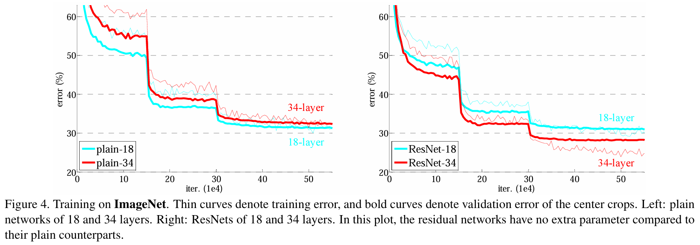

## 1. 为什么残差连接有效？

在标准的前馈神经网络中，第 $l$ 层的传播过程如下：

1. 输入：$a^{l-1}$（上一层的输出）
2. 线性变换：$z^l = W^l \cdot a^{l-1} + b^l$，记为 $z^l = H(a^{l-1})$
3. 激活：$a^l = g(z^l)$（其中 $g$ 是激活函数，如ReLU、Sigmoid等）
4. 输出：$a^l$ 作为当前层的输出，传递给下一层

这个过程可以表示为：$a^l = g(H(a^{l-1}))$

在深层网络中，当反向传播时，梯度需要从输出层一直传递到浅层。假设网络有 $L$ 层，则第 $l$ 层的梯度可以表示为：

$$
\frac{\partial \mathcal{L}}{\partial a^l} = \frac{\partial \mathcal{L}}{\partial a^L} \cdot \frac{\partial a^L}{\partial a^{L-1}} \cdot \frac{\partial a^{L-1}}{\partial a^{L-2}} \cdot ... \cdot \frac{\partial a^{l+1}}{\partial a^l}
$$

对于每一项 $\frac{\partial a^{i+1}}{\partial a^i}$，可以展开为：

$$
\frac{\partial a^{i+1}}{\partial a^i} = \frac{\partial a^{i+1}}{\partial z^{i+1}} \cdot \frac{\partial z^{i+1}}{\partial a^i} = g'(z^{i+1}) \cdot W^{i+1}
$$

当网络层数很深时，这些项的连乘会导致两个问题：

1. **梯度消失**：如果 $\|g'(z^{i+1}) \cdot W^{i+1}\| < 1$，那么连乘后的梯度会指数级减小，导致浅层网络几乎无法学习。

2. **梯度爆炸**：如果 $\|g'(z^{i+1}) \cdot W^{i+1}\| > 1$，那么连乘后的梯度会指数级增大，导致训练不稳定。

但是根据之前的讨论，“不稳定的梯度”可以通过使用更好的参数初始化方法、更换激活函数和使用批归一化来缓解，使得深度神经网络可以训练收敛。而残差连接则更加关注“网络退化”问题（degradation problem），即随着网络层数的增加，网络的性能不升反降的现象。

  

“网络退化”问题与常理相悖，因为通常认为网络越深，性能越好。假设存在某个 $L$ 层的网络 $F$ 是最优的，那么可以构造一个 $L+1$ 层的网络 $F'$，其前 $L$ 层与 $F$ 相同，最后一层是一个恒等映射（identity mapping）。这样，$F'$ 的性能至少不会比 $F$ 差，因此不会出现“网络退化”问题；又或者 $L$ 层网络还不是最优的层数，继续添加层数应该可以取得更好的结果。综上所述，与浅层网络相比，深层网络的效果应该更好。

但是实验结果表明，随着网络层数的增加，网络的性能不升反降，原因可能是网络层数在某层已经达到最优，后续冗余的深层网络不能很好地学习恒等映射，导致网络退化。注意，网络退化并非过拟合，而是模型在训练集上的表现比浅层网络更差，是由网络不能很好地学习恒等映射导致的。

为了缓解网络退化现象，需要实现恒等映射：$H(a^{l-1}) \to a^{l-1}$，即使网络的某层净输入和线性输出保持一致，则有：

$$
z^l = H(a^{l-1}) = \mathcal{F} (a^{l-1}) + a^{l-1}
$$

其中 $\mathcal{F}$ 是残差函数。当 $\mathcal{F} (a^{l-1}) \to 0$，则有 $z^l = a^{l-1}$，即网络的某层净输入和线性输出保持一致，实现了恒等映射。理论和实验证明，拟合残差函数比拟合恒等映射更容易。

从优化的角度来看，如果希望某一层实现恒等映射，即 $H(x) = x$，那么在标准网络中，我们需要通过调整权重使得 $W \cdot x + b = x$。这要求权重矩阵 $W$ 必须接近单位矩阵，偏置 $b$ 接近零向量，这是一个有约束的优化问题。而在残差网络中，我们只需要学习残差函数 $\mathcal{F}(x)$，使得 $\mathcal{F}(x) = 0$，这相当于让权重接近零，偏置接近零，这是一个更容易优化的无约束问题。

从梯度流动角度来看，在残差网络中，反向传播时梯度可以通过两条路径流动：一条是通过残差块，另一条是通过捷径连接（shortcut connection）。即使残差块的梯度很小，梯度仍然可以通过捷径连接直接传播到前面的层，这使得网络更容易训练。

从实验角度来看，何凯明等人在ResNet论文中通过实验证明，当使用残差连接时，即使网络深度增加到100多层甚至1000多层，网络性能仍然可以提高，而不会出现退化现象。这表明残差连接确实使得网络能够更有效地学习。

综上所述，残差连接通过添加"捷径"（shortcut）来缓解网络退化问题。在残差块中，输出变为：

$$
a^l = g(\mathcal{F}(a^{l-1}) + a^{l-1}) = g(z^{l} + a^{l-1})
$$

此时，令 $z^l = \mathcal{F}(a^{l-1})$，为了接下来讨论方便，假设残差块不使用激活函数。从前向传播角度来看，有：

$$
a^l = z^l + a^{l-1}
$$

对任意两个层数 $l_2 > l_1$，递归展开上式：

$$
a^{l_2} = z^{l_2} + a^{l_2-1} = z^{l_2} + z^{l_2-1} + a^{l_2-2} = ... = \sum_{i=l_1}^{l_2-1} z^i + a^{l_1}
$$

上式说明，在前向传播时，任意低层网络的输出都可以传播到高层，增强了深层网络的传播能力。

从反向传播角度来看，有：

$$
\frac{\partial \mathcal{L}}{\partial a^{l_1}} = \frac{\partial \mathcal{L}}{\partial a^{l_2}} \cdot \frac{\partial a^{l_2}}{\partial a^{l_1}} = \frac{\partial \mathcal{L}}{\partial a^{l_2}} \left ( 1 + \sum_{i=l_1}^{l_2-1} \frac{\partial z^i}{\partial a^{l_1}} \right )
$$

上式说明，在反向传播时，任意高层网络的梯度（$\frac{\partial \mathcal{L}}{\partial a^{l_2}}$）都可以传播到低层（$\frac{\partial \mathcal{L}}{\partial a^{l_1}}$），增强了深层网络的梯度流动能力。

从“破碎梯度”（Shattered Gradients Problem）角度来看，随着网络层数增加，梯度倾向于变得越来越不相关，类似于白噪声。当梯度变得像白噪声一样时，它们所携带的关于损失函数的信息就会减少，每次梯度更新时可认为是在做随机扰动。这使得优化算法难以找到下降方向，导致训练困难。此外，由于不同层的梯度相关性很低，很难找到一个对所有层都合适的学习率；当梯度破碎时，批归一化的效果会减弱，因为它假设不同批次的数据具有相似的统计特性，而破碎的梯度会破坏这一假设。[The Shattered Gradients Problem: If resnets are the answer, then what is the question?](https://arxiv.org/abs/1702.08591) 论文中指出，残差连接可以缓解破碎梯度问题，使得梯度更稳定，更容易优化。论文认为，对于 plain networks 来说，即使 BN 过后梯度的模稳定在了正常范围内，但梯度的相关性随着层数增加而持续衰减。经证明，ResNet 可以有效减少这种相关性的衰减，大概从 $\frac{1}{2^L}$ 减少到 $\frac{1}{\sqrt{L}}$。
