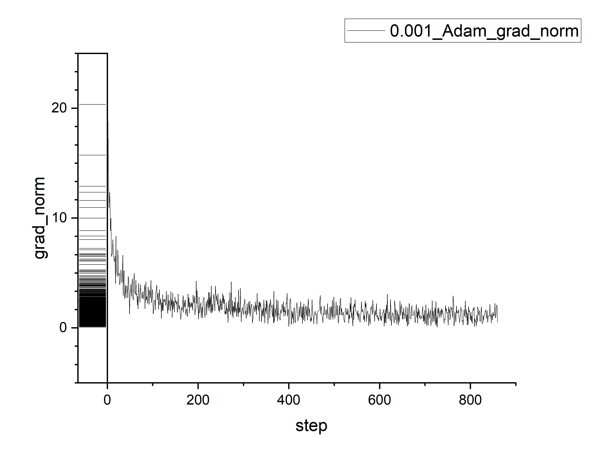
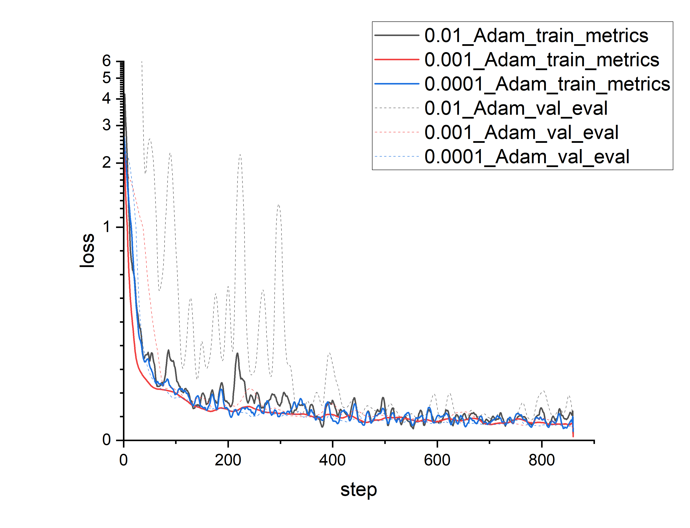
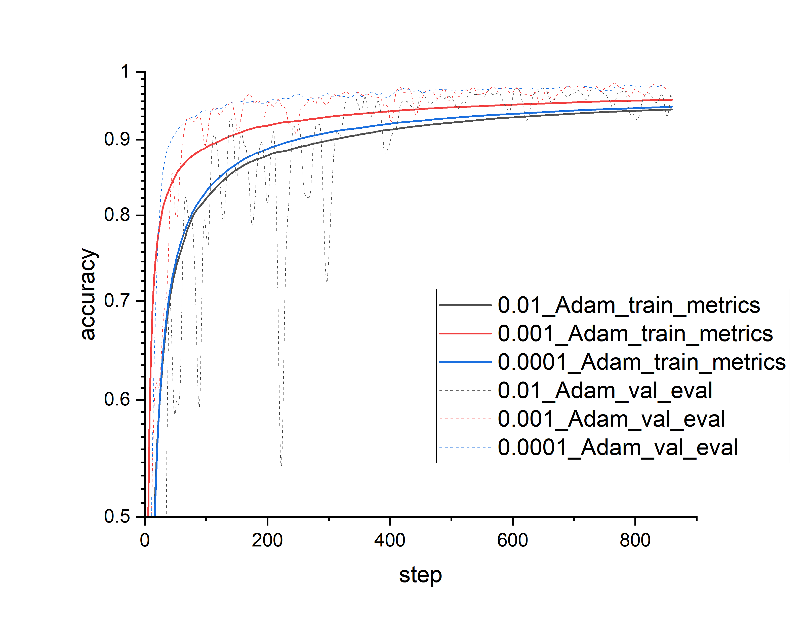
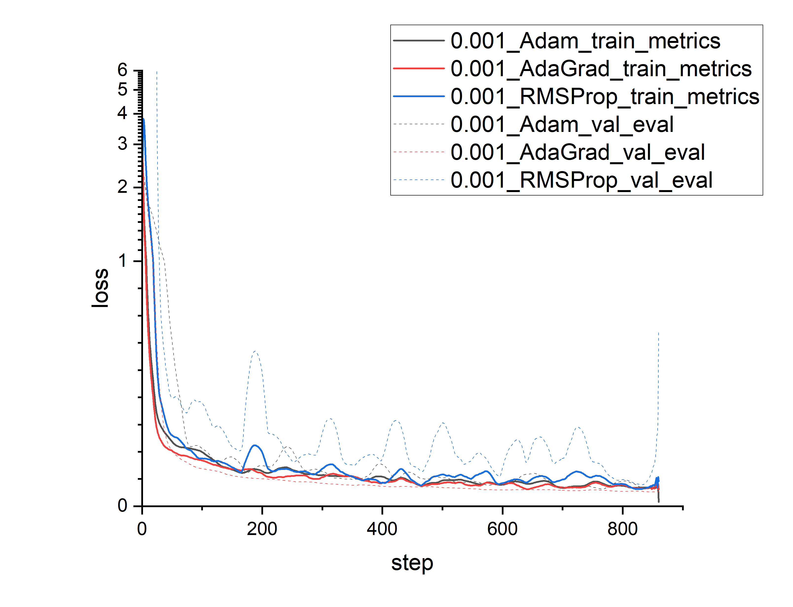
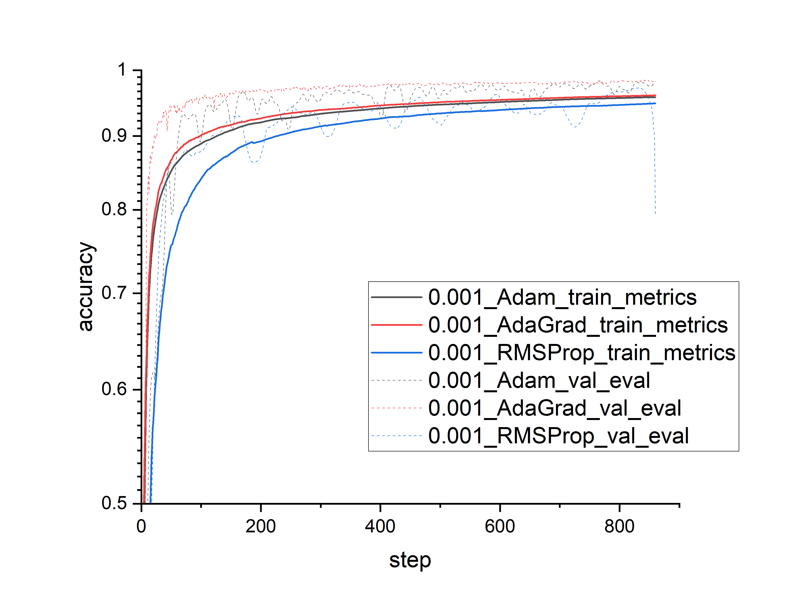

# MNIST with PyTorch Lightning

> 利用 PyTorch Lightning 训练 MNIST 数据。验证梯度范数、学习率、优化器对训练的影响。

```bash
pip show lightning
Version: 2.5.1.post0
```

## Fast dev run

```bash
DATASET_DIR="/repos/datasets"
python mnist_pl.py --output_grad_norm --fast_dev_run --dataset_dir $DATASET_DIR
```

```text
Seed set to 1234
Using default `ModelCheckpoint`. Consider installing `litmodels` package to enable `LitModelCheckpoint` for automatic upload to the Lightning model registry.
GPU available: True (cuda), used: True
TPU available: False, using: 0 TPU cores
HPU available: False, using: 0 HPUs
Running in `fast_dev_run` mode: will run the requested loop using 1 batch(es). Logging and checkpointing is suppressed.
You are using a CUDA device ('NVIDIA GeForce RTX 3060 Ti') that has Tensor Cores. To properly utilize them, you should set `torch.set_float32_matmul_precision('medium' | 'high')` which will trade-off precision for performance. For more details, read https://pytorch.org/docs/stable/generated/torch.set_float32_matmul_precision.html#torch.set_float32_matmul_precision
LOCAL_RANK: 0 - CUDA_VISIBLE_DEVICES: [0]

  | Name           | Type               | Params | Mode 
--------------------------------------------------------------
0 | model          | ResNet             | 11.2 M | train
1 | criterion      | CrossEntropyLoss   | 0      | train
2 | train_accuracy | MulticlassAccuracy | 0      | train
3 | val_accuracy   | MulticlassAccuracy | 0      | train
4 | test_accuracy  | MulticlassAccuracy | 0      | train
--------------------------------------------------------------
11.2 M    Trainable params
0         Non-trainable params
11.2 M    Total params
44.701    Total estimated model params size (MB)
72        Modules in train mode
0         Modules in eval mode
Epoch 0: 100%|██████████████| 1/1 [00:00<00:00,  1.02it/s, train_loss_step=2.650, val_loss=2.500, val_acc=0.0781, train_loss_epoch=2.650, train_acc_epoch=0.0938]`Trainer.fit` stopped: `max_steps=1` reached.                                                                                                                    
Epoch 0: 100%|██████████████| 1/1 [00:00<00:00,  1.02it/s, train_loss_step=2.650, val_loss=2.500, val_acc=0.0781, train_loss_epoch=2.650, train_acc_epoch=0.0938]
LOCAL_RANK: 0 - CUDA_VISIBLE_DEVICES: [0]
Testing DataLoader 0: 100%|████████████████████████████████████████████████████████████████████████████████████████████████████████| 1/1 [00:00<00:00, 70.41it/s]
─────────────────────────────────────────────────────────────────────────────────────────────────────────────────────────────────────────────────────────────────
       Test metric             DataLoader 0
─────────────────────────────────────────────────────────────────────────────────────────────────────────────────────────────────────────────────────────────────
        test_acc                 0.015625
        test_loss           2.5446341037750244
─────────────────────────────────────────────────────────────────────────────────────────────────────────────────────────────────────────────────────────────────
```

## Track gradients

```bash
python mnist_pl.py --output_grad_norm --max_epochs 1 --dataset_dir $DATASET_DIR
```



## Different learning rates

```bash
python mnist_pl.py  --learning_rate 0.0001 --max_epochs 1  --dataset_dir $DATASET_DIR
python mnist_pl.py --learning_rate 0.001 --max_epochs 1  --dataset_dir $DATASET_DIR
python mnist_pl.py --learning_rate 0.01 --max_epochs 1  --dataset_dir $DATASET_DIR
```





## Different optimizers

```bash
python mnist_pl.py --optimizer "Adam" --max_epochs 1 --dataset_dir $DATASET_DIR
python mnist_pl.py --optimizer "RMSProp" --max_epochs 1 --dataset_dir $DATASET_DIR
python mnist_pl.py --optimizer "AdaGrad" --max_epochs 1 --dataset_dir $DATASET_DIR
```





## Code

```python
import argparse
import csv
import os

import lightning as pl
import torch
import torch.nn as nn
import torch.optim as optim
import torchvision.datasets as datasets
import torchvision.transforms as transforms
from lightning.pytorch.callbacks import Callback
from torch.utils.data import DataLoader, random_split
from torchmetrics import Accuracy
from torchvision import models


class MNISTDataModule(pl.LightningDataModule):
    def __init__(
        self, data_dir: str = "./data", batch_size: int = 64, num_workers: int = 4
    ):
        super().__init__()
        self.data_dir = data_dir
        self.batch_size = batch_size
        self.num_workers = num_workers
        self.transform = transforms.Compose(
            [transforms.ToTensor(), transforms.Normalize((0.1307,), (0.3081,))]
        )
        self.mnist_train = None
        self.mnist_val = None
        self.mnist_test = None

    def prepare_data(self):
        datasets.MNIST(self.data_dir, train=True, download=True)
        datasets.MNIST(self.data_dir, train=False, download=True)

    def setup(self, stage: str = None):
        if stage == "fit" or stage is None:
            mnist_full = datasets.MNIST(
                self.data_dir, train=True, transform=self.transform
            )
            self.mnist_train, self.mnist_val = random_split(mnist_full, [55000, 5000])
        if stage == "test" or stage is None:
            self.mnist_test = datasets.MNIST(
                self.data_dir, train=False, transform=self.transform
            )

    def train_dataloader(self):
        return DataLoader(
            self.mnist_train,
            batch_size=self.batch_size,
            num_workers=self.num_workers,
            shuffle=True,
            persistent_workers=True if self.num_workers > 0 else False,
        )

    def val_dataloader(self):
        return DataLoader(
            self.mnist_val,
            batch_size=self.batch_size,
            num_workers=self.num_workers,
            persistent_workers=True if self.num_workers > 0 else False,
        )

    def test_dataloader(self):
        return DataLoader(
            self.mnist_test,
            batch_size=self.batch_size,
            num_workers=self.num_workers,
            persistent_workers=True if self.num_workers > 0 else False,
        )


class LitResNet18(pl.LightningModule):
    def __init__(self, learning_rate=1e-3, optimizer_name="Adam"):
        super().__init__()
        self.save_hyperparameters()
        self.learning_rate = learning_rate
        self.optimizer_name = optimizer_name

        self.model = models.resnet18(
            weights=None
        )  # weights=None as we train from scratch
        # Adjust for MNIST (1 input channel, 10 output classes)
        self.model.conv1 = nn.Conv2d(
            1, 64, kernel_size=7, stride=2, padding=3, bias=False
        )
        self.model.fc = nn.Linear(self.model.fc.in_features, 10)

        self.criterion = nn.CrossEntropyLoss()

        # For torchmetrics >= 0.7, task needs to be specified
        self.train_accuracy = Accuracy(task="multiclass", num_classes=10)
        self.val_accuracy = Accuracy(task="multiclass", num_classes=10)
        self.test_accuracy = Accuracy(task="multiclass", num_classes=10)

    def forward(self, x):
        return self.model(x)

    def training_step(self, batch, batch_idx):
        x, y = batch
        logits = self(x)
        loss = self.criterion(logits, y)
        preds = torch.argmax(logits, dim=1)

        self.train_accuracy.update(preds, y)

        self.log(
            "train_loss", loss, on_step=True, on_epoch=True, prog_bar=True, logger=True
        )
        self.log(
            "train_acc",
            self.train_accuracy,
            on_step=True,
            on_epoch=True,
            prog_bar=True,
            logger=True,
        )
        return {"loss": loss, "train_acc": self.train_accuracy.compute()}

    def validation_step(self, batch, batch_idx):
        x, y = batch
        logits = self(x)
        loss = self.criterion(logits, y)
        preds = torch.argmax(logits, dim=1)

        self.val_accuracy.update(preds, y)

        self.log(
            "val_loss", loss, on_step=False, on_epoch=True, prog_bar=True, logger=True
        )
        self.log(
            "val_acc",
            self.val_accuracy,
            on_step=False,
            on_epoch=True,
            prog_bar=True,
            logger=True,
        )
        return loss

    def test_step(self, batch, batch_idx):
        x, y = batch
        logits = self(x)
        loss = self.criterion(logits, y)
        preds = torch.argmax(logits, dim=1)

        self.test_accuracy.update(preds, y)

        self.log("test_loss", loss, on_step=False, on_epoch=True, logger=True)
        self.log(
            "test_acc", self.test_accuracy, on_step=False, on_epoch=True, logger=True
        )
        return loss

    def configure_optimizers(self):
        if self.optimizer_name == "Adam":
            optimizer = optim.Adam(self.parameters(), lr=self.learning_rate)
        elif self.optimizer_name == "AdaGrad":
            optimizer = optim.Adagrad(self.parameters(), lr=self.learning_rate)
        elif self.optimizer_name == "RMSProp":
            optimizer = optim.RMSprop(self.parameters(), lr=self.learning_rate)
        else:
            raise ValueError(f"Unsupported optimizer: {self.optimizer_name}")
        return optimizer


class CustomCSVLogger(Callback):
    def __init__(self, save_dir, lr, optimizer_name, output_grad_norm):
        super().__init__()
        self.save_dir = save_dir
        self.lr = lr
        self.optimizer_name = optimizer_name
        self.output_grad_norm = output_grad_norm

        os.makedirs(self.save_dir, exist_ok=True)

        self.train_metrics_file = os.path.join(
            self.save_dir, f"{self.lr}_{self.optimizer_name}_train_metrics.csv"
        )
        self.val_eval_file = os.path.join(
            self.save_dir, f"{self.lr}_{self.optimizer_name}_val_eval.csv"
        )
        self.test_eval_file = os.path.join(
            self.save_dir, f"{self.lr}_{self.optimizer_name}_test_eval.csv"
        )

        if self.output_grad_norm:
            self.grad_norm_file = os.path.join(
                self.save_dir, f"{self.lr}_{self.optimizer_name}_grad_norm.csv"
            )

        self._initialize_files()

    def _initialize_files(self):
        with open(self.train_metrics_file, "w", newline="") as f:
            writer = csv.writer(f)
            writer.writerow(["step", "train_loss", "train_acc"])

        with open(self.val_eval_file, "w", newline="") as f:
            writer = csv.writer(f)
            writer.writerow(["step", "val_loss", "val_acc"])

        with open(
            self.test_eval_file, "w", newline=""
        ) as f:  # Header written, data appended on_test_end
            writer = csv.writer(f)
            writer.writerow(["epoch", "test_loss", "test_acc"])

        if self.output_grad_norm:
            with open(self.grad_norm_file, "w", newline="") as f:
                writer = csv.writer(f)
                writer.writerow(["step", "grad_norm"])

    def on_train_batch_end(
        self,
        trainer: "pl.Trainer",
        pl_module: "pl.LightningModule",
        outputs: dict,
        batch: any,
        batch_idx: int,
    ):
        step = trainer.global_step

        train_loss = outputs["loss"]
        train_acc = outputs["train_acc"]

        with open(self.train_metrics_file, "a", newline="") as f:
            writer = csv.writer(f)
            writer.writerow(
                [
                    step,
                    train_loss.item() if torch.is_tensor(train_loss) else train_loss,
                    train_acc.item() if torch.is_tensor(train_acc) else train_acc,
                ]
            )

        if self.output_grad_norm:
            grad_norm_val = trainer.logged_metrics.get("grad_norm_step", float("nan"))

            with open(self.grad_norm_file, "a", newline="") as f:
                writer = csv.writer(f)
                writer.writerow(
                    [
                        step,
                        grad_norm_val.item()
                        if torch.is_tensor(grad_norm_val)
                        else grad_norm_val,
                    ]
                )

    def on_validation_epoch_end(
        self, trainer: "pl.Trainer", pl_module: "pl.LightningModule"
    ):
        step = trainer.global_step

        val_loss = trainer.logged_metrics.get("val_loss", float("nan"))
        val_acc = trainer.logged_metrics.get("val_acc", float("nan"))

        if (
            not (torch.is_tensor(val_loss) or isinstance(val_loss, float))
            or not (torch.is_tensor(val_acc) or isinstance(val_acc, float))
            or (isinstance(val_loss, float) and val_loss == float("nan"))
        ):
            if trainer.sanity_checking:
                return

        with open(self.val_eval_file, "a", newline="") as f:
            writer = csv.writer(f)
            writer.writerow(
                [
                    step,
                    val_loss.item() if torch.is_tensor(val_loss) else val_loss,
                    val_acc.item() if torch.is_tensor(val_acc) else val_acc,
                ]
            )

    def on_test_end(self, trainer: "pl.Trainer", pl_module: "pl.LightningModule"):
        epoch = trainer.current_epoch  # Epoch at which testing was performed
        test_loss = trainer.logged_metrics.get("test_loss", float("nan"))
        test_acc = trainer.logged_metrics.get("test_acc", float("nan"))

        with open(self.test_eval_file, "a", newline="") as f:
            writer = csv.writer(f)
            # This will typically be one row of data after training completes.
            writer.writerow(
                [
                    epoch,
                    test_loss.item() if torch.is_tensor(test_loss) else test_loss,
                    test_acc.item() if torch.is_tensor(test_acc) else test_acc,
                ]
            )


class GradientNormCallback(Callback):
    def on_after_backward(self, trainer, pl_module):
        grad_norm = 0.0
        for p in pl_module.parameters():
            if p.grad is not None:
                grad_norm += p.grad.data.norm(2).item() ** 2
        grad_norm = grad_norm**0.5
        pl_module.log("grad_norm", grad_norm, on_step=True, on_epoch=True)


def main(args):
    pl.seed_everything(args.seed, workers=True)

    data_module = MNISTDataModule(
        data_dir=args.dataset_dir,
        batch_size=args.batch_size,
        num_workers=args.num_workers,
    )
    model = LitResNet18(learning_rate=args.learning_rate, optimizer_name=args.optimizer)

    # Determine the actual root directory for all logs
    actual_default_root_dir = args.default_root_dir
    if actual_default_root_dir is None:
        # This matches PyTorch Lightning's default behavior for default_root_dir
        actual_default_root_dir = os.path.join(os.getcwd(), "lightning_logs")

    # Define the path for our custom CSV logs within the actual_default_root_dir
    csv_output_subdir_name = "csv_logs"
    csv_save_location = os.path.join(actual_default_root_dir, csv_output_subdir_name)

    custom_csv_logger = CustomCSVLogger(
        save_dir=csv_save_location,
        lr=args.learning_rate,
        optimizer_name=args.optimizer,
        output_grad_norm=args.output_grad_norm,
    )

    callbacks = [custom_csv_logger]

    # Add other PL callbacks if needed, e.g., ModelCheckpoint, EarlyStopping
    # from pytorch_lightning.callbacks import ModelCheckpoint, EarlyStopping
    # callbacks.append(ModelCheckpoint(dirpath=os.path.join(args.default_root_dir or 'lightning_logs', 'checkpoints')))

    trainer_args = {
        "deterministic": True,  # For reproducibility
        "callbacks": callbacks,
        "logger": True,  # Enables internal logging accessible by callbacks, logs to default logger (e.g. TensorBoardLogger)
        "val_check_interval": 1,
    }
    if args.output_grad_norm:
        trainer_args["callbacks"].append(GradientNormCallback())  # L2 norm

    trainer = pl.Trainer(
        max_epochs=args.max_epochs,
        accelerator=args.accelerator,
        devices=args.devices,
        default_root_dir=args.default_root_dir
        if args.default_root_dir
        else "lightning_logs",
        fast_dev_run=args.fast_dev_run,
        **trainer_args,
    )

    trainer.fit(model, datamodule=data_module)
    trainer.test(model, datamodule=data_module)


if __name__ == "__main__":
    parser = argparse.ArgumentParser(
        description="PyTorch Lightning MNIST ResNet18 Training",
        formatter_class=argparse.ArgumentDefaultsHelpFormatter,
    )

    # Model/Training specific arguments
    parser.add_argument(
        "--learning_rate",
        type=float,
        default=1e-3,
    )
    parser.add_argument(
        "--optimizer",
        type=str,
        default="Adam",
        choices=["Adam", "AdaGrad", "RMSProp"],
    )
    parser.add_argument(
        "--batch_size",
        type=int,
        default=64,
    )
    parser.add_argument("--num_workers", type=int, default=4)
    parser.add_argument("--seed", type=int, default=1234)
    parser.add_argument(
        "--output_grad_norm",
        action="store_true",
        help="If set, output gradient norm to CSV.",
    )
    parser.add_argument(
        "--dataset_dir",
        type=str,
        default="/repos/datasets/",
        help="Directory to save MNIST dataset.",
    )

    # Add all PyTorch Lightning Trainer arguments
    # parser = pl.Trainer.add_argparse_args(parser) # Deprecated
    # Instead, let users pass them directly, and Trainer.from_argparse_args will pick them up.
    parser.add_argument("--max_epochs", type=int, default=10)
    parser.add_argument(
        "--accelerator",
        type=str,
        default="auto",
        help="Accelerator to use ('cpu', 'gpu', 'tpu', 'mps', 'auto')",
    )
    parser.add_argument(
        "--devices",
        default="auto",
        help="Devices to use (e.g., 1 for one GPU, [0,1] for two GPUs, 'auto')",
    )
    parser.add_argument(
        "--default_root_dir",
        type=str,
        default=None,
        help="Default root directory for logs and checkpoints. If None, uses 'lightning_logs'.",
    )
    parser.add_argument("--fast_dev_run", action="store_true", help="Fast dev run")

    args = parser.parse_args()
    main(args)
```
