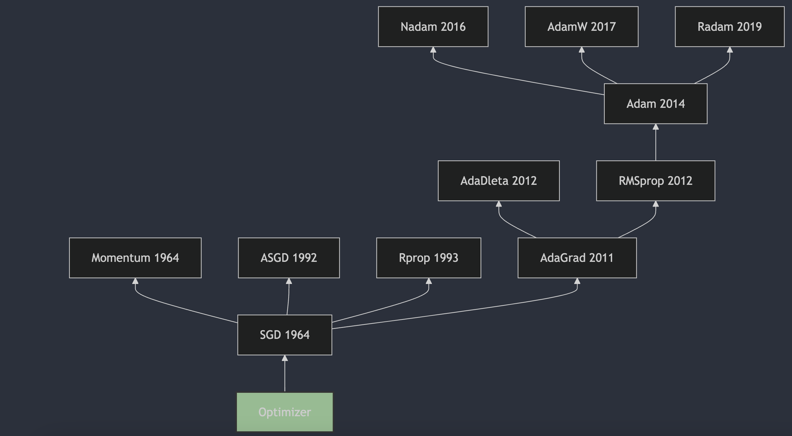

# 揭秘神经网络训练的“引擎”——优化器（Optimizer）

  

---

🚀 在训练深度学习模型时，选择合适的优化器至关重要。它就像是驱动模型学习的强大引擎，决定了模型能否快速、稳定地找到最优解。从经典的 SGD 到广受欢迎的 Adam 及其变种，优化器的世界充满了各种精妙的设计和权衡。

你是否好奇：

* 不同的优化器是如何工作的？它们各自有什么优缺点？
* Momentum 如何帮助梯度下降“冲”出局部最优？
* Adam 为何能在众多任务中脱颖而出？AdamW 和 RAdam 又带来了哪些改进？

本文将带您踏上一场优化器世界的探索之旅，从基础的随机梯度下降（SGD）出发，逐一解析 Momentum、AdaGrad、RMSprop、Adam、Nadam、AdamW、RAdam 等主流优化算法的核心思想、更新过程和实际应用。无论您是深度学习初学者还是希望深化理解优化策略的实践者，相信本文都能为您带来启发！

---

- [揭秘神经网络训练的“引擎”——优化器（Optimizer）](#揭秘神经网络训练的引擎优化器optimizer)
  - [1. SGD](#1-sgd)
    - [1.1. SGD 更新过程](#11-sgd-更新过程)
    - [1.2. Mini-Batch SGD 更新过程](#12-mini-batch-sgd-更新过程)
  - [2. Momentum](#2-momentum)
    - [2.1. EWA](#21-ewa)
      - [2.1.1. 偏差修正](#211-偏差修正)
    - [2.2. 动量方法](#22-动量方法)
  - [3. ASGD](#3-asgd)
  - [4. Rprop](#4-rprop)
  - [5. AdaGrad](#5-adagrad)
  - [6. AdaDelta](#6-adadelta)
  - [7. RMSprop](#7-rmsprop)
  - [8. Adam](#8-adam)
    - [8.1. 类比理解：信噪比](#81-类比理解信噪比)
  - [9. Nadam](#9-nadam)
    - [9.1. NAG](#91-nag)
  - [10. AdamW](#10-adamw)
  - [11. RAdam](#11-radam)

---

(´∀｀)♡ 本文来源：[CSDN-Sylvan Ding](https://blog.csdn.net/IYXUAN)，版权归原作者所有，转载请注明出处。**如果您喜欢本文，欢迎点赞并收藏。**

---

## 1. SGD

随机梯度下降（Stochastic Gradient Descent，SGD）是一种用于优化可微分目标函数的迭代方法，它是梯度下降优化的随机近似。SGD的提出可以追溯到1951年，由Herbert Robbins和Sutton Monro在他们的论文《A Stochastic Approximation Method》中首次描述了随机近似方法，这可以看作是SGD的前身。随后，J. Kiefer和J. Wolfowitz在1952年发表了论文《Stochastic Estimation of the Maximum of a Regression Function》，这篇论文更接近于机器学习领域中SGD的现代理解。

随机梯度下降（SGD）的更新公式是梯度下降法的一种变体，它用于优化目标函数，特别是在处理大规模数据集时。SGD 在每次迭代中只使用一个或一小批样本来计算梯度，然后更新模型参数。这样做可以减少每次迭代的计算成本，并有助于算法逃离局部最小值。

### 1.1. SGD 更新过程

SGD 用于最小化损失函数$L$来优化参数向量$\mathbf{w}$。SGD 通过在每次迭代中基于单个或少量样本计算梯度来更新参数，从而实现高效的优化。以下是 SGD 的更新过程:

**初始化**

* 初始化参数向量$\mathbf{w}_0$，通常使用随机值或零向量。
* 设定全局学习率$\eta$，通常取值为一个较小的正数（如 0.01），可以是固定的，也可以随迭代次数衰减。

**迭代更新过程**

在每次迭代$t = 1, 2, \dots$中，执行以下步骤：

**随机选择样本：**

从训练数据集中随机选择一个样本$(x_i, y_i)$，其中$x_i$是输入特征，$y_i$是对应的标签。

**计算梯度：**

计算损失函数$L$对当前参数$\mathbf{w}_t$的梯度，基于选定的单个样本：

$$
\mathbf{g}_t = \nabla_{\mathbf{w}} L(\mathbf{w}_t; x_i, y_i)
$$

这里$L(\mathbf{w}_t; x_i, y_i)$是基于单个样本$(x_i, y_i)$的损失值。

**更新参数：**

使用计算得到的梯度更新参数：
$$
\mathbf{w}_{t+1} = \mathbf{w}_t - \eta \cdot \mathbf{g}_t
$$

**其中$\eta$是学习率，控制每次更新的步长。$\mathbf{g}_t$是梯度，控制每次更新的方向。后续 Adam 优化器会使用一阶动量来优化更新方向，使用二阶动量来优化更新步长。**

**重复迭代**

重复步骤 2，直到满足停止条件（例如达到最大迭代次数、损失收敛或梯度足够小）。通常，SGD 会遍历数据集多次（称为多个 epoch），每次遍历时随机打乱数据顺序以确保随机性。

**SGD 的特点**

1. **随机性：** SGD 每次迭代只使用一个样本计算梯度，因此梯度估计具有较高的噪声。这种随机性有助于逃离局部最优，但也可能导致优化路径震荡。
2. **计算效率：** 由于每次迭代只处理一个样本，SGD 的计算成本较低，适合大规模数据集。
3. **收敛性：** SGD 的收敛速度较慢，且可能在最优解附近震荡，但通过适当调整学习率（如逐步衰减），可以实现较好的收敛。

### 1.2. Mini-Batch SGD 更新过程

Mini-Batch SGD 是 SGD 的一种变体，通过在每次迭代中使用一小批（mini-batch）样本而非单个样本计算梯度，从而在计算效率和梯度估计稳定性之间取得平衡。

**Mini-Batch SGD 更新过程**

**初始化：**

与 SGD 相同，初始化参数向量$\mathbf{w}_0$和学习率$\eta$。

**迭代更新过程：**

在每次迭代$t = 1, 2, \dots$中，执行以下步骤：

**随机选择一批样本：** 从训练数据集中随机选择一小批样本（batch size 通常为 32、64、128 等），记为$B_t = \{(x_{i1}, y_{i1}), (x_{i2}, y_{i2}), \dots, (x_{ib}, y_{ib})\}$，其中$b$是 batch size。

**计算平均梯度：** 计算损失函数对当前参数$\mathbf{w}_t$的平均梯度，基于选定的 mini-batch：

$$
\mathbf{g}_t = \frac{1}{b} \sum_{(x_i, y_i) \in B_t} \nabla_{\mathbf{w}} L(\mathbf{w}_t; x_i, y_i)
$$

这里$\mathbf{g}_t$是 mini-batch 中所有样本梯度的平均值。

**更新参数：** 使用平均梯度更新参数：

$$
\mathbf{w}_{t+1} = \mathbf{w}_t - \eta \cdot \mathbf{g}_t
$$

**Mini-Batch SGD 的优点**

Mini-Batch SGD 在深度学习中是目前最常用的优化方式，因为它在计算效率和收敛稳定性之间取得了良好的平衡：

1. **稳定性：** 相比 SGD，Mini-Batch SGD 的梯度估计更准确，优化路径更平滑，收敛速度通常更快。
2. **并行化：** Mini-Batch SGD 可以通过 GPU 并行计算批次内样本的梯度，大幅提高训练速度。
3. **适用性：** 通过调整 batch size，可以在内存和计算资源之间找到平衡点，适应不同的硬件环境。

## 2. Momentum

动量（Momentum）方法最初由B.T.Polyak在1964年提出。这一方法被用来加速梯度下降算法的收敛，特别是在处理具有较大条件数的优化问题时。B.T.Polyak在论文《Some methods of speeding up the convergence of iteration methods》中描述了这一方法，这篇论文发表在了《USSR Computational Mathematics and Mathematical Physics》上。动量方法通过在每一步的更新中加入一部分上一步的速度，帮助算法在相关方向上加速，并减少在目标函数的平坦区域中的震荡。这种方法后来被广泛应用于机器学习领域，尤其是在深度学习中，成为了优化算法中的一个重要组成部分。

### 2.1. EWA

指数加权平均（Exponential Weighted Moving Average, EWA）是一种用于平滑时间序列数据或信号的统计方法，通过对历史数据赋予指数衰减的权重来计算平均值。它的核心思想是：最近的数据对当前平均值的影响更大，而较旧的数据影响逐渐减小。

**基本原理**

指数加权平均通过一个衰减因子（通常记为$\beta$或$\alpha$）来控制历史数据的权重。假设有一组时间序列数据$x_1, x_2, \dots, x_t$，指数加权平均的计算公式为：

$$
v_t = \beta \cdot v_{t-1} + (1 - \beta) \cdot x_t
$$

其中：

* $v_t$是第$t$时刻的指数加权平均值；
* $v_{t-1}$是第$t-1$时刻的指数加权平均值；
* $x_t$是第$t$时刻的观测值；
* $\beta$是衰减因子（通常在 0.9 到 0.99 之间），决定了历史数据的权重衰减速度。

初始值$v_0$通常设为 0。

**特点**

1. **指数衰减权重：** 权重随时间呈指数下降，最近的数据权重为$1 - \beta$，前一时刻的权重为$(1 - \beta) \cdot \beta$，前两时刻的权重为$(1 - \beta) \cdot \beta^2$，以此类推。这也是被叫做指数加权平均的原因。当距离当前时刻越远，权重衰减的越厉害。
2. **平滑效果：** 指数加权平均能够有效减少数据中的噪声，突出趋势，适用于时间序列分析和信号处理。

#### 2.1.1. 偏差修正

在计算初期，由于初始值$v_0 = 0$或其他非理想值，指数加权平均可能会低估真实平均值。为解决这一问题，引入偏差修正：

$$
\hat{v}_t = \frac{v_t}{1 - \beta^t}
$$
其中$\beta^t$是$\beta$的$t$次方。随着$t$增加，$1 - \beta^t$接近 1，偏差修正的影响逐渐减小。

**偏差修正的数学推导**

EWA 的计算公式为：

$$
v_t = \beta \cdot v_{t-1} + (1 - \beta) \cdot x_t
$$

初始值$v_0$通常设为 0。如果$v_0 = 0$，在计算初期，$v_t$会偏向于 0，低估真实的移动平均值。这种偏差随着$t$增加逐渐减小，但初期的影响可能显著，尤其是在优化算法（如 Adam）中会导致不稳定的更新步长。

**偏差问题的来源**

假设希望$v_t$近似于最近若干观测值的加权平均，权重随时间指数衰减。展开$v_t$的递归公式：

$$
v_t = (1 - \beta) \cdot x_t + \beta \cdot v_{t-1}
$$
$$
= (1 - \beta) \cdot x_t + \beta \cdot \left[ (1 - \beta) \cdot x_{t-1} + \beta \cdot v_{t-2} \right]
$$
$$
= (1 - \beta) \cdot x_t + \beta \cdot (1 - \beta) \cdot x_{t-1} + \beta^2 \cdot v_{t-2}
$$

继续展开，直到初始值$v_0$：

$$
v_t = (1 - \beta) \cdot \sum_{k=0}^{t-1} \beta^k \cdot x_{t-k} + \beta^t \cdot v_0
$$

假设$v_0 = 0$，则：

$$
v_t = (1 - \beta) \cdot \sum_{k=0}^{t-1} \beta^k \cdot x_{t-k}
$$

注意到$t$时刻的权重之和为：

$$
\sum_{k=0}^{t-1} (1 - \beta) \cdot \beta^k = (1 - \beta) \cdot \frac{1 - \beta^t}{1 - \beta} = 1 - \beta^t
$$

由于$\beta^t > 0$，权重之和小于 1，尤其在$t$较小时，$\beta^t$较大，权重之和远小于 1。这意味着$v_t$低估了真实的加权平均值。为了修正这种偏差，我们希望对权重进行归一化，即$v_t$的权重之和为 1，从而更准确地反映加权平均值。当前权重之和为$1 - \beta^t$，因此可以通过将$v_t$除以$1 - \beta^t$来进行修正：

$$
\hat{v}_t = \frac{v_t}{1 - \beta^t}
$$

**偏差修正的效果**

* **初期：** 在$t$较小时，$\beta^t$较大，$1 - \beta^t$较小，除以$1 - \beta^t$会显著放大$v_t$，从而补偿初始值$v_0 = 0$导致的低估。
* **后期：** 随着$t$增加，$\beta^t$接近 0，$1 - \beta^t$接近 1，偏差修正的影响逐渐消失，$\hat{v}_t \approx v_t$。

**偏差修正在优化算法中的应用**

在深度学习优化算法（如 Adam、RAdam）中，偏差修正被广泛用于一阶动量（梯度平均）和二阶动量（梯度平方平均）的计算。例如，在 Adam 中：

* 一阶动量：$m_t = \beta_1 \cdot m_{t-1} + (1 - \beta_1) \cdot g_t$，修正为$\hat{m}_t = \frac{m_t}{1 - \beta_1^t}$；
* 二阶动量：$v_t = \beta_2 \cdot v_{t-1} + (1 - \beta_2) \cdot g_t^2$，修正为$\hat{v}_t = \frac{v_t}{1 - \beta_2^t}$。

这种修正确保在训练初期，动量值不会因初始值为 0 而被低估，从而避免更新步长过小或不稳定的问题。

### 2.2. 动量方法

动量（Momentum）方法是一种在深度学习中广泛使用的优化策略，它通过引入动量项来加速梯度下降算法的收敛并提高其稳定性。动量方法的核心思想是模拟物理学中的动量概念，通过累积过去梯度的信息来调整参数更新的方向和幅度。动量通过指数加权平均的方式来计算。

动量方法在标准 SGD 的基础上引入了一个动量向量$\mathbf{v}_t$，用于存储历史梯度的指数移动平均。更新规则如下：

在每次迭代$t = 1, 2, \dots$中：

计算当前梯度：$\mathbf{g}_t = \nabla_{\mathbf{w}} L(\mathbf{w}_t)$

更新动量向量（历史梯度的指数移动平均）：
$$
\mathbf{v}_t = \beta \cdot \mathbf{v}_{t-1} + (1 - \beta) \cdot \mathbf{g}_t
$$

或者在经典实现中直接累加梯度：

$$
\mathbf{v}_t = \beta \cdot \mathbf{v}_{t-1} + \eta \cdot \mathbf{g}_t
$$

更新参数：

$$
\mathbf{w}_{t+1} = \mathbf{w}_t - \mathbf{v}_t
$$

**优点**

1. **加速收敛：** 在损失函数表面较平坦或梯度方向一致的区域，动量方法通过累积历史梯度加速参数更新。
2. **减少震荡：** 在损失函数表面曲率高或梯度方向频繁变化的区域，动量方法通过平滑更新方向减少震荡。
3. **逃离局部最优：** 动量带来的惯性有助于跳出浅的局部最优解。

**局限性**

1. **超参数敏感：** 动量系数$\beta$和学习率$\eta$需要仔细调参，设置不当可能导致发散或收敛过慢。
2. **可能过度前进：** 动量可能导致参数更新越过最优解，尤其在接近最优解时。

**改进与应用**

* **Nesterov 加速梯度（NAG）：** 通过“向前看”机制，在动量预测位置计算梯度，进一步提高收敛速度。
* **Adam 及其变体：** 结合动量（一阶动量）和自适应学习率（二阶动量），提升优化性能。

## 3. ASGD

平均随机梯度下降（Average Stochastic Gradient Descent，ASGD）是一种用于优化可微分目标函数的迭代方法，它是梯度下降优化的随机近似。ASGD的提出可以追溯到1992年，由B.T.Polyak在他的论文《Acceleration of Stochastic Approximation by Averaging》中首次描述了这一方法。ASGD通过对多个随机梯度的平均值进行更新，来减少随机梯度的方差，从而提高优化算法的收敛速度。这种方法在训练深度神经网络时，可以帮助算法更快地收敛到最优解。不同于上节的 Momentum 对梯度进行指数加权平均，ASGD 是对多个随机梯度进行平均。ASGD 的更新过程如下：

ASGD（Averaged Stochastic Gradient Descent，平均随机梯度下降）是一种改进的随机梯度下降方法，通过对历史参数进行平均来提高收敛性和稳定性，尤其在优化非凸问题时表现较好。以下是 ASGD 的更新公式和相关说明。

**初始化：**

* 初始化参数向量$\mathbf{w}_0$，通常为随机值。
* 初始化平均参数向量$\bar{\mathbf{w}}_0 = \mathbf{w}_0$。
* 设定学习率$\eta_t$，可以是固定值或随时间衰减（如$\eta_t = \frac{\eta_0}{1 + \lambda t}$）。
* 设定平均开始的迭代步数$t_0$，在$t < t_0$时不进行平均。

**迭代更新：**

在每次迭代$t = 1, 2, \dots$中：

计算当前梯度：

$$
\mathbf{g}_t = \nabla_{\mathbf{w}} L(\mathbf{w}_t; x_i, y_i)
$$

训练初期的快速探索（标准 SGD 更新）：在训练初期（$t < t_0$），ASGD 等同于标准 SGD，参数更新完全依赖当前梯度和学习率。这一阶段的作用是快速探索参数空间，接近损失函数的较优区域。由于不进行平均，参数可以快速响应梯度变化，尤其在损失函数表面较陡的区域能够快速下降：

$$
\mathbf{w}_{t+1} = \mathbf{w}_t - \eta_t \cdot \mathbf{g}_t
$$

训练后期的平滑优化（更新平均参数）：当迭代次数达到$t_0$后，ASGD 开始计算参数的移动平均$\bar{\mathbf{w}}_t$。平均参数的作用是减少 SGD 由于随机梯度噪声导致的参数震荡，尤其是在接近最优解时，参数更新轨迹会更加平滑。这种平滑效应有助于避免参数在最优解附近剧烈波动，从而提高模型的稳定性:
$$
\bar{\mathbf{w}}_{t+1} = \frac{t - t_0}{t - t_0 + 1} \cdot \bar{\mathbf{w}}_t + \frac{1}{t - t_0 + 1} \cdot \mathbf{w}_{t+1}
$$

或者等价地写为：

$$
\bar{\mathbf{w}}_{t+1} = \bar{\mathbf{w}}_t + \frac{1}{t - t_0 + 1} \cdot (\mathbf{w}_{t+1} - \bar{\mathbf{w}}_t)
$$

如果$t < t_0$，则不更新平均参数：

$$
\bar{\mathbf{w}}_{t+1} = \mathbf{w}_{t+1}
$$

最终输出的参数通常是平均参数$\bar{\mathbf{w}}_T$，而不是最后的$\mathbf{w}_T$，因为平均参数往往具有更好的泛化性能。

## 4. Rprop

Rprop（Resilient Backpropagation）算法是由Martin Riedmiller和Hermann Braun在1993年提出的。这一算法在论文《A Direct Adaptive Method for Faster Backpropagation Learning: The RPROP Algorithm》中被详细描述，该论文发表在1993年的IEEE国际会议上。Rprop算法通过仅使用梯度的符号来计算更新，而不是梯度的大小，从而动态地为每个权重独立地调整步长（$\eta_{t}$）。这种方法克服了传统梯度下降算法的一些固有缺点，并且由于其对误差函数行为的局部适应性，使得学习过程更加高效。

**Rprop 的核心思想**

1. **梯度符号决定更新方向：**
   Rprop 不考虑梯度的大小，只关注梯度的符号（正或负）来决定参数更新的方向。如果梯度为正，表示参数需要减小；如果梯度为负，表示参数需要增大。这种方式避免了梯度大小带来的数值问题（如梯度消失或爆炸）。
2. **自适应更新步长：**
   每个参数都有一个独立的更新步长（也称为更新值或增量），这些步长会根据梯度符号的历史变化自适应调整：
   * 如果连续迭代中梯度符号不变（即更新方向一致），则增加步长以加速收敛。
   * 如果梯度符号发生变化（即更新方向改变，可能接近极值点），则减小步长以避免越过最优解。
3. **解耦参数更新：**
   **Rprop 对每个参数独立地调整更新步长（$\eta_{t}$）**，不像标准梯度下降那样依赖全局学习率。这种解耦机制使 Rprop 能够更好地适应损失函数表面的不同曲率。

**Rprop 的更新过程**

1. **初始化：**
   * 初始化参数向量$\mathbf{w}_0$，通常为随机值。
   * 为每个参数$w_i$初始化一个更新步长$\Delta_{i,0}$，通常设为一个较小的正值（如 0.1）。
   * 设定步长调整因子：
     * 增加因子$\eta^+$，通常设为 1.2，用于在梯度符号不变时增加步长。
     * 减少因子$\eta^-$，通常设为 0.5，用于在梯度符号变化时减小步长。
   * 设定步长上下限：最大步长$\Delta_{\text{max}}$（如 50.0）和最小步长$\Delta_{\text{min}}$（如$10^{-6}$），以防止步长过大或过小。

2. **迭代更新：**
   * 计算当前梯度：
    $$
     g_{i,t} = \frac{\partial L}{\partial w_i} \bigg|_{w_{i,t}}
    $$
   * 确定更新方向：根据梯度符号决定参数更新方向：
    $$
     \text{sign}(g_{i,t}) =
     \begin{cases}
     -1, & \text{if } g_{i,t} > 0 \quad (\text{参数需要减小}) \\
     +1, & \text{if } g_{i,t} < 0 \quad (\text{参数需要增大}) \\
     0, & \text{if } g_{i,t} = 0 \quad (\text{不更新})
     \end{cases}
    $$
   * 调整更新步长：根据当前梯度和前一次梯度符号的变化调整步长$\Delta_{i,t}$：
     * 如果当前梯度符号与前一次相同（即$g_{i,t} \cdot g_{i,t-1} > 0$），表示更新方向一致，增加步长：
      $$
       \Delta_{i,t} = \min(\Delta_{i,t-1} \cdot \eta^+, \Delta_{\text{max}})
      $$
     * 如果当前梯度符号与前一次相反（即$g_{i,t} \cdot g_{i,t-1} < 0$），表示可能越过极值点，减小步长：
      $$
       \Delta_{i,t} = \max(\Delta_{i,t-1} \cdot \eta^-, \Delta_{\text{min}})
      $$
       同时，为了避免重复震荡，在某些实现中会将当前梯度设为 0（即不更新参数），以防止反复跨过极值点。
     * 如果当前梯度为 0 或无变化，则步长保持不变：
      $$
       \Delta_{i,t} = \Delta_{i,t-1}
      $$
   * 更新参数：使用调整后的步长和梯度符号更新参数：
    $$
     w_{i,t+1} = w_{i,t} - \text{sign}(g_{i,t}) \cdot \Delta_{i,t}
    $$

3. **重复迭代：**
   重复步骤 2，直到满足停止条件（如达到最大迭代次数、损失收敛或梯度足够小）。

注：在 SGD 中，每轮的变化量为$\eta \cdot g_t$，方向由梯度$g_t$决定，步长由$\eta$和$g_t$共同决定（因为$g_t$没有归一化），$\eta$决定所有参数的步长。而在 Rprop 中，每轮的变化量是$\Delta_{i,t} \cdot \text{sign}(g_{i,t})$，方向由梯度$g_{i,t}$决定，步长由$\Delta_{i,t}$决定，步长是每个参数独立的。

**Rprop 的伪代码**

```python
# 初始化
w = 初始化参数()  # 随机初始化参数
Delta = 初始化步长()  # 为每个参数设置初始步长，如 0.1
eta_plus = 1.2  # 步长增加因子
eta_minus = 0.5  # 步长减少因子
Delta_max = 50.0  # 最大步长
Delta_min = 1e-6  # 最小步长
g_prev = 0  # 前一次梯度，初始为 0

for t in range(max_iterations):
    g = 计算梯度(w)  # 计算当前梯度
    for i in range(len(w)):  # 对每个参数独立处理
        if g[i] * g_prev[i] > 0:  # 梯度符号不变，加速
            Delta[i] = min(Delta[i] * eta_plus, Delta_max)
        elif g[i] * g_prev[i] < 0:  # 梯度符号改变，减速
            Delta[i] = max(Delta[i] * eta_minus, Delta_min)
            g[i] = 0  # 可选：避免重复震荡
        # 否则步长不变
      
        # 更新参数
        if g[i] > 0:
            w[i] -= Delta[i]
        elif g[i] < 0:
            w[i] += Delta[i]
    g_prev = g  # 保存当前梯度用于下一次迭代
```

**Rprop 的优点**

1. **无需手动调整学习率：**
   Rprop 不依赖全局学习率，而是为每个参数自适应调整更新步长，避免了传统梯度下降中学习率选择困难的问题。
2. **对梯度大小不敏感：**
   由于只使用梯度符号，Rprop 避免了梯度消失或爆炸的影响，特别适合深度网络或损失函数表面不平滑的情况。
3. **快速收敛：**
   通过动态调整步长，Rprop 能够在梯度方向一致时加速更新，在接近极值点时减缓更新，从而在许多任务中表现出较快的收敛速度。
4. **参数独立更新：**
   每个参数的步长独立调整，适应了损失函数在不同参数维度上的不同曲率，提高了优化效率。

**Rprop 的局限性**

1. **不适合 mini-batch 训练：**
   Rprop 最初设计用于全批量梯度下降（即基于整个数据集计算梯度），在随机梯度下降（SGD）或 mini-batch 训练中，由于梯度噪声较大，梯度符号频繁变化可能导致步长频繁减小，影响收敛速度。
2. **对超参数敏感：**
   虽然无需调整学习率，但 Rprop 的性能依赖于步长调整因子$\eta^+$和$\eta^-$、初始步长以及步长上下限的设置，不当的参数可能导致收敛问题。
3. **缺乏二阶信息：**
   Rprop 仅使用一阶梯度信息（符号），未考虑损失函数的曲率（二阶信息），在某些复杂优化问题中可能不如 Adam 等现代优化器有效。
4. **可能陷入局部最优：**
   由于步长调整机制，Rprop 在接近局部最优时可能因步长过小而难以逃脱，尤其在非凸优化问题中。

**改进与变体**

为了解决 Rprop 在 mini-batch 训练中的局限性，提出了几种改进版本：

* **iRprop+：** 通过引入回退机制（当损失增加时撤销更新），提高了算法对噪声的鲁棒性，适用于 mini-batch 训练。
* **iRprop-：** 简化版本，移除回退机制，但仍对步长调整规则进行优化。

此外，Rprop 的思想启发了一些现代优化算法的设计，如 Adam 方法。

## 5. AdaGrad

AdaGrad（Adaptive Gradient Algorithm）是由 John Duchi, Elad Hazan, 和 Yoram Singer 提出的。这个算法在2011年的论文《Adaptive Subgradient Methods for Online Learning and Stochastic Optimization》中被详细描述，并发表在了《Journal of Machine Learning Research》上。AdaGrad算法的主要特点是为每个参数独立地调整学习率，使得不频繁更新的参数可以获得更大的学习率，而频繁更新的参数则获得较小的学习率。这种自适应调整学习率的方法特别适合处理稀疏数据，因为它能够对稀疏特征给予更多的关注。然而，AdaGrad也有缺点，主要是在学习过程中累积的平方梯度和会导致学习率变得过小，从而在训练后期几乎停止学习。为了解决这个问题，后续研究者提出了AdaGrad的变种，如AdaDelta和Adam等。

**AdaGrad 更新过程**

我们用$\mathbf{w}_t$表示第$t$次迭代时的参数向量，$\mathbf{g}_t$表示第$t$次迭代时损失函数对参数的梯度向量，即$\mathbf{g}_t = \nabla_{\mathbf{w}} L(\mathbf{w}_t)$。

**1. 初始化**

* 初始化参数向量$\mathbf{w}_0$，通常使用随机值或零向量。
* 初始化累积平方梯度向量$\mathbf{r}_0$，通常设为零向量$\mathbf{r}_0 = \mathbf{0}$。
* 设定全局学习率$\eta$，通常是一个较小的正数（如 0.01）。
* 设定一个很小的正数$\epsilon$，用于数值稳定性，防止除以零（通常取值为$10^{-8}$）。

**2. 迭代更新过程**
在每次迭代$t = 1, 2, \dots$中，执行以下步骤：

1. **计算当前梯度：**
   计算损失函数$L$对当前参数$\mathbf{w}_t$的梯度：
  $$
   \mathbf{g}_t = \nabla_{\mathbf{w}} L(\mathbf{w}_t)
  $$
   这里$\mathbf{g}_t$是一个向量，其每个元素$g_{t,i}$是损失函数对参数$w_{t,i}$的偏导数。

2. **累积历史梯度的平方和：**
   更新累积平方梯度向量$\mathbf{r}_t$。对于每个参数$i$，累积其梯度的平方：
  $$
   \mathbf{r}_t = \mathbf{r}_{t-1} + \mathbf{g}_t \odot \mathbf{g}_t
  $$
   其中$\odot$表示 Hadamard 积，即对向量$\mathbf{g}_t$的每个元素分别平方后累加到$\mathbf{r}_{t-1}$的对应位置上。换句话说，对于每个参数$i$：
  $$
   r_{t,i} = r_{t-1,i} + g_{t,i}^2
  $$
   这样，$r_{t,i}$存储了从训练开始到当前迭代$t$，参数$w_i$的所有梯度平方的累积和。

3. **计算自适应学习率：**
   对于每个参数$w_i$，基于累积平方梯度$r_{t,i}$计算一个自适应的学习率因子。AdaGrad 使用全局学习率$\eta$除以累积平方梯度的平方根：
  $$
   \text{每个参数的自适应学习率}_i = \frac{\eta}{\sqrt{r_{t,i} + \epsilon}}
  $$
   由于$r_{t,i}$是累积的平方和，它会随着迭代次数增加而单调递增，因此自适应学习率因子会逐渐减小。

4. **更新参数：**
   使用当前梯度$\mathbf{g}_t$和自适应学习率因子更新参数$\mathbf{w}_t$。对于每个参数$i$：
  $$
   w_{t+1,i} = w_{t,i} - \frac{\eta}{\sqrt{r_{t,i} + \epsilon}} \cdot g_{t,i}
  $$
   用向量形式表示：
  $$
   \mathbf{w}_{t+1} = \mathbf{w}_t - \eta \cdot \left( \frac{1}{\sqrt{\mathbf{r}_t + \epsilon}} \odot \mathbf{g}_t \right)
  $$

**3. 重复迭代**
重复步骤 2，直到满足停止条件（例如达到最大迭代次数、损失收敛或梯度足够小）。

**直观解释**

* **累积平方梯度$\mathbf{r}_t$的作用：**$r_{t,i}$记录了参数$w_i$从训练开始以来梯度的“历史强度”。如果某个参数的梯度经常很大（即$g_{t,i}$的值较大），那么$r_{t,i}$会增长得很快，导致自适应学习率变小，更新步长变小；反之，如果某个参数的梯度很小或很少更新（例如在稀疏数据中），$r_{t,i}$增长缓慢，自适应学习率较大，更新步长较大。
* **自适应学习率的作用：** 这种机制使得 AdaGrad 能够自动调整每个参数的学习率，无需手动调参。对于频繁更新的参数，学习率逐渐减小以避免震荡；对于不常更新的参数，学习率保持较大以加速学习。

**示例伪代码**

```python
# 初始化
w = 初始化参数()  # 随机初始化参数
r = 0  # 累积平方梯度，初始化为0
eta = 0.01  # 全局学习率
epsilon = 1e-8  # 防止除以零的小常数

for t in 范围(最大迭代次数):
    g = 计算梯度(w)  # 计算当前梯度
    r = r + g * g  # 累积梯度平方（元素级乘法）
    adaptive_lr = eta / sqrt(r + epsilon)  # 计算自适应学习率
    w = w - adaptive_lr * g  # 更新参数
```

AdaGrad 的更新过程通过累积历史梯度的平方和，为每个参数计算一个自适应的学习率。这种方法特别适合处理稀疏数据，因为它能为不常更新的参数分配较大的学习率。然而，由于$\mathbf{r}_t$单调递增，学习率会随时间不断减小，可能导致训练后期更新过慢甚至停止。为解决这一问题，后续的优化算法如 RMSprop 和 Adam 在 AdaGrad 的基础上引入了梯度平方的指数移动平均，而不是简单的累积和。

## 6. AdaDelta

AdaDelta算法是由Matthew D. Zeiler在2012年提出的。这一算法的详细描述和原理可以在论文《ADADELTA: An Adaptive Learning Rate Method》中找到。AdaDelta算法旨在解决AdaGrad算法中学习率单调递减的问题，通过限制累积梯度的窗口大小来调整学习率，使得算法在训练过程中能够自适应地调整每个参数的学习率，而不需要手动设置。这种方法对噪声梯度信息、不同的模型结构、各种数据模式以及超参数选择都表现出了较强的鲁棒性。

**AdaDelta 更新过程**

**1. 初始化**

* 初始化参数向量$\mathbf{w}_0$，通常使用随机值或零向量。
* 初始化两个状态向量：
  * 累积梯度平方和的指数移动平均$\mathbf{E}[\mathbf{g}^2]_0 = \mathbf{0}$
  * 累积更新量平方和的指数移动平均$\mathbf{E}[\Delta\mathbf{w}^2]_0 = \mathbf{0}$
* 设定衰减率$\rho$，通常是一个接近 1 的值（如 0.9 或 0.95），用于控制指数移动平均的衰减速度。

**2. 迭代更新过程**

在每次迭代$t = 1, 2, \dots$中，执行以下步骤：

1. **计算当前梯度：**
  $$
   \mathbf{g}_t = \nabla_{\mathbf{w}} L(\mathbf{w}_t)
  $$

2. **更新梯度平方的指数移动平均：**
   AdaDelta 不像 AdaGrad 那样累积所有历史梯度的平方和，而是使用指数移动平均来近似最近的梯度平方和。对于每个参数$i$，更新梯度平方的指数移动平均：
  $$
   \mathbf{E}[\mathbf{g}^2]_t = \rho \cdot \mathbf{E}[\mathbf{g}^2]_{t-1} + (1 - \rho) \cdot \mathbf{g}_t \odot \mathbf{g}_t
  $$
   换句话说，对于每个参数$i$：
  $$
   E[g^2]_{t,i} = \rho \cdot E[g^2]_{t-1,i} + (1 - \rho) \cdot g_{t,i}^2
  $$
   这种指数移动平均使得更近的梯度平方对当前平均值的影响更大，而较早的梯度平方影响逐渐减小，避免了 AdaGrad 中学习率单调递减的问题。

3. **计算 RMS 梯度（均方根梯度）：**
   基于梯度平方的指数移动平均，计算均方根（RMS）梯度：
  $$
   \text{RMS}[\mathbf{g}]_t = \sqrt{\mathbf{E}[\mathbf{g}^2]_t + \epsilon}
  $$

4. **计算更新量：**
   AdaDelta 引入了一个额外的机制，即通过梯度更新量的平方的指数移动平均来进一步调整**更新步长**。首先，计算当前迭代的更新量$\Delta\mathbf{w}_t$。更新量基于 RMS 梯度和之前的更新量平方的 RMS 值：
  $$
   \Delta\mathbf{w}_t = - \frac{\text{RMS}[\Delta\mathbf{w}]_{t-1}}{\text{RMS}[\mathbf{g}]_t} \odot \mathbf{g}_t
  $$
   其中$\text{RMS}[\Delta\mathbf{w}]_{t-1}$是基于前一次迭代的更新量平方的指数移动平均计算的均方根值（在第一次迭代时，由于$\mathbf{E}[\Delta\mathbf{w}^2]_0 = \mathbf{0}$，可以直接设为 1 或一个小的初始值）。**这一步的直观解释是，更新量的大小不仅依赖于当前梯度，还依赖于历史更新量的大小，从而保持更新量的“惯性”或稳定性。**

5. **更新更新量平方的指数移动平均：**
   在计算出当前更新量$\Delta\mathbf{w}_t$后，更新更新量平方的指数移动平均：
  $$
   \mathbf{E}[\Delta\mathbf{w}^2]_t = \rho \cdot \mathbf{E}[\Delta\mathbf{w}^2]_{t-1} + (1 - \rho) \cdot \Delta\mathbf{w}_t \odot \Delta\mathbf{w}_t
  $$

6. **更新参数：**
   使用计算出的更新量$\Delta\mathbf{w}_t$更新参数：
  $$
   \mathbf{w}_{t+1} = \mathbf{w}_t + \Delta\mathbf{w}_t
  $$

**3. 重复迭代**

重复步骤 2，直到满足停止条件（例如达到最大迭代次数、损失收敛或梯度足够小）。

AdaDelta 引入更新量平方的指数移动平均（即$\mathbf{E}[\Delta\mathbf{w}^2]_t$）的主要目的是为了进一步提高自适应学习率的稳定性和性能，模拟二阶优化方法（如牛顿法）的思想，同时解决 AdaGrad 中学习率单调递减的问题。

**模拟二阶优化方法（近似牛顿法）**

* **牛顿法的思想：** 在优化问题中，牛顿法利用损失函数的二阶导数（Hessian 矩阵）来调整更新步长。Hessian 矩阵反映了损失函数的曲率信息，可以帮助确定更合适的更新方向和步长，从而加速收敛。然而，计算和存储 Hessian 矩阵及其逆在高维参数空间中是非常昂贵的。
* **AdaDelta 的近似：** AdaDelta 通过引入$\mathbf{E}[\Delta\mathbf{w}^2]_t$，结合$\mathbf{E}[\mathbf{g}^2]_t$，试图近似牛顿法中的步长调整机制。更新量$\Delta\mathbf{w}_t$的这种比值形式类似于牛顿法中 Hessian 矩阵逆与梯度的乘积，目的是根据历史更新量的大小来调整当前更新步长，使得更新更加符合损失函数的曲率特性。

* **直观解释：** 如果历史更新量较大，说明之前的步长较大，当前步长可以适当保持较大的规模；如果历史更新量较小，说明之前的步长较小，当前步长也应保持较小。通过这种方式，AdaDelta 能够动态调整步长，模拟二阶信息，而无需直接计算 Hessian 矩阵。

**保持更新量的“惯性”**

引入更新量平方的指数移动平均，使得当前更新量$\Delta\mathbf{w}_t$不仅依赖于当前梯度，还受到历史更新量大小的影响。这相当于为更新过程引入了一种“惯性”，使得步长变化不会过于剧烈。如果没有$\mathbf{E}[\Delta\mathbf{w}^2]_t$，更新量将完全由当前梯度的 RMS 值决定，可能导致步长在不同迭代之间波动过大，尤其是在梯度变化较大的情况下。

**自适应步长：消除全局学习率的需求**

在 AdaGrad 中，仍然需要设置一个全局学习率$\eta$，而这个超参数的选择可能对性能有较大影响。AdaDelta 通过引入更新量平方的指数移动平均，利用$\text{RMS}[\Delta\mathbf{w}]_{t-1} / \text{RMS}[\mathbf{g}]_t$的比值来决定更新步长，完全消除了对全局学习率的需求。

**解决 AdaGrad 学习率单调递减的问题**

在 AdaGrad 中，梯度平方的累积和$\mathbf{r}_t$是单调递增的，导致学习率随时间不断减小，最终可能趋于零，使得优化过程过早停止。AdaDelta 首先通过梯度平方的指数移动平均$\mathbf{E}[\mathbf{g}^2]_t$解决了累积和无限增长的问题（因为指数移动平均只关注近期的梯度平方）。其次，引入更新量平方的指数移动平均$\mathbf{E}[\Delta\mathbf{w}^2]_t$，使得更新步长不仅依赖于梯度的大小，还与历史更新量的规模相关。这种双重自适应机制确保了学习率不会单调递减，而是根据优化过程的动态变化进行调整。

**示例伪代码**

```python
# 初始化
w = 初始化参数()  # 随机初始化参数
E_g2 = 0  # 梯度平方的指数移动平均，初始化为0
E_dw2 = 0  # 更新量平方的指数移动平均，初始化为0
rho = 0.95  # 衰减率
epsilon = 1e-8  # 防止除以零的小常数

for t in 范围(最大迭代次数):
    g = 计算梯度(w)  # 计算当前梯度
    E_g2 = rho * E_g2 + (1 - rho) * g * g  # 更新梯度平方的指数移动平均
    RMS_g = sqrt(E_g2 + epsilon)  # 计算RMS梯度
  
    # 计算更新量
    if t == 0:
        RMS_dw = 1  # 第一次迭代时，RMS_dw可以设为1或一个小的初始值
    else:
        RMS_dw = sqrt(E_dw2 + epsilon)  # 计算RMS更新量
    dw = - (RMS_dw / RMS_g) * g  # 计算当前更新量
  
    E_dw2 = rho * E_dw2 + (1 - rho) * dw * dw  # 更新更新量平方的指数移动平均
    w = w + dw  # 更新参数
```

## 7. RMSprop

RMSProp（Root Mean Square Propagation）算法由 Geoffrey Hinton 在他的 Coursera 课程《Neural Networks for Machine Learning》中提出，该课程首次发布于2012年。RMSProp 算法是一种自适应学习率的优化方法，它通过使用梯度的平方的指数移动平均值来调整每个参数的学习率，从而加快学习速度并减少训练过程中的震荡。RMSprop 的设计灵感部分来源于 AdaGrad，但通过指数移动平均（而非累加）历史梯度平方，避免了 AdaGrad 中学习率随时间单调递减导致后期更新过慢的问题。

RMSprop（Root Mean Square Propagation）是一种自适应学习率的优化算法，由 Geoffrey Hinton 在其 Coursera 课程中提出，旨在改进随机梯度下降（SGD）的收敛性能。RMSprop 通过对历史梯度的平方进行指数移动平均来调整学习率，使其在不同参数维度上自适应地缩放更新步长，从而加速收敛并减少震荡。以下是 RMSprop 梯度更新算法的详细解释。

**RMSprop 更新过程**

1. **初始化：**
   * 初始化参数向量$\mathbf{w}_0$，通常为随机值。
   * 初始化梯度平方均值的缓存向量$\mathbf{r}_0 = \mathbf{0}$，用于存储历史梯度平方的指数移动平均。
   * 设定全局学习率$\eta$，通常取较小值（如 0.001）。
   * 设定衰减率$\rho$，通常取值为 0.9 或 0.99，表示历史梯度平方的保留程度。

2. **迭代更新：**
   在每次迭代$t = 1, 2, \dots$中，执行以下步骤：
   * **计算当前梯度：**
    $$
     \mathbf{g}_t = \nabla_{\mathbf{w}} L(\mathbf{w}_t)
    $$
   * **更新梯度平方均值：** 计算历史梯度平方的指数移动平均：
    $$
     \mathbf{r}_t = \rho \cdot \mathbf{r}_{t-1} + (1 - \rho) \cdot \mathbf{g}_t^2
    $$
   * **计算自适应更新步长：** 使用$\mathbf{r}_t$对梯度进行归一化，得到自适应步长：
    $$
     \text{step}_t = \eta \cdot \frac{\mathbf{g}_t}{\sqrt{\mathbf{r}_t + \epsilon}}
    $$
   * **更新参数：** 使用自适应步长更新参数：
    $$
     \mathbf{w}_{t+1} = \mathbf{w}_t - \eta \cdot \frac{\mathbf{g}_t}{\sqrt{\mathbf{r}_t + \epsilon}}
    $$

3. **重复迭代：**
   重复步骤 2，直到满足停止条件（如达到最大迭代次数或损失收敛）。

**RMSprop 公式总结**

$$
\mathbf{r}_t = \rho \cdot \mathbf{r}_{t-1} + (1 - \rho) \cdot \mathbf{g}_t^2
$$

$$
\mathbf{w}_{t+1} = \mathbf{w}_t - \eta \cdot \frac{\mathbf{g}_t}{\sqrt{\mathbf{r}_t + \epsilon}}
$$

RMSprop 仅需存储一个额外的向量$\mathbf{r}_t$，计算开销低，适合大规模深度学习任务。

**RMSprop 的局限性**

1. **全局学习率仍需调参：** 尽管 RMSprop 自适应调整步长，但全局学习率$\eta$仍需根据任务选择，不当设置可能影响性能。
2. **缺乏动量：** 标准 RMSprop 不包含动量机制（Momentum），可能在某些情况下收敛速度不如结合动量的优化器（如 Adam）。

**与相关算法的对比**

* **与 SGD 的对比：** SGD 使用固定学习率，容易因梯度尺度差异导致收敛慢或发散，而 RMSprop 通过自适应学习率解决这一问题。
* **与 AdaGrad 的对比：** AdaGrad 累加历史梯度平方，导致学习率随时间单调递减，训练后期更新过慢；RMSprop 使用指数移动平均，保持学习率活力。
* **与 Adam 的对比：** Adam 在 RMSprop 基础上引入了动量机制（一阶动量），进一步加速收敛并提高稳定性，RMSprop 可视为 Adam 的简化版。

## 8. Adam

Adam(Adaptive Moment Estimation)算法是由Diederik P. Kingma和Jimmy Ba在2014年提出的。这一算法的详细描述和原理可以在论文《Adam: A Method for Stochastic Optimization》中找到，该论文最初是在2014年12月22日提交到arXiv的，并且后来在2015年的ICLR会议上发表。Adam算法结合了AdaGrad算法和RMSProp算法的优点，通过计算梯度的一阶矩估计和二阶矩估计来为不同的参数设计独立的自适应性学习率，从而实现更高效的网络训练。

**Adam 更新过程**

**初始化**

* 初始化参数向量$\mathbf{w}_0$，通常使用随机值或零向量。
* 初始化一阶动量（梯度的指数移动平均）向量$\mathbf{m}_0 = \mathbf{0}$。
* 初始化二阶动量（梯度平方的指数移动平均）向量$\mathbf{v}_0 = \mathbf{0}$。
* 设定衰减率：
  * 一阶动量的衰减率$\beta_1$，通常取值为 0.9。
  * 二阶动量的衰减率$\beta_2$，通常取值为 0.999。
* 设定全局学习率$\eta$，通常取值为 0.001。
* 设定一个很小的正数$\epsilon$，用于数值稳定性，防止除以零（通常取值为$10^{-8}$）。

**迭代更新过程**

1. **计算当前梯度：**
  $$
   \mathbf{g}_t = \nabla_{\mathbf{w}} L(\mathbf{w}_t)
  $$

2. **更新一阶动量（梯度的指数移动平均）：**
   更新一阶动量向量$\mathbf{m}_t$，即梯度的指数移动平均：
  $$
   \mathbf{m}_t = \beta_1 \cdot \mathbf{m}_{t-1} + (1 - \beta_1) \cdot \mathbf{g}_t
  $$
   **$\mathbf{m}_t$类似于动量法（Momentum）中的速度项，表示梯度的加权平均，赋予最近的梯度更大的权重。**

3. **更新二阶动量（梯度平方的指数移动平均）：**
   更新二阶动量向量$\mathbf{v}_t$，即梯度平方的指数移动平均：
  $$
   \mathbf{v}_t = \beta_2 \cdot \mathbf{v}_{t-1} + (1 - \beta_2) \cdot \mathbf{g}_t \odot \mathbf{g}_t
  $$
   **$\mathbf{v}_t$类似于 RMSprop 或 AdaDelta 中的梯度平方平均，用于自适应地调整学习率。**

4. **偏差修正：**
   由于$\mathbf{m}_0$和$\mathbf{v}_0$初始化为零向量，在训练初期，$\mathbf{m}_t$和$\mathbf{v}_t$会偏向于零（尤其是当$\beta_1$和$\beta_2$接近 1 时）。为了解决这一问题，Adam 引入了偏差修正项，计算修正后的一阶和二阶动量：
  $$
   \hat{\mathbf{m}}_t = \frac{\mathbf{m}_t}{1 - \beta_1^t}
  $$
  $$
   \hat{\mathbf{v}}_t = \frac{\mathbf{v}_t}{1 - \beta_2^t}
  $$

5. **更新参数：**
   使用修正后的一阶动量$\hat{\mathbf{m}}_t$和二阶动量$\hat{\mathbf{v}}_t$计算参数更新量，并更新参数：
  $$
   \mathbf{w}_{t+1} = \mathbf{w}_t - \eta \cdot \frac{\hat{\mathbf{m}}_t}{\sqrt{\hat{\mathbf{v}}_t} + \epsilon}
  $$

**示例伪代码**

```python
# 初始化
w = 初始化参数()  # 随机初始化参数
m = 0  # 一阶动量，初始化为0
v = 0  # 二阶动量，初始化为0
beta1 = 0.9  # 一阶动量衰减率
beta2 = 0.999  # 二阶动量衰减率
eta = 0.001  # 全局学习率
epsilon = 1e-8  # 防止除以零的小常数
t = 0  # 迭代次数

for t in 范围(最大迭代次数):
    t += 1
    g = 计算梯度(w)  # 计算当前梯度
    m = beta1 * m + (1 - beta1) * g  # 更新一阶动量
    v = beta2 * v + (1 - beta2) * (g * g)  # 更新二阶动量
    m_hat = m / (1 - beta1 ** t)  # 偏差修正一阶动量
    v_hat = v / (1 - beta2 ** t)  # 偏差修正二阶动量
    w = w - eta * m_hat / (sqrt(v_hat) + epsilon)  # 更新参数
```

### 8.1. 类比理解：信噪比

Adam 的更新规则也可以看作是对梯度信号的“归一化”处理：

*$\hat{\mathbf{m}}_t$代表梯度的平均值，可以看作是信号（signal），表示参数更新的方向和强度。
*$\sqrt{\hat{\mathbf{v}}_t}$代表梯度的均方根（Root Mean Square, RMS），可以看作是噪声（noise）或波动性的度量。

通过计算$\frac{\hat{\mathbf{m}}_t}{\sqrt{\hat{\mathbf{v}}_t}}$，Adam 实际上是在计算一种“信号-噪声比”（signal-to-noise ratio）。这种比值确保了：

* 如果某个参数的梯度波动较大（$\hat{\mathbf{v}}_t$大，噪声大），则学习率被缩减（分母较大），避免更新步长过大导致震荡。
* 如果某个参数的梯度波动较小（$\hat{\mathbf{v}}_t$小，噪声小），则学习率被放大（分母较小），加速该方向上的收敛。

这种缩放方式类似于统计学中的标准化处理，确保更新步长在不同参数维度上具有相似的尺度。

## 9. Nadam

Nadam（Nesterov-accelerated Adaptive Moment Estimation，加速的自适应矩估计）算法是由Tim Salimans et al. 在2016年提出的。这一算法结合了Adam算法和Nesterov Accelerated Gradient（NAG）算法的优点，旨在提高优化算法的性能。Nadam算法的详细描述和原理可以在论文《Incorporating Nesterov Momentum into Adam》中找到，该论文最初在2016年提交到arXiv，并且后来在2017年的ICLR会议上发表。

Nadam 是 Adam 优化算法的一种改进版本，它结合了 Adam 的自适应学习率机制和 Nesterov 加速梯度（Nesterov Accelerated Gradient, NAG）的动量更新思想，旨在通过引入 Nesterov 动量来改进 Adam 的收敛速度和稳定性。

**Nadam 与 Adam 的主要区别：Nesterov 动量**

Nadam 的核心改进在于引入了 Nesterov 加速梯度的思想。以下是 Nadam 和 Adam 在更新过程中的关键区别：

**Adam：** 直接使用偏差修正后的一阶动量$\hat{\mathbf{m}}_t$作为更新方向：

$$
\mathbf{w}_{t+1} = \mathbf{w}_t - \eta \cdot \frac{\hat{\mathbf{m}}_t}{\sqrt{\hat{\mathbf{v}}_t} + \epsilon}
$$

**Nadam：** 在偏差修正后的一阶动量$\hat{\mathbf{m}}_t$基础上，结合当前梯度$\mathbf{g}_t$进行 Nesterov 修正，得到$\tilde{\mathbf{m}}_t$：

$$
\tilde{\mathbf{m}}_t = \beta_1 \cdot \hat{\mathbf{m}}_t + (1 - \beta_1) \cdot \mathbf{g}_t
$$

 然后使用$\tilde{\mathbf{m}}_t$作为更新方向：

$$
\mathbf{w}_{t+1} = \mathbf{w}_t - \eta \cdot \frac{\tilde{\mathbf{m}}_t}{\sqrt{\hat{\mathbf{v}}_t} + \epsilon}
$$

**Nesterov 加速的直观解释：**

* Nesterov 加速梯度（NAG）是一种改进的动量方法，其核心思想是“向前看”。在传统动量法中，更新方向基于当前动量和梯度，而 NAG 先根据当前动量“向前迈一步”，然后在该位置计算梯度，相当于对动量方向进行修正。
* 在 Nadam 中，$\tilde{\mathbf{m}}_t = \beta_1 \cdot \hat{\mathbf{m}}_t + (1 - \beta_1) \cdot \mathbf{g}_t$体现了这种“向前看”的思想：$\beta_1 \cdot \hat{\mathbf{m}}_t$表示基于当前动量的预测方向，而$(1 - \beta_1) \cdot \mathbf{g}_t$是当前梯度的修正。这种组合使得更新方向更加精确，尤其是在损失函数表面曲率变化较大的情况下。

在标准 NAG 中，梯度是在预测位置$\mathbf{w}_t + \beta \cdot \mathbf{v}_{t-1}$计算的，但这需要额外的梯度计算，成本较高。Nadam 通过调整更新公式中的一阶动量项，结合当前梯度$\mathbf{g}_t$和历史动量$\hat{\mathbf{m}}_t$，近似了 Nesterov 动量在预测位置上的梯度更新效果。

**收敛性改进：**

* Nesterov 动量在理论上具有更快的收敛速度，尤其是在凸优化问题中。NAG 的收敛率为$O(1/t^2)$，优于传统动量法的$O(1/t)$。
* Nadam 通过引入 Nesterov 动量，结合 Adam 的自适应学习率，旨在进一步加速收敛并提高优化稳定性，尤其是在深度学习任务中，损失函数表面可能非常复杂。

### 9.1. NAG

NAG 的核心在于在预测位置$\mathbf{w}_{\text{temp}}$计算梯度：

$$
\mathbf{w}_{\text{temp}} = \mathbf{w}_t + \beta \cdot \mathbf{v}_{t-1}
$$

$$
\mathbf{g}_t = \nabla_{\mathbf{w}} L(\mathbf{w}_{\text{temp}})
$$

$$
\mathbf{v}_t = \beta \cdot \mathbf{v}_{t-1} - \eta \cdot \mathbf{g}_t
$$

$$
\mathbf{w}_{t+1} = \mathbf{w}_t + \mathbf{v}_t
$$

## 10. AdamW

AdamW（Adam with Weight Decay）算法是由Ilya Loshchilov和Frank Hutter提出的。这一算法的详细描述和原理可以在论文《Decoupled Weight Decay Regularization》中找到，该论文发表于2017年。在论文中，作者指出了传统Adam算法在权重衰减（weight decay）方面的一些问题，并提出了AdamW作为解决方案。AdamW 的核心创新在于将权重衰减从梯度更新中解耦，直接作为参数的直接惩罚项，而不是将其融入梯度计算中。这种方法在实践中被证明可以提高模型的收敛速度和泛化能力。

**AdamW 与 Adam 的主要区别：解耦权重衰减**

AdamW 的核心改进在于权重衰减的处理方式：

**Adam：** 在原始 Adam 中，权重衰减通常通过在损失函数中添加 L2 正则化项（即$\frac{\lambda}{2} \|\mathbf{w}\|^2$）来实现。这等价于在梯度中加入一个额外的项$\lambda \cdot \mathbf{w}_t$：

$$
\mathbf{g}_t' = \mathbf{g}_t + \lambda \cdot \mathbf{w}_t
$$

然后将$\mathbf{g}_t'$用于更新一阶和二阶动量。这种方式将权重衰减融入梯度计算中，会导致动量和自适应学习率（基于$\hat{\mathbf{v}}_t$）作用于$\lambda \cdot \mathbf{w}_t$项。这可能导致权重衰减的效果被自适应学习率削弱或扭曲，尤其是在训练初期或梯度较小时。

**AdamW：** AdamW 将权重衰减从梯度计算中解耦，梯度$\mathbf{g}_t$仅基于损失函数本身，不包含权重衰减项。权重衰减作为一个独立的项直接作用于参数更新：

$$
\mathbf{w}_{t+1} = \mathbf{w}_t - \eta \cdot \left( \frac{\hat{\mathbf{m}}_t}{\sqrt{\hat{\mathbf{v}}_t} + \epsilon} + \lambda \cdot \mathbf{w}_t \right)
$$

等价写为：

$$
\mathbf{w}_{t+1} = \mathbf{w}_t - \eta \cdot \frac{\hat{\mathbf{m}}_t}{\sqrt{\hat{\mathbf{v}}_t} + \epsilon} - \eta \cdot \lambda \cdot \mathbf{w}_t
$$

这种解耦方式确保一阶动量$\mathbf{m}_t$和二阶动量$\mathbf{v}_t$仅基于损失函数的梯度，而不受权重衰减的影响。

**实践效果：**

* 研究表明，AdamW 在许多深度学习任务中表现出更好的泛化性能，尤其是在图像分类和自然语言处理任务中。例如，在 Transformer 模型（如 BERT）的训练中，AdamW 是常用的优化器。
* 解耦权重衰减使得 AdamW 的行为更接近 SGD with Momentum 的权重衰减效果，而 SGD 在泛化性能上通常优于 Adam。

## 11. RAdam

RAdam（Rectified Adam）是由Liyuan Liu et al. 提出的。这一算法的详细描述和原理可以在论文《On the Variance of the Adaptive Learning Rate and Beyond》中找到，该论文首次发表于2019年，并在2020年的ICLR会议上发表。论文中提出了RAdam算法，其核心创新在于引入了一种自适应动量调整机制，通过对一阶动量的偏差修正进行整流（Rectification），使得优化器在训练初期更加稳定，并在后期逐步过渡到接近 Adam 的行为。

**RAdam 更新过程**

**迭代更新过程**

1. **计算当前梯度：**
  $$
   \mathbf{g}_t = \nabla_{\mathbf{w}} L(\mathbf{w}_t)
  $$

2. **更新一阶动量：**
  $$
   \mathbf{m}_t = \beta_1 \cdot \mathbf{m}_{t-1} + (1 - \beta_1) \cdot \mathbf{g}_t
  $$

3. **更新二阶动量：**
  $$
   \mathbf{v}_t = \beta_2 \cdot \mathbf{v}_{t-1} + (1 - \beta_2) \cdot \mathbf{g}_t \odot \mathbf{g}_t
  $$

4. **偏差修正（仅对二阶动量）：**
   与 Adam 类似，由于$\mathbf{v}_0$初始化为零向量，在训练初期$\mathbf{v}_t$会偏向于零。为了解决这一问题，RAdam 对二阶动量进行偏差修正：
  $$
   \hat{\mathbf{v}}_t = \frac{\mathbf{v}_t}{1 - \beta_2^t}
  $$

   **注意：** RAdam 并不直接对一阶动量$\mathbf{m}_t$进行偏差修正，而是通过后续的整流机制间接处理一阶动量的初始化偏差问题。

5. **计算自适应动量整流项：**
   **这是 RAdam 与 Adam 的主要区别。RAdam 引入了一个自适应整流机制，用于调整一阶动量的更新步长，避免训练初期由于动量偏差导致的收敛不稳定。具体步骤如下：**

   * 计算一阶动量的最大长度（基于$\beta_1$的几何级数和）：
    $$
     \rho_{\infty} = \frac{2}{1 - \beta_1} - 1
    $$
     这个值是固定的，通常对于$\beta_1 = 0.9$，$\rho_{\infty} = 19$。
   * 计算当前迭代的动量长度（基于当前迭代次数$t$）：
    $$
     \rho_t = \rho_{\infty} - \frac{2 \cdot t \cdot \beta_1^t}{1 - \beta_1^t}
    $$
     在训练初期，$\rho_t$较小，随着$t$增加，$\rho_t$逐渐接近$\rho_{\infty}$。
   * 计算整流系数$r_t$：
     * 如果$\rho_t > 5$（或其他阈值，通常设为 5），则启用整流：
      $$
       r_t = \sqrt{\frac{(1 - \beta_1^t) \cdot (\rho_t - 4) \cdot (\rho_t - 2) \cdot \rho_{\infty}}{(1 - \beta_1) \cdot (\rho_{\infty} - 4) \cdot (\rho_{\infty} - 2) \cdot \rho_t}}
      $$
       这个整流系数$r_t$在训练初期较小，随着$t$增加逐渐接近 1。
     * 否则（$\rho_t \leq 5$），禁用整流：
      $$
       r_t = 0
      $$
       这意味着在训练极初期，RAdam 退化为 SGD 行为，不使用动量。

6. **更新参数：**
   根据整流系数$r_t$，计算参数更新量并更新参数：
   * 如果$r_t > 0$（启用整流）：
    $$
     \mathbf{w}_{t+1} = \mathbf{w}_t - \eta \cdot r_t \cdot \frac{\mathbf{m}_t}{\sqrt{\hat{\mathbf{v}}_t} + \epsilon}
    $$
     这里$\mathbf{m}_t$是未进行偏差修正的一阶动量，$r_t$作为整流系数调整更新步长。
   * 如果$r_t = 0$（禁用整流）：
    $$
     \mathbf{w}_{t+1} = \mathbf{w}_t - \eta \cdot \frac{\mathbf{g}_t}{\sqrt{\hat{\mathbf{v}}_t} + \epsilon}
    $$
     在这种情况下，RAdam 退化为类似 SGD 的更新方式，直接使用当前梯度$\mathbf{g}_t$，不使用动量。

**示例伪代码**

```python
# 初始化
w = 初始化参数()  # 随机初始化参数
m = 0  # 一阶动量，初始化为0
v = 0  # 二阶动量，初始化为0
beta1 = 0.9  # 一阶动量衰减率
beta2 = 0.999  # 二阶动量衰减率
eta = 0.001  # 全局学习率
epsilon = 1e-8  # 防止除以零的小常数
rho_inf = 2 / (1 - beta1) - 1  # 最大动量长度
t = 0  # 迭代次数

for t in 范围(最大迭代次数):
    t += 1
    g = 计算梯度(w)  # 计算当前梯度
    m = beta1 * m + (1 - beta1) * g  # 更新一阶动量
    v = beta2 * v + (1 - beta2) * (g * g)  # 更新二阶动量
    v_hat = v / (1 - beta2 ** t)  # 偏差修正二阶动量
  
    # 计算整流系数
    rho_t = rho_inf - 2 * t * (beta1 ** t) / (1 - beta1 ** t)
    if rho_t > 5:
        r_t = sqrt(((1 - beta1 ** t) * (rho_t - 4) * (rho_t - 2) * rho_inf) / 
                   ((1 - beta1) * (rho_inf - 4) * (rho_inf - 2) * rho_t))
        w = w - eta * r_t * m / (sqrt(v_hat) + epsilon)  # 使用整流动量更新
    else:
        w = w - eta * g / (sqrt(v_hat) + epsilon)  # 退化为SGD更新
```

**RAdam 与 Adam 的主要区别：对一阶动量的自适应整流机制**

RAdam 的核心改进在于对一阶动量的自适应整流机制。以下是 RAdam 和 Adam 在更新过程中的关键区别：

1. **一阶动量的偏差修正处理：**
   * **Adam：** 对一阶动量$\mathbf{m}_t$进行偏差修正，计算$\hat{\mathbf{m}}_t = \frac{\mathbf{m}_t}{1 - \beta_1^t}$，然后直接使用$\hat{\mathbf{m}}_t$作为更新方向。
   * **RAdam：** 不直接对一阶动量$\mathbf{m}_t$进行偏差修正，而是引入一个整流系数$r_t$，通过$r_t \cdot \mathbf{m}_t$调整更新步长。整流系数$r_t$在训练初期较小，逐渐接近 1，从而避免了训练初期动量偏差导致的不稳定更新。

2. **训练初期的行为：**
   * **Adam：** 在训练初期，由于$\mathbf{m}_0 = \mathbf{0}$，一阶动量$\hat{\mathbf{m}}_t$的偏差修正可能导致更新步长过大或不稳定，尤其是在梯度稀疏或噪声较大的情况下。
   * **RAdam：** 在训练极初期（$\rho_t \leq 5$），RAdam 禁用动量，直接使用当前梯度$\mathbf{g}_t$更新参数，类似于 SGD。随着迭代次数增加，逐步引入动量并通过$r_t$进行整流，平滑过渡到类似 Adam 的行为。

**理论依据：**

Adam 的偏差修正虽然在理论上补偿了动量初始化的偏差，但在实践中可能导致训练初期更新步长不稳定，尤其是在深度学习任务中，初始梯度可能具有高方差。RAdam 通过分析一阶动量的方差，提出了一种自适应整流机制，确保训练初期更新步长受控，避免过大的动量影响，同时在训练后期接近 Adam 的更新规则。

RAdam 结合了 Adam 的自适应学习率机制和更稳定的训练初期行为，具有以下特点：

1. **训练初期更稳定：** 通过整流系数$r_t$和初期禁用动量，RAdam 避免了 Adam 在训练初期可能出现的更新不稳定问题。
2. **更好的泛化能力：** RAdam 在训练初期类似于 SGD 的行为，而 SGD 通常具有较好的泛化性能。随着训练进行，RAdam 逐步过渡到 Adam 的自适应动量更新，兼顾了快速收敛和泛化能力。
3. **易于使用：** RAdam 不引入额外的超参数（整流阈值通常固定为 5），可以直接替代 Adam 使用。

在实践中，RAdam 在许多深度学习任务中表现出比 Adam 更优的性能，尤其是在图像分类和目标检测等任务中。实验表明，RAdam 能够在训练初期提供更稳定的收敛轨迹，并在最终性能上接近或优于 Adam。

总的来说，在训练极初期（$\rho_t \leq 5$），禁用动量，直接使用当前梯度更新，类似于 SGD。在训练稍后期（$\rho_t > 5$），引入整流系数$r_t$，通过$r_t \cdot \mathbf{m}_t$调整一阶动量更新步长，随着迭代次数增加逐步接近 Adam 的行为。

RAdam 的更新公式为：

* 若$\rho_t > 5$：
 $$
  \mathbf{w}_{t+1} = \mathbf{w}_t - \eta \cdot r_t \cdot \frac{\mathbf{m}_t}{\sqrt{\hat{\mathbf{v}}_t} + \epsilon}
 $$
* 否则：
 $$
  \mathbf{w}_{t+1} = \mathbf{w}_t - \eta \cdot \frac{\mathbf{g}_t}{\sqrt{\hat{\mathbf{v}}_t} + \epsilon}
 $$

---

> 参考文献：luhengshiwo. (2025). LLMForEverybody [Code repository]. GitHub. [https://github.com/luhengshiwo/LLMForEverybody](https://github.com/luhengshiwo/LLMForEverybody)

---

(´∀｀)♡ 本文来源：[CSDN-Sylvan Ding](https://blog.csdn.net/IYXUAN)，版权归原作者所有，转载请注明出处。**如果您喜欢本文，欢迎点赞并收藏。**
