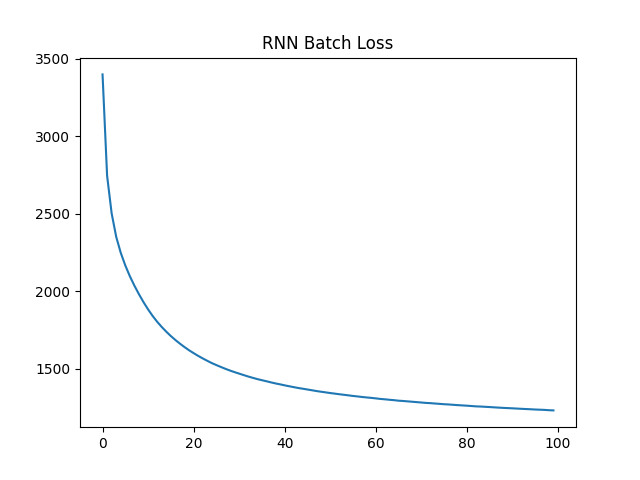

# 时序建模演进之路：从 MLP、RNN 到 LSTM 与 GRU

---

您是否好奇机器如何能像人类一样理解、生成流畅的文本，甚至是从海量代码中自动生成文档？这些自然语言处理 (NLP) 领域的迷人挑战，其核心在于模型处理和记忆 **序列数据** 的能力。

然而，并非所有模型都能胜任这项任务。经典的多层感知机 (MLP) 虽然强大，但在面对时间序列数据（如文本）时，常常显得力不从心，难以捕捉词语之间的依赖关系。为了克服这一局限，研究者们开发了循环神经网络 (RNN) 及其更强大的“记忆”变体——长短期记忆网络 (LSTM) 和门控循环单元 (GRU)。

本文将带您踏上一段从 MLP 到 LSTM 的演进之旅。我们将一起探索：

- 简单的前馈网络 (MLP) 为何难以处理序列数据？
- RNN 如何通过“循环”结构引入记忆，又为何会遭遇“遗忘”难题（如梯度消失）？
- LSTM 和 GRU 如何巧妙地设计“门控”机制，实现对信息的长期记忆和选择性遗忘？
- 不同的分词方法（如字符级、BPE、BBPE）如何影响模型的输入？

---

- [时序建模演进之路：从 MLP、RNN 到 LSTM 与 GRU](#时序建模演进之路从-mlprnn-到-lstm-与-gru)
  - [1. Dataset](#1-dataset)
  - [2. MLP](#2-mlp)
  - [3. RNN](#3-rnn)
    - [3.1. RNN Batch](#31-rnn-batch)
    - [3.2. 长序列遗忘问题](#32-长序列遗忘问题)
      - [3.2.1. 梯度消失问题](#321-梯度消失问题)
      - [3.2.2. 隐状态的覆盖与稀释](#322-隐状态的覆盖与稀释)
  - [4. LSTM](#4-lstm)
    - [4.1. LSTM 的数学解释](#41-lstm-的数学解释)
    - [4.2. 对长短期记忆的讨论](#42-对长短期记忆的讨论)
  - [5. GRU](#5-gru)
    - [5.1. GRU vs. LSTM](#51-gru-vs-lstm)
  - [6. 分词器](#6-分词器)
    - [6.1. Character Level](#61-character-level)
    - [6.2. Byte-Pair Encoding (BPE)](#62-byte-pair-encoding-bpe)
    - [6.3. BBPE](#63-bbpe)
  - [7. 代码仓库](#7-代码仓库)
  - [8. 参考文献](#8-参考文献)

---

(´∀｀)♡ 本文来源：[CSDN-Sylvan Ding](https://blog.csdn.net/IYXUAN)，版权归原作者所有，转载请注明出处。**如果您喜欢本文，欢迎点赞并收藏。**

---

## 1. Dataset

  

CodeSearchNet corpus is a dataset of 2 milllion (comment, code) pairs from opensource libraries hosted on GitHub. It contains code and documentation for several programming languages.

A data point consists of a function code along with its documentation. Each data point also contains meta data on the function, such as the repository it was extracted from.

```text
{
  'id': '0',
  'repository_name': 'organisation/repository',
  'func_path_in_repository': 'src/path/to/file.py',
  'func_name': 'func',
  'whole_func_string': 'def func(args):\n"""Docstring"""\n [...]',
  'language': 'python', 
  'func_code_string': '[...]',
  'func_code_tokens': ['def', 'func', '(', 'args', ')', ...],
  'func_documentation_string': 'Docstring',
  'func_documentation_string_tokens': ['Docstring'],
  'split_name': 'train',
  'func_code_url': 'https://github.com/<org>/<repo>/blob/<hash>/src/path/to/file.py#L111-L150'
}
```

More details can be found in [Huggingface: CodeSearchNet](https://huggingface.co/datasets/code-search-net/code_search_net).

We use [espejelomar/code_search_net_python_10000_examples](https://huggingface.co/datasets/espejelomar/code_search_net_python_10000_examples) as a subset of CodeSearchNet corpus for our experiments.

---

  

<!-- markdownlint-disable MD033 -->
<center>本文 MLP 和 RNN 在文本数据上的训练过程示意图.</center>
<!-- markdownlint-enable MD033 -->

## 2. MLP

核心代码：

```python
from datasets import load_dataset
from datasets.dataset_dict import DatasetDict


def load_training_dataset(
    dataset_name: str = "espejelomar/code_search_net_python_10000_examples",
    split: str = "train",
) -> DatasetDict:
    dataset = load_dataset(dataset_name, split=split).filter(
        lambda x: x["func_code_url"].startswith("https://github.com/apache")
    )
    return dataset


class CharacterTokenizer:
    def __init__(self, dataset):
        self.chars = set()
        self.char_to_index = {}
        self.index_to_char = {}
        self.bos_token = "<bos>"
        self.eos_token = "<eos>"
        self.bos_index = 0
        self.eos_index = 1

        self.build_vocab(dataset)

    def build_vocab(self, dataset):
        self.chars.update(char for char in "".join(dataset))
        chars_sorted = sorted(self.chars)
        self.char_to_index[self.bos_token] = self.bos_index
        self.char_to_index[self.eos_token] = self.eos_index
        self.char_to_index.update({char: i + 2 for i, char in enumerate(chars_sorted)})
        self.index_to_char = {i: char for char, i in self.char_to_index.items()}

    def encode(self, text):
        return [self.char_to_index[char] for char in text]

    def decode(self, indices):
        if isinstance(indices, int):
            return self.index_to_char[indices]
        elif isinstance(indices, list):
            return [self.index_to_char[i] for i in indices]
        else:
            raise ValueError(f"Invalid input type: {type(indices)}")

    def __len__(self):
        return len(self.char_to_index)


def autoregressive_text_processor(
    text: str,
    tokenizer: CharacterTokenizer,
    context_length: int = 10,
) -> tuple[list[list[int]], list[int]]:
    inputs, labels = [], []
    bos_index = tokenizer.bos_index
    eos_index = tokenizer.eos_index
    encoded_text = tokenizer.encode(text)
    x = [bos_index] * context_length + encoded_text + [eos_index]
    for i in range(len(x) - context_length):
        inputs.append(x[i : i + context_length])
        labels.append(x[i + context_length])
    return inputs, labels


def autoregressive_training_data_creator(
    dataset: DatasetDict | list[str] | str,
    tokenizer: CharacterTokenizer,
    context_length: int = 10,
) -> dict[str, list[int]]:
    if not isinstance(dataset, str):
        texts = dataset["whole_func_string"]
    if isinstance(texts, str):
        inputs, labels = autoregressive_text_processor(texts, tokenizer, context_length)
        return {"inputs": inputs, "labels": labels}
    inputs, labels = [], []
    for text in texts:
        input, label = autoregressive_text_processor(text, tokenizer, context_length)
        inputs.extend(input)
        labels.extend(label)
    return {"inputs": inputs, "labels": labels}


import torch
from torch import nn


class CharMLP(nn.Module):
    def __init__(
        self,
        vocab_size: int,
        embedding_dim: int = 32,
        hidden_dim: int = 512,
        context_length: int = 10,
    ):
        super().__init__()
        self.embedding = nn.Embedding(vocab_size, embedding_dim)
        self.mlp = nn.Sequential(
            nn.Linear(embedding_dim * context_length, hidden_dim),
            nn.LayerNorm(hidden_dim),
            nn.SiLU(),
            nn.Linear(hidden_dim, hidden_dim),
            nn.LayerNorm(hidden_dim),
            nn.SiLU(),
            nn.Linear(hidden_dim, vocab_size),
        )

    def forward(self, x: torch.Tensor) -> torch.Tensor:
        x = self.embedding(x)  # (batch_size, context_length, embedding_dim)
        x = x.view(x.size(0), -1)  # (batch_size, context_length * embedding_dim)
        return self.mlp(x)  # (batch_size, vocab_size)


def model_saver(model: nn.Module, path: str):
    os.makedirs(os.path.dirname(path), exist_ok=True)
    torch.save(model.state_dict(), path)
    logging.info(f"Model saved to {path}")


def train_model_mlp(
    model: nn.Module,
    optimizer: torch.optim.Optimizer,
    dataloader: DataLoader,
    loss_fn: nn.Module,
    num_epochs: int = 1000,
    print_every: int = 100,
    save_path: str = "./outputs",
):
    model.train()
    num_batches = len(dataloader)
    epoch_loss_list = []
    for epoch in range(num_epochs):
        epoch_loss = 0
        for batch_idx, data in enumerate(dataloader):
            inputs, labels = data["inputs"], data["labels"]
            outputs = model(inputs)
            loss = loss_fn(outputs, labels)
            optimizer.zero_grad()
            loss.backward()
            optimizer.step()

            batch_loss = round(loss.item() * 1000, 3)

            if batch_idx % print_every == 0:
                logging.info(
                    f"Epoch {epoch}/{num_epochs}, Batch {batch_idx}/{num_batches}, Loss: {batch_loss}"
                )

            epoch_loss += batch_loss

        epoch_loss /= num_batches
        epoch_loss_list.append(epoch_loss)

    model_saver(model, os.path.join(save_path, "checkpoints", "model.pth"))
    draw_loss(
        epoch_loss_list,
        os.path.join(save_path, "logs", "loss.png"),
        title="MLP Loss",
    )


@torch.no_grad()
def generate_text_mlp(
    model: torch.nn.Module,
    tokenizer: CharacterTokenizer,
    context: torch.Tensor,  # shape: (1, 10)
    max_length: int = 100,
    device: str = "cuda" if torch.cuda.is_available() else "cpu",
    model_path: str | None = None,
):
    if model_path is not None:
        assert os.path.exists(model_path), f"Model path {model_path} does not exist"
        logging.info(f"Loading model from {model_path}")
        model.load_state_dict(
            torch.load(model_path, map_location=device, weights_only=True)
        )
    model.eval()
    context = context.to(device)
    output = []
    for _ in range(max_length):
        logits = model(context)
        probs = F.softmax(logits, dim=-1)
        next_token = torch.multinomial(probs, num_samples=1)
        output.append(next_token.item())
        if next_token.item() == tokenizer.eos_index:
            break
        context = torch.cat([context[..., 1:], next_token], dim=-1)

    return tokenizer.decode(output)


import logging

import torch
from torch import nn
from torch.utils.data import DataLoader


def run(device: str = "cuda" if torch.cuda.is_available() else "cpu"):
    dataset = load_training_dataset()

    tokenizer = CharacterTokenizer(dataset["whole_func_string"])
    tokenized_dataset = dataset.map(
        lambda x: autoregressive_training_data_creator(x, tokenizer),
        batched=True,
        remove_columns=dataset.column_names,
        # load_from_cache_file=False,
    )
    tokenized_dataset.set_format(type="torch", device=device)

    logging.info(
        f"Shape of tokenized dataset: {tokenized_dataset['inputs'].shape}, {tokenized_dataset['labels'].shape}"
    )  # torch.Size([56006, 10]), torch.Size([56006])

    dataloader = DataLoader(tokenized_dataset, batch_size=512, shuffle=True)

    model = CharMLP(vocab_size=len(tokenizer)).to(device)

    optimizer = torch.optim.AdamW(model.parameters(), lr=1e-3)

    loss_fn = nn.CrossEntropyLoss()

    train_model_mlp(
        model,
        optimizer,
        dataloader,
        loss_fn,
        num_epochs=100,
        print_every=10,
        save_path="./outputs",
    )

    generated_text = generate_text_mlp(
        model,
        tokenizer,
        torch.zeros((1, 10), device=device, dtype=torch.long),
        # model_path="./outputs/checkpoints/model.pth",
    )
    print("".join(generated_text))


if __name__ == "__main__":
    logging.basicConfig(level=logging.INFO)
    run()
```

Loss:

  

Output:

```text
INFO:root:Shape of tokenized dataset: torch.Size([56006, 10]), torch.Size([56006])
INFO:root:Epoch 0/10, Batch 0/110, Loss: 4647.415
INFO:root:Epoch 0/10, Batch 10/110, Loss: 2894.608
INFO:root:Epoch 0/10, Batch 20/110, Loss: 2847.503
...
INFO:root:Epoch 99/100, Batch 90/110, Loss: 159.394
INFO:root:Epoch 99/100, Batch 100/110, Loss: 206.771
INFO:root:Model saved to ./outputs/checkpoints/model.pth
def modify_url_for_impersonation(velue))

        >>> sorted.lookup(1024)
        elif infer_range :
```

MLP（多层感知机）是一种前馈神经网络，适用于处理独立的数据点，但在处理序列数据（如文本、时间序列等）时存在局限性。MLP无法捕捉数据中的时序依赖关系，因为它假设输入数据是独立的，缺乏对上下文或顺序的建模能力。

相比之下，RNN（循环神经网络）专门设计用于处理序列数据。RNN通过引入隐藏状态，能够记住之前的输入信息，并在当前时间步利用这些信息来影响输出。这使得RNN在处理文本生成、语音识别、机器翻译等任务时表现更为优异，因为这些任务需要理解输入序列中的上下文和依赖关系。

RNN 相较于 MLP 具有以下几个优点：

1. **参数效率更高**：
   - 带时间窗口的 MLP 需要为每个时间步长或窗口内的数据点分配独立的权重，参数数量会随着时间窗口的增大而显著增加。而 RNN 通过共享权重（即同一个权重矩阵在每个时间步长重复使用），大大减少了参数数量，提高了模型的效率，尤其是在处理较长序列时。

2. **能够捕捉长期依赖关系**：
   - 带时间窗口的 MLP 只能处理固定大小的时间窗口，无法直接捕捉窗口之外的长期依赖关系。如果需要处理更长的依赖，必须增加窗口大小，导致计算复杂度和参数数量激增。而 RNN 理论上可以通过其循环结构捕捉任意长度的依赖关系（尽管在实际中可能受到梯度消失等问题的影响）。

3. **动态处理序列**：
   - RNN 能够处理变长序列数据，无需预先定义固定的时间窗口大小。相比之下，带时间窗口的 MLP 需要预先设定窗口大小，且对不同长度的序列适应性较差，可能需要额外的填充或截断操作。

4. **隐状态的记忆能力**：
   - RNN 通过隐状态（hidden state）在时间步之间传递信息，能够“记住”之前的输入信息，从而对序列中的上下文有更好的建模能力。而带时间窗口的 MLP 缺乏这种记忆机制，每个窗口的处理是独立的，无法直接利用窗口外的历史信息。

5. **更适合序列建模的结构**：
   - RNN 的循环结构天然适合序列数据的建模，能够更好地处理时间序列中的顺序信息和因果关系。而带时间窗口的 MLP 只是将时间序列数据展平为一个固定大小的向量，可能会丢失部分时序信息。

尽管 RNN 有上述优点，但在实际应用中，RNN 也存在一些局限性，例如梯度消失或梯度爆炸问题，导致其在捕捉长期依赖时效果不佳（可以通过 LSTM 或 GRU 等改进结构缓解）。此外，RNN 的序列处理方式使其难以并行化，训练速度可能不如 MLP 或 Transformer 等模型。

---

  

<!-- markdownlint-disable MD033 -->
<center>RNN, LSTM, and GRU cells.</center>
<!-- markdownlint-enable MD033 -->

## 3. RNN

  

RNN 的隐藏层计算公式：

$$
h_t = \tanh(W_{ih} x_t + b_{ih} + W_{hh} h_{t-1} + b_{hh})
$$

其中：

- $h_t$ 是当前时间步的隐藏状态
- $x_t$ 是当前时间步的输入
- $h_{t-1}$ 是前一时间步的隐藏状态
- $W_{ih}$ 是输入到隐藏层的权重矩阵
- $b_{ih}$ 是输入到隐藏层的偏置
- $W_{hh}$ 是隐藏层到隐藏层的权重矩阵
- $b_{hh}$ 是隐藏层到隐藏层的偏置
- $\tanh$ 是激活函数，用于引入非线性

输出公式：

$$
o_t = W_{ho} h_t + b_{ho}
$$

其中：

- $o_t$ 是当前时间步的输出
- $W_{ho}$ 是隐藏层到输出层的权重矩阵
- $b_{ho}$ 是隐藏层到输出层的偏置

Loss:

  

Output:

```text
INFO:root:Shape of dataset: 48
INFO:root:Epoch 0/10, Batch 0/48, Loss: 4731.576
INFO:root:Epoch 0/10, Batch 10/48, Loss: 3478.167
...
INFO:root:Epoch 9/10, Batch 0/48, Loss: 1885.701
INFO:root:Epoch 9/10, Batch 10/48, Loss: 1685.585
INFO:root:Epoch 9/10, Batch 20/48, Loss: 1675.268
INFO:root:Epoch 9/10, Batch 30/48, Loss: 1351.528
INFO:root:Epoch 9/10, Batch 40/48, Loss: 2299.495
INFO:root:Model saved to ./outputs/checkpoints/model.pth
INFO:root:Loading model from ./outputs/checkpoints/model.pth
def ):
        valued as lreataurt().dtype, in enith f_vatilion(([boIal_boname(k 2h5lax))._shourt([10
```

核心代码：

```python
class RNNCell(nn.Module):
    def __init__(self, input_size, hidden_size):
        super().__init__()
        self.input_size = input_size
        self.hidden_size = hidden_size
        combined_size = self.input_size + self.hidden_size
        self.mlp_ih = nn.Linear(combined_size, hidden_size)
        self.activation = nn.Tanh()
        self.norm = nn.LayerNorm(hidden_size)

    def forward(self, input, hidden=None):
        if hidden is None:
            hidden = torch.zeros((1, self.hidden_size), device=input.device)
        combined = torch.cat((input, hidden), dim=-1)  # (1, H + I)
        hidden = self.norm(self.activation(self.mlp_ih(combined)))  # (1, H)
        return hidden


class CharRNN(nn.Module):
    def __init__(self, vocab_size, embedding_dim=32, hidden_size=64):
        super().__init__()
        self.vocab_size = vocab_size
        self.embedding_dim = embedding_dim
        self.hidden_size = hidden_size
        self.embedding = nn.Embedding(vocab_size, embedding_dim)
        self.rnn_cell = RNNCell(embedding_dim, hidden_size)
        self.mlp_ho = nn.Linear(hidden_size, vocab_size)

    def forward(self, input, hidden=None):
        embedded = self.embedding(input)  # (1) -> (1, E)
        hidden = self.rnn_cell(embedded, hidden)  # (1, H)
        output = self.mlp_ho(hidden)  # (1, V)
        return output, hidden


def rnn_training_data_creator(
    text: str,
    tokenizer: CharacterTokenizer,
) -> tuple[list[int], list[int]]:
    tokenized = tokenizer.encode(text)
    # inputs = [tokenizer.bos_index] + tokenized
    # labels = tokenized + [tokenizer.eos_index]
    inputs = tokenized
    labels = tokenized[1:] + [tokenizer.eos_index]
    return inputs, labels


def train_model_rnn(
    model: nn.Module,
    optimizer: torch.optim.Optimizer,
    dataloader: list[str],
    tokenizer: CharacterTokenizer,
    loss_fn: nn.Module,
    num_epochs: int = 1000,
    print_every: int = 100,
    save_path: str = "./outputs",
):
    model.train()
    num_batches = len(dataloader)
    epoch_loss_list = []
    device = next(model.parameters()).device
    for epoch in range(num_epochs):
        epoch_loss = 0
        for batch_idx, data in enumerate(dataloader):
            inputs, labels = rnn_training_data_creator(data, tokenizer)
            inputs = torch.tensor(inputs, device=device).unsqueeze(0)  # (1, ...)
            labels = torch.tensor(labels, device=device).unsqueeze(0)  # (1, ...)
            hidden = None
            loss = torch.tensor(0.0, device=device)
            for i in range(inputs.shape[1]):
                output, hidden = model(inputs[:, i], hidden)
                loss = loss + loss_fn(output, labels[:, i])
            loss = loss / inputs.shape[1]
            optimizer.zero_grad()
            loss.backward()
            optimizer.step()

            batch_loss = round(loss.item() * 1000, 3)

            if batch_idx % print_every == 0:
                logging.info(
                    f"Epoch {epoch}/{num_epochs}, Batch {batch_idx}/{num_batches}, Loss: {batch_loss}"
                )

            epoch_loss += batch_loss

        epoch_loss /= num_batches
        epoch_loss_list.append(epoch_loss)

    model_saver(model, os.path.join(save_path, "checkpoints", "model.pth"))
    draw_loss(
        epoch_loss_list,
        os.path.join(save_path, "logs", "loss.png"),
        title="RNN Loss",
    )


@torch.no_grad()
def generate_text_rnn(
    model: torch.nn.Module,
    tokenizer: CharacterTokenizer,
    max_length: int = 100,
    device: str = "cuda" if torch.cuda.is_available() else "cpu",
    model_path: str | None = None,
):
    if model_path is not None:
        assert os.path.exists(model_path), f"Model path {model_path} does not exist"
        logging.info(f"Loading model from {model_path}")
        model.load_state_dict(
            torch.load(model_path, map_location=device, weights_only=True)
        )
    model.eval()
    outputs = []
    next_token = torch.tensor((tokenizer.encode("d")[0],), device=device)
    outputs.append(next_token.item())
    hidden = None
    for _ in range(max_length):
        output, hidden = model(next_token, hidden)
        probs = F.softmax(output, dim=-1)
        next_token = torch.multinomial(probs, num_samples=1).squeeze(0)
        outputs.append(next_token.item())
        if next_token.item() == tokenizer.eos_index:
            break

    return tokenizer.decode(outputs)


def run(device: str = "cuda" if torch.cuda.is_available() else "cpu"):
    dataset = load_training_dataset()["whole_func_string"]

    tokenizer = CharacterTokenizer(dataset)

    logging.info(f"Shape of dataset: {len(dataset)}")

    model = CharRNN(vocab_size=len(tokenizer)).to(device)

    optimizer = torch.optim.AdamW(model.parameters(), lr=1e-2)

    loss_fn = nn.CrossEntropyLoss()

    train_model_rnn(
        model,
        optimizer,
        dataset,
        tokenizer,
        loss_fn,
        num_epochs=10,
        print_every=10,
        save_path="./outputs",
    )

    generated_text = generate_text_rnn(
        model,
        tokenizer,
        model_path="./outputs/checkpoints/model.pth",
    )
    print("".join(generated_text))


if __name__ == "__main__":
    logging.basicConfig(level=logging.INFO)
    run()
```

### 3.1. RNN Batch

Loss:

  

Output:

```text
INFO:root:Shape of tokenized dataset: torch.Size([55526, 10]), torch.Size([55526, 10])
INFO:root:Epoch 0/100, Batch 0/109, Loss: 4717.875
INFO:root:Epoch 0/100, Batch 10/109, Loss: 3532.494
INFO:root:Epoch 0/100, Batch 20/109, Loss: 3242.316
INFO:root:Epoch 0/100, Batch 30/109, Loss: 3014.339
INFO:root:Epoch 0/100, Batch 40/109, Loss: 2884.775
...
INFO:root:Epoch 99/100, Batch 80/109, Loss: 1459.405
INFO:root:Epoch 99/100, Batch 90/109, Loss: 1371.348
INFO:root:Epoch 99/100, Batch 100/109, Loss: 1396.691
INFO:root:Model saved to ./outputs/checkpoints/model.pth
def and to None: and ncolet_names.append(["ault, dreple.deftequtiod_to_replace : Convert default of act
```

核心代码：

```python
def rnn_batch_text_processor(
    text: str,
    tokenizer: CharacterTokenizer,
    sequence_length: int = 10,
) -> tuple[list[list[int]], list[int]]:
    inputs, labels = [], []
    eos_index = tokenizer.eos_index
    encoded_text = tokenizer.encode(text)
    x = encoded_text + [eos_index]
    if len(x) >= sequence_length:
        for i in range(len(x) - sequence_length):
            inputs.append(x[i : i + sequence_length])
            labels.append(x[i + 1 : i + sequence_length + 1])
    return inputs, labels


def rnn_batch_training_data_creator(
    dataset: DatasetDict | list[str] | str,
    tokenizer: CharacterTokenizer,
    sequence_length: int = 10,
) -> dict[str, list[int]]:
    if not isinstance(dataset, str):
        texts = dataset["whole_func_string"]
    if isinstance(texts, str):
        inputs, labels = rnn_batch_text_processor(texts, tokenizer, sequence_length)
        return {"inputs": inputs, "labels": labels}
    inputs, labels = [], []
    for text in texts:
        input, label = rnn_batch_text_processor(text, tokenizer, sequence_length)
        inputs.extend(input)
        labels.extend(label)
    return {"inputs": inputs, "labels": labels}


class RNNCell(nn.Module):
    def __init__(self, input_size, hidden_size):
        super().__init__()
        self.input_size = input_size
        self.hidden_size = hidden_size
        combined_size = self.input_size + self.hidden_size
        self.i2h = nn.Sequential(
            nn.Linear(combined_size, hidden_size),
            nn.SiLU(),
            nn.LayerNorm(hidden_size),
        )

    def forward(self, input, hidden=None):
        B, T, C = input.shape
        input = input.transpose(0, 1)  # (T, B, C)
        if hidden is None:
            hidden = torch.zeros((B, self.hidden_size), device=input.device)
        outputs = []
        for i in range(T):
            combined = torch.cat((input[i], hidden), dim=-1)  # (B, H + C)
            hidden = self.i2h(combined)  # (B, H)
            outputs.append(hidden)
        outputs = torch.stack(outputs, dim=0)  # (T, B, H)
        return outputs.transpose(0, 1)  # (B, T, H)


class CharRNNBatch(nn.Module):
    def __init__(self, vocab_size, embedding_dim=32, hidden_size=64):
        super().__init__()
        self.vocab_size = vocab_size
        self.embedding_dim = embedding_dim
        self.hidden_size = hidden_size
        self.embedding = nn.Embedding(vocab_size, embedding_dim)
        self.dropout = nn.Dropout(0.1)
        # multi-layer RNN
        self.rnn1 = RNNCell(embedding_dim, hidden_size)
        self.rnn2 = RNNCell(hidden_size, hidden_size)
        self.mlp_ho = nn.Linear(hidden_size, vocab_size)

    def forward(self, input):
        embedded = self.embedding(input)  # (B, T) -> (B, T, E)
        hidden = self.dropout(self.rnn1(embedded))  # (B, T, H)
        hidden = self.dropout(self.rnn2(hidden))  # (B, T, H)
        outputs = self.mlp_ho(hidden)  # (B, T, V)
        return outputs


def train_model_rnn_batch(
    model: nn.Module,
    optimizer: torch.optim.Optimizer,
    dataloader: DataLoader,
    loss_fn: nn.Module,
    num_epochs: int = 1000,
    print_every: int = 100,
    save_path: str = "./outputs",
):
    model.train()
    num_batches = len(dataloader)
    epoch_loss_list = []
    for epoch in range(num_epochs):
        epoch_loss = 0
        for batch_idx, data in enumerate(dataloader):
            inputs, labels = data["inputs"], data["labels"]
            logits = model(inputs)  # (B, T, V)
            loss = loss_fn(logits.transpose(-2, -1), labels)
            optimizer.zero_grad()
            loss.backward()
            optimizer.step()

            batch_loss = round(loss.item() * 1000, 3)

            if batch_idx % print_every == 0:
                logging.info(
                    f"Epoch {epoch}/{num_epochs}, Batch {batch_idx}/{num_batches}, Loss: {batch_loss}"
                )

            epoch_loss += batch_loss

        epoch_loss /= num_batches
        epoch_loss_list.append(epoch_loss)

    model_saver(model, os.path.join(save_path, "checkpoints", "model.pth"))
    draw_loss(
        epoch_loss_list,
        os.path.join(save_path, "logs", "loss.png"),
        title="RNN Batch Loss",
    )


@torch.no_grad()
def generate_text_rnn_batch(
    model: torch.nn.Module,
    tokenizer: CharacterTokenizer,
    context: torch.Tensor,
    sequence_length: int = 10,
    max_length: int = 100,
    device: str = "cuda" if torch.cuda.is_available() else "cpu",
    model_path: str | None = None,
):
    if model_path is not None:
        assert os.path.exists(model_path), f"Model path {model_path} does not exist"
        logging.info(f"Loading model from {model_path}")
        model.load_state_dict(
            torch.load(model_path, map_location=device, weights_only=True)
        )
    model.eval()
    context = context.to(device)
    output = [] if context is None else context.tolist()[0]
    for _ in range(max_length):
        logits = model(context[..., -sequence_length:])[:, -1, :]
        probs = F.softmax(logits, dim=-1)
        next_token = torch.multinomial(probs, num_samples=1)
        output.append(next_token.item())
        if next_token.item() == tokenizer.eos_index:
            break
        context = torch.cat([context, next_token], dim=-1)

    return tokenizer.decode(output)


def run(device: str = "cuda" if torch.cuda.is_available() else "cpu"):
    sequence_length = 10

    dataset = load_training_dataset()

    tokenizer = CharacterTokenizer(dataset["whole_func_string"])
    tokenized_dataset = dataset.map(
        lambda x: rnn_batch_training_data_creator(x, tokenizer, sequence_length),
        batched=True,
        remove_columns=dataset.column_names,
        # load_from_cache_file=False,
    )
    tokenized_dataset.set_format(type="torch", device=device)

    logging.info(
        f"Shape of tokenized dataset: {tokenized_dataset['inputs'].shape}, {tokenized_dataset['labels'].shape}"
    )  # torch.Size([55526, 10]), torch.Size([55526, 10])

    dataloader = DataLoader(tokenized_dataset, batch_size=512, shuffle=True)

    model = CharRNNBatch(vocab_size=len(tokenizer)).to(device)

    optimizer = torch.optim.AdamW(model.parameters(), lr=1e-3)

    loss_fn = nn.CrossEntropyLoss()

    train_model_rnn_batch(
        model,
        optimizer,
        dataloader,
        loss_fn,
        num_epochs=100,
        print_every=10,
        save_path="./outputs",
    )

    generated_text = generate_text_rnn_batch(
        model,
        tokenizer,
        torch.tensor(
            tokenizer.encode("def"), device=device, dtype=torch.long
        ).unsqueeze(0),
        sequence_length=10,
        # model_path="./outputs/checkpoints/model.pth",
    )
    print("".join(generated_text))


if __name__ == "__main__":
    logging.basicConfig(level=logging.INFO)
    run()
```

### 3.2. 长序列遗忘问题

梯度消失问题和隐状态的覆盖与稀释问题是 RNN 中导致长序列遗忘问题的两个主要因素。

#### 3.2.1. 梯度消失问题

RNN 的“梯度消失”问题可以通过反向传播通过时间（Backpropagation Through Time, BPTT）的梯度计算公式来解释：

**RNN 的基本结构和前向传播**

RNN 在每个时间步 $t$ 的隐状态 $h_t$ 和输出 $y_t$ 通常定义如下：

$$
h_t = \tanh(W_{hh} h_{t-1} + W_{xh} x_t + b_h)
$$

$$
y_t = W_{hy} h_t + b_y
$$

隐状态 $h_t$ 依赖于前一时间步的隐状态 $h_{t-1}$，这种递归关系使得信息可以沿着时间步传递。

**反向传播通过时间（BPTT）**

在训练 RNN 时，损失函数 $L$ 是对所有时间步的损失 $L_t$ 求和：

$$
L = \sum_{t=1}^T L_t
$$

计算损失 $L$ 对参数的梯度 $\frac{\partial L}{\partial W_{hh}}$。由于 RNN 的循环结构，梯度计算需要通过 BPTT 展开时间步，计算每个时间步的贡献。根据链式法则，这个梯度可以分解为：

$$
\frac{\partial L}{\partial W_{hh}} = \sum_{t=1}^T \frac{\partial L}{\partial h_t} \frac{\partial h_t}{\partial W_{hh}}
$$

$\frac{\partial L}{\partial h_t}$ 这个量本身在反向传播（BPTT）过程中计算，它累积了当前时间步和未来所有时间步对损失的贡献。考虑损失 $L$ 对隐状态 $h_t$ 的梯度 $\frac{\partial L}{\partial h_t}$，它包含两部分：

1. 当前时间步的直接影响：$\frac{\partial L_t}{\partial h_t}$；
2. 未来时间步通过隐状态传递的影响：$\frac{\partial L_{t+1:T}}{\partial h_t}$。

因此：
$$
\frac{\partial L}{\partial h_t} = \frac{\partial L_t}{\partial h_t} + \frac{\partial L_{t+1:T}}{\partial h_t}
$$
其中，未来时间步的影响通过链式法则展开：
$$
\frac{\partial L_{t+1:T}}{\partial h_t} = \sum_{k=t+1}^T \frac{\partial L_k}{\partial h_k} \cdot \frac{\partial h_k}{\partial h_t}
$$

**隐状态之间的梯度传递**

隐状态之间的依赖关系为：

$$
h_{t+1} = \tanh(W_{hh} h_t + W_{xh} x_{t+1} + b_h)
$$

因此，$\frac{\partial h_{t+1}}{\partial h_t} = \text{diag}(\tanh'(W_{hh} h_t + W_{xh} x_{t+1} + b_h)) \cdot W_{hh}$

其中 $\tanh'(x) = 1 - \tanh^2(x)$，其值在 $[-1, 1]$ 之间，通常小于 1。

对于更远的时间步，梯度需要多次乘以 $W_{hh}$ 和 $\tanh'$。假设从时间步 $t$ 到 $k$ （$k > t$），梯度传递为：

$$
\frac{\partial h_k}{\partial h_t} = \prod_{i=t+1}^k \text{diag}(\tanh'(W_{hh} h_{i-1} + W_{xh} x_i + b_h)) \cdot W_{hh}
$$

在上述公式中，梯度 $\frac{\partial h_k}{\partial h_t}$ 包含了 $k-t$ 次矩阵乘法和 $\tanh'$ 的乘积。如果 $W_{hh}$ 的特征值小于 1，或者 $\tanh'$ 的值持续小于 1，多次乘法会导致梯度值指数级衰减。

因此，当序列很长（即 $k-t$ 很大）时，梯度 $\frac{\partial h_k}{\partial h_t}$ 会趋近于 0，导致早期时间步的隐状态 $h_t$ 对后续损失 $L_k$ 的影响几乎为 0，模型学习不到早期时间步对当前时间步的影响。这就是“梯度消失”问题：模型无法有效学习到长距离依赖，因为早期时间步的参数更新几乎没有梯度支持。

**改进方法（如 LSTM）**

为了解决梯度消失问题，LSTM 引入了遗忘门、输入门和输出门，允许梯度通过“细胞状态”（cell state）以加法形式传递，而不是乘法形式，从而避免了指数级衰减。具体来说，LSTM 的细胞状态更新公式为：

$$
c_t = f_t \cdot c_{t-1} + i_t \cdot \tilde{c}_t
$$

其中 $f_t$ 是遗忘门，控制保留多少历史信息；$i_t$ 是输入门，控制添加多少新信息。由于 $c_t$ 的更新是加法操作，梯度不会像 RNN 那样快速消失，从而更好地捕捉长期依赖。

#### 3.2.2. 隐状态的覆盖与稀释

隐状态的覆盖与稀释问题是指 RNN 的隐状态 $h_t$ 在每个时间步都会被新输入信息更新，导致早期时间步的信息在隐状态中逐渐被覆盖或稀释，最终丢失。

RNN 的隐状态更新公式为：

$$
h_t = \tanh(W_{hh} h_{t-1} + W_{xh} x_t + b_h)
$$

每次更新时，新的输入 $x_t$ 和前一隐状态 $h_{t-1}$ 的组合会生成新的 $h_t$。随着时间步的增加，早期时间步的信息在 $h_t$ 中的占比越来越小，最终可能被完全覆盖或稀释掉。

## 4. LSTM

  

LSTM 的计算公式如下：

1. **遗忘门（Forget Gate）**：决定需要丢弃的信息。
   $$
   f_t = \sigma(W_f \cdot [h_{t-1}, x_t] + b_f)
   $$
   其中，$f_t$ 是遗忘门的输出，$W_f$ 是权重矩阵，$b_f$ 是偏置，$h_{t-1}$ 是上一时刻的隐藏状态，$x_t$ 是当前输入，$\sigma$ 是 sigmoid 激活函数。

2. **输入门（Input Gate）**：决定需要更新的信息。
   $$
   i_t = \sigma(W_i \cdot [h_{t-1}, x_t] + b_i)
   $$
   其中，$i_t$ 是输入门的输出。

3. **候选单元状态（Candidate Cell State）**：计算候选的新信息。
   $$
   \tilde{C}_t = \tanh(W_C \cdot [h_{t-1}, x_t] + b_C)
   $$
   其中，$\tilde{C}_t$ 是候选单元状态，$\tanh$ 是双曲正切激活函数。

4. **单元状态更新（Cell State Update）**：结合遗忘门和输入门更新单元状态。
   $$
   C_t = f_t \cdot C_{t-1} + i_t \cdot \tilde{C}_t
   $$
   其中，$C_t$ 是当前时刻的单元状态，$C_{t-1}$ 是上一时刻的单元状态。

5. **输出门（Output Gate）**：决定输出的信息。
   $$
   o_t = \sigma(W_o \cdot [h_{t-1}, x_t] + b_o)
   $$
   其中，$o_t$ 是输出门的输出。

6. **隐藏状态更新（Hidden State Update）**：基于输出门和单元状态计算最终输出。
   $$
   h_t = o_t \cdot \tanh(C_t)
   $$
   其中，$h_t$ 是当前时刻的隐藏状态。

Loss:

  

Output:

```text
INFO:root:Shape of tokenized dataset: torch.Size([55526, 10]), torch.Size([55526, 10])
INFO:root:Epoch 0/100, Batch 0/109, Loss: 4593.426
INFO:root:Epoch 0/100, Batch 10/109, Loss: 4332.986
INFO:root:Epoch 0/100, Batch 20/109, Loss: 4016.002
INFO:root:Epoch 0/100, Batch 30/109, Loss: 3568.88
INFO:root:Epoch 0/100, Batch 40/109, Loss: 3243.886
...
INFO:root:Epoch 99/100, Batch 90/109, Loss: 1251.924
INFO:root:Epoch 99/100, Batch 100/109, Loss: 1215.728
INFO:root:Model saved to ./outputs/checkpoints/model.pth
defa1
               if not be recorly sequence(starting refload``.long))):
```

核心代码：

```python
class LSTMCell(nn.Module):
    def __init__(self, input_size, hidden_size):
        super().__init__()
        self.input_size = input_size
        self.hidden_size = hidden_size
        combined_size = self.input_size + self.hidden_size
        # 4 * hidden_size: forget gate, input gate, candidate cell state, output gate
        self.linear = nn.Linear(combined_size, 4 * self.hidden_size)
        self.init_weight()

    def forward(self, input, state=None):
        B, _ = input.shape  # (B, C)
        if state is None:
            state = self.init_state(B, input.device)
        cs, hs = state  # (B, H)
        combined = torch.cat((input, hs), dim=-1)  # (B, C + H)
        gates_linear = self.linear(combined)  # (B, 4H)
        # forget gate, input gate, candidate cell state, output gate
        f, i, g, o = gates_linear.chunk(4, dim=-1)  # ((B, H) * 4)
        forget_gate = F.sigmoid(f)
        input_gate = F.sigmoid(i)
        candidate_cs = F.tanh(g)
        output_gate = F.sigmoid(o)
        cs = forget_gate * cs + input_gate * candidate_cs
        hs = output_gate * F.tanh(cs)
        return cs, hs

    def init_weight(self):
        # Tanh/Sigmoid vanishing gradients can be solved with Xavier initialization
        stdv = 1.0 / torch.sqrt(torch.tensor(self.hidden_size))
        for weight in self.parameters():
            nn.init.uniform_(weight, -stdv, stdv)

        # set bias of forget gate to 1 to keep the cell state
        if hasattr(self.linear, "bias") and self.linear.bias is not None:
            self.linear.bias.data[: self.hidden_size] = 1.0

    def init_state(self, B, device):
        cs = torch.zeros((B, self.hidden_size), device=device)
        hs = torch.zeros((B, self.hidden_size), device=device)
        return cs, hs


class CharLSTM(nn.Module):
    def __init__(self, vocab_size, embedding_dim=32, hidden_size=64):
        super().__init__()
        self.vocab_size = vocab_size
        self.embedding_dim = embedding_dim
        self.hidden_size = hidden_size
        self.embedding = nn.Embedding(vocab_size, embedding_dim)
        self.lstm = LSTMCell(embedding_dim, hidden_size)
        self.mlp_ho = nn.Linear(hidden_size, vocab_size)

    def forward(self, input):
        embedded = self.embedding(input)  # (B, T) -> (B, T, E)
        B, T, C = embedded.shape
        embedded = embedded.transpose(0, 1)  # (T, B, C)
        outputs = []
        state = None
        for i in range(T):
            state = self.lstm(embedded[i], state)
            outputs.append(state[1])
        outputs = torch.stack(outputs, dim=0)  # (T, B, H)
        outputs = self.mlp_ho(outputs)  # (T, B, V)
        return outputs.transpose(0, 1)  # (B, T, V)


def run(device: str = "cuda" if torch.cuda.is_available() else "cpu"):
    sequence_length = 10

    dataset = load_training_dataset()

    tokenizer = CharacterTokenizer(dataset["whole_func_string"])
    tokenized_dataset = dataset.map(
        lambda x: rnn_batch_training_data_creator(x, tokenizer, sequence_length),
        batched=True,
        remove_columns=dataset.column_names,
        # load_from_cache_file=False,
    )
    tokenized_dataset.set_format(type="torch", device=device)

    logging.info(
        f"Shape of tokenized dataset: {tokenized_dataset['inputs'].shape}, {tokenized_dataset['labels'].shape}"
    )  # torch.Size([55526, 10]), torch.Size([55526, 10])

    dataloader = DataLoader(tokenized_dataset, batch_size=512, shuffle=True)

    model = CharLSTM(vocab_size=len(tokenizer)).to(device)

    optimizer = torch.optim.AdamW(model.parameters(), lr=1e-3)

    loss_fn = nn.CrossEntropyLoss()

    train_model_rnn_batch(
        model,
        optimizer,
        dataloader,
        loss_fn,
        num_epochs=100,
        print_every=10,
        save_path="./outputs",
    )

    generated_text = generate_text_rnn_batch(
        model,
        tokenizer,
        torch.tensor(
            tokenizer.encode("def"), device=device, dtype=torch.long
        ).unsqueeze(0),
        sequence_length=10,
        # model_path="./outputs/checkpoints/model.pth",
    )
    print("".join(generated_text))


if __name__ == "__main__":
    logging.basicConfig(level=logging.INFO)
    run()
```

### 4.1. LSTM 的数学解释

RNN 的核心问题回顾：

1. **梯度消失 (Vanishing Gradient)**：在反向传播（BPTT）中，计算 $\frac{\partial L}{\partial h_t}$ 时，梯度需要乘以 $\frac{\partial h_k}{\partial h_t} = \prod_{i=t+1}^k \text{diag}(\tanh'(\dots)) \cdot W_{hh}$。由于 $\tanh'$ 的值小于等于 1，且 $W_{hh}$ 的范数可能小于 1，这个乘积在长序列（大的 $k-t$）下会指数级衰减趋近于 0，导致无法学习长期依赖。
2. **信息覆盖/稀释 (Information Overwriting/Dilution)**：RNN 的隐藏状态更新 $h_t = \tanh(W_{hh} h_{t-1} + W_{xh} x_t + b_h)$ 在每一步都将旧状态 $h_{t-1}$ 与新输入 $x_t$ 混合，通过非线性变换。经过多步后，早期信息可能被完全覆盖或稀释。

LSTM 通过引入**门控机制 (Gating Mechanism)** 和一个独立的**细胞状态 (Cell State)** $C_t$ 来解决这些问题。

**1. 解决梯度消失问题**

关键在于 LSTM 的细胞状态更新：

$$
C_t = f_t \odot C_{t-1} + i_t \odot \tilde{C}_t
$$

其中 $f_t$ 是遗忘门，$i_t$ 是输入门。

在反向传播计算 $\frac{\partial L}{\partial C_{t-1}}$ 时，根据链式法则，梯度会通过 $C_t$ 传递：

$$
\frac{\partial L}{\partial C_{t-1}} = \frac{\partial L}{\partial C_t} \frac{\partial C_t}{\partial C_{t-1}}
$$

计算 $\frac{\partial C_t}{\partial C_{t-1}}$：

$$
\frac{\partial C_t}{\partial C_{t-1}} = \frac{\partial}{\partial C_{t-1}} (f_t \odot C_{t-1} + i_t \odot \tilde{C}_t)
$$

由于 $f_t, i_t, \tilde{C}_t$ 也依赖于 $h_{t-1}$，而 $h_{t-1}$ 又依赖于 $C_{t-1}$ (通过 $h_{t-1} = o_{t-1} \odot \tanh(C_{t-1})$)，这个求导会比较复杂。但核心在于第一项 $f_t \odot C_{t-1}$：

$$
\frac{\partial (f_t \odot C_{t-1})}{\partial C_{t-1}} = f_t \odot \frac{\partial C_{t-1}}{\partial C_{t-1}} + \frac{\partial f_t}{\partial C_{t-1}} \odot C_{t-1} = f_t + \text{依赖于门导数的项}
$$

因此，$\frac{\partial C_t}{\partial C_{t-1}}$ 中包含了一个直接的 $f_t$ 项（以及其他项）。当梯度沿着时间反向传播时，从 $C_t$ 到 $C_k$ ( $k < t$ ) 的梯度路径包含：

$$
\frac{\partial C_t}{\partial C_k} = \prod_{j=k+1}^t \frac{\partial C_j}{\partial C_{j-1}} = \prod_{j=k+1}^t (f_j + \dots)
$$

关键点在于这个路径主要是**加法和逐元素乘法** (通过 $f_j$)，而不是像 RNN 中那样涉及重复的**矩阵乘法** ($W_{hh}$)。遗忘门 $f_j$ 的值由 sigmoid 函数决定，在 $[0, 1]$ 之间。如果网络学习到在需要保留信息时将 $f_j$ 设置为接近 1，梯度就可以几乎无衰减地流过这些时间步。即使 $f_j$ 小于 1，衰减也是逐元素发生的，并且没有 RNN 中 $W_{hh}$ 矩阵乘法可能导致的快速、统一的衰减。这种结构使得梯度能够更有效地传播到较早的时间步，缓解了梯度消失问题。细胞状态 $C_t$ 就像一条“传送带”，信息和梯度可以在其上相对顺畅地流动。

**2. 解决信息覆盖/稀释问题**

LSTM 通过门控机制精确控制信息流：

- **遗忘门 $f_t = \sigma(W_f \cdot [h_{t-1}, x_t] + b_f)$**：决定从上一个细胞状态 $C_{t-1}$ 中**遗忘**多少信息。$f_t$ 的每个元素值接近 0 时，对应维度的旧信息被遗忘；接近 1 时，旧信息被保留。这通过 $f_t \odot C_{t-1}$ 实现。
- **输入门 $i_t = \sigma(W_i \cdot [h_{t-1}, x_t] + b_i)$**：决定将多少**新的候选信息** $\tilde{C}_t = \tanh(W_C \cdot [h_{t-1}, x_t] + b_C)$ 添加到细胞状态中。$i_t$ 的每个元素值决定对应维度的新信息的更新程度。这通过 $i_t \odot \tilde{C}_t$ 实现。
- **输出门 $o_t = \sigma(W_o \cdot [h_{t-1}, x_t] + b_o)$**：决定细胞状态 $C_t$ 中的哪些信息需要输出到当前的隐藏状态 $h_t$。这通过 $h_t = o_t \odot \tanh(C_t)$ 实现。

与 RNN 中 $h_t$ 总是由 $h_{t-1}$ 和 $x_t$ 的固定组合变换而来不同，LSTM 的细胞状态 $C_t$ 的更新是**选择性**的。它可以通过 $f_t \approx 1$ 和 $i_t \approx 0$ 来**完全保留**旧信息 $C_{t-1}$，也可以通过 $f_t \approx 0$ 和 $i_t \approx 1$ 来**完全丢弃**旧信息并替换为新信息 $\tilde{C}_t$，或者介于两者之间进行加权组合。这种精细的控制机制使得 LSTM 能够根据需要长期存储或选择性更新信息，避免了简单 RNN 中信息的强制混合和覆盖问题。

### 4.2. 对长短期记忆的讨论

Cell State 主要用于存储长期记忆信息，通过遗忘门和输入门的控制，它倾向于保留对长期依赖有用的信息。而 Hidden State 则更多地反映当前时间步的短期上下文信息。

**Hidden State 是必须存在的吗**

试想，如果只有 Cell State，那么输出 $h_t$ 将不会被传递给下一个时间步。因此，Hidden State 不仅是当前时间步的输出，也是传递给下一个时间步的重要信息载体。它的存在使得下一个时间步的门控机制（如遗忘门、输入门）能够根据前一时间步的上下文进行决策。如果没有 Hidden State，模型将无法利用前一时间步的短期上下文来影响下一个时间步的计算，导致信息流动中断，模型对序列的建模能力下降。

**为什么 Cell State 存储长期记忆而 Hidden State 存储短期记忆**

Cell State（细胞状态）是 LSTM 的核心创新之一，专门设计用来存储和传递长期信息。它通过加法操作更新，避免了传统 RNN 中由于反复的矩阵乘法和非线性变换导致的梯度消失问题。Cell State 的更新公式为：

$$
C_t = f_t \cdot C_{t-1} + i_t \cdot \tilde{C}_t
$$

其中，$f_t$（遗忘门）控制保留多少旧信息，$i_t$（输入门）控制添加多少新信息。这种加法更新机制使得信息可以以较小的衰减（甚至无衰减，如果 $f_t \approx 1$）传递到未来的时间步，因此 Cell State 能够存储长期依赖信息。

Hidden State（隐藏状态）是通过输出门 $o_t$ 和 Cell State 的非线性变换得到的：

$$
h_t = o_t \cdot \tanh(C_t)
$$

RNN 的隐藏状态更新公式为：

$$
h_t = \tanh(W_{hh} h_{t-1} + W_{xh} x_t + b_h)
$$

RNN 的 Hidden State 由于更新机制的限制（信息覆盖和梯度消失），难以存储长期依赖，而 LSTM 的 Hidden State 虽然有 Cell State 辅助，但其本身仍然更多受到当前时间步和近期输入的影响。因为输出门 $o_t = \sigma(W_o \cdot [h_{t-1}, x_t] + b_o))$，它直接依赖于当前输入 $x_t$ 和前一时间步的 Hidden State $h_{t-1}$，这意味着输出门 $o_t$ 的值会受到当前时间步输入和近期上下文的强烈影响，从而决定了从 Cell State $C_t$ 中提取哪些信息作为 Hidden State $h_t$。由于 $o_t$ 主要由当前输入 $x_t$ 和前一时间步的 $h_{t-1}$ 决定，它更倾向于关注当前时间步和近期的信息，而不是 Cell State 中存储的长期依赖信息。因此，即使 Cell State $C_t$ 包含长期记忆，Hidden State $h_t$ 也会通过 $o_t$ 的调节，更多地反映当前和近期的上下文。

**LSTM 的 Cell State 更新机制与 ResNet 的设计理念有一定的相似之处**

- **ResNet 的残差连接**：ResNet 通过引入残差连接（skip connection），使得网络的输出为 $F(x) + x$，即当前层的输出加上输入本身。这种加法操作使得梯度可以直接通过残差连接反向传播，避免了深层网络中的梯度消失问题，同时也让网络更容易学习恒等映射（即保留输入信息）。
- **LSTM 的 Cell State 更新**：LSTM 的 Cell State 更新公式 $C_t = f_t \cdot C_{t-1} + i_t \cdot \tilde{C}_t$ 同样是通过加法操作实现的。如果遗忘门 $f_t \approx 1$ 且输入门 $i_t \approx 0$，那么 $C_t \approx C_{t-1}$，相当于直接传递旧信息，类似于 ResNet 的恒等映射。这种机制使得信息可以在时间步之间无损传递，缓解了长期依赖问题。

ResNet 的残差连接是在空间维度（网络层）上传递信息，而 LSTM 的 Cell State 是在时间维度（序列步长）上传递信息。此外，LSTM 还通过门控机制（如遗忘门和输入门）对信息的传递和更新进行精细控制，而 ResNet 的残差连接通常是无条件的加法。

## 5. GRU

  

GRU 的计算公式如下：

1. **更新门（Update Gate）**：决定多少过去的信息需要被传递到未来。
   $$
   z_t = \sigma(W_z \cdot [h_{t-1}, x_t] + b_z)
   $$
   其中，$z_t$ 是更新门的输出，$\sigma$ 是sigmoid激活函数，$h_{t-1}$ 是上一时刻的隐藏状态，$x_t$ 是当前时刻的输入。

2. **重置门（Reset Gate）**：决定多少过去的信息需要被遗忘。
   $$
   r_t = \sigma(W_r \cdot [h_{t-1}, x_t] + b_r)
   $$
   其中，$r_t$ 是重置门的输出。

3. **候选隐藏状态（Candidate Hidden State）**：计算当前时刻的候选隐藏状态。
   $$
   \tilde{h}_t = \tanh(W_h \cdot [r_t \cdot h_{t-1}, x_t] + b_h)
   $$
   其中，$\tilde{h}_t$ 是候选隐藏状态，$\tanh$ 是双曲正切激活函数。

4. **隐藏状态更新（Hidden State Update）**：结合更新门和候选隐藏状态更新最终的隐藏状态。
   $$
   h_t = (1 - z_t) \cdot h_{t-1} + z_t \cdot \tilde{h}_t
   $$
   其中，$h_t$ 是当前时刻的隐藏状态。

Loss:

  

Output:

```text
INFO:root:Shape of tokenized dataset: torch.Size([55526, 10]), torch.Size([55526, 10])
INFO:root:Epoch 0/100, Batch 0/109, Loss: 4529.18
INFO:root:Epoch 0/100, Batch 10/109, Loss: 4265.667
INFO:root:Epoch 0/100, Batch 20/109, Loss: 3538.757
INFO:root:Epoch 0/100, Batch 30/109, Loss: 3336.226
INFO:root:Epoch 0/100, Batch 40/109, Loss: 3261.675
INFO:root:Epoch 0/100, Batch 50/109, Loss: 3193.058
...
INFO:root:Epoch 99/100, Batch 80/109, Loss: 958.393
INFO:root:Epoch 99/100, Batch 90/109, Loss: 946.002
INFO:root:Epoch 99/100, Batch 100/109, Loss: 935.687
INFO:root:Model saved to ./outputs/checkpoints/model.pth
def train(: - stands for "
        # Valid in di.ort/get", "Mastr's
                   |   5|  null| am
```

核心代码：

```python
class GRUCell(nn.Module):
    def __init__(self, input_size, hidden_size):
        super().__init__()
        self.input_size = input_size
        self.hidden_size = hidden_size
        combined_size = self.input_size + self.hidden_size
        self.linear_update_gate = nn.Sequential(
            nn.Linear(combined_size, self.hidden_size),
            nn.Sigmoid(),
        )
        self.linear_reset_gate = nn.Sequential(
            nn.Linear(combined_size, self.hidden_size),
            nn.Sigmoid(),
        )
        self.linear_new_gate = nn.Sequential(
            nn.Linear(combined_size, self.hidden_size), nn.Tanh()
        )

    def forward(self, input, hidden=None):
        B, _ = input.shape  # (B, C)
        if hidden is None:  # (B, H)
            hidden = self.init_state(B, input.device)
        combined = torch.cat((input, hidden), dim=-1)  # (B, C + H)
        z_t = self.linear_update_gate(combined)  # (B, H)
        r_t = self.linear_reset_gate(combined)  # (B, H)
        h_c = self.linear_new_gate(torch.cat((input, r_t * hidden), dim=-1))  # (B, H)
        h_t = (1 - z_t) * hidden + z_t * h_c
        return h_t

    def init_weight(self):
        # Tanh/Sigmoid vanishing gradients can be solved with Xavier initialization
        stdv = 1.0 / torch.sqrt(torch.tensor(self.hidden_size))
        for weight in self.parameters():
            nn.init.uniform_(weight, -stdv, stdv)

    def init_state(self, B, device):
        state = torch.zeros((B, self.hidden_size), device=device)
        return state


class CharGRU(nn.Module):
    def __init__(
        self, vocab_size, embedding_dim=32, hidden_size=64, num_layers=3, dropout=0.0
    ):
        super().__init__()
        self.vocab_size = vocab_size
        self.embedding_dim = embedding_dim
        self.hidden_size = hidden_size
        self.embedding = nn.Embedding(vocab_size, embedding_dim)
        # multi-layer GRU
        self.layers = nn.ModuleList()
        for i in range(num_layers):
            cur_input_size = embedding_dim if i == 0 else hidden_size
            self.layers.append(GRUCell(cur_input_size, hidden_size))
        self.dropout = nn.Dropout(dropout) if dropout > 0 else None
        self.mlp_ho = nn.Linear(hidden_size, vocab_size)

    def forward(self, input):
        embedded = self.embedding(input)  # (B, T) -> (B, T, E)
        B, T, C = embedded.shape
        embedded = embedded.transpose(0, 1)  # (T, B, C)
        hidden = None
        current_input = embedded  # (T, B, C)
        for i, gru in enumerate(self.layers):
            layer_output = []
            for t in range(T):
                hidden = gru(current_input[t], hidden)
                layer_output.append(hidden)
            current_input = torch.stack(layer_output, dim=0)  # (T, B, H)
            hidden = None

            if self.dropout and i < len(self.layers) - 1:
                current_input = self.dropout(current_input)
        outputs = self.mlp_ho(current_input)  # (T, B, V)
        return outputs.transpose(0, 1)  # (B, T, V)


def run(device: str = "cuda" if torch.cuda.is_available() else "cpu"):
    sequence_length = 10

    dataset = load_training_dataset()

    tokenizer = CharacterTokenizer(dataset["whole_func_string"])
    tokenized_dataset = dataset.map(
        lambda x: rnn_batch_training_data_creator(x, tokenizer, sequence_length),
        batched=True,
        remove_columns=dataset.column_names,
        # load_from_cache_file=False,
    )
    tokenized_dataset.set_format(type="torch", device=device)

    logging.info(
        f"Shape of tokenized dataset: {tokenized_dataset['inputs'].shape}, {tokenized_dataset['labels'].shape}"
    )  # torch.Size([55526, 10]), torch.Size([55526, 10])

    dataloader = DataLoader(tokenized_dataset, batch_size=512, shuffle=True)

    model = CharGRU(vocab_size=len(tokenizer)).to(device)

    optimizer = torch.optim.AdamW(model.parameters(), lr=1e-3)

    loss_fn = nn.CrossEntropyLoss()

    train_model_rnn_batch(
        model,
        optimizer,
        dataloader,
        loss_fn,
        num_epochs=100,
        print_every=10,
        save_path="./outputs",
    )

    generated_text = generate_text_rnn_batch(
        model,
        tokenizer,
        torch.tensor(
            tokenizer.encode("def"), device=device, dtype=torch.long
        ).unsqueeze(0),
        sequence_length=10,
        # model_path="./outputs/checkpoints/model.pth",
    )
    print("".join(generated_text))


if __name__ == "__main__":
    logging.basicConfig(level=logging.INFO)
    run()
```

### 5.1. GRU vs. LSTM

GRU（Gated Recurrent Unit，门控循环单元）是 LSTM 的一种简化变体，由 Cho 等人在 2014 年提出。GRU 在保留 LSTM 核心优势（即解决 RNN 的梯度消失和长期依赖问题）的同时，通过简化结构减少了参数数量，提高了计算效率。以下是 GRU 对 LSTM 的具体改进：

**减少门控机制的数量**

- **LSTM 的门控机制**：LSTM 有三个主要的门控机制，分别是：
  - **遗忘门（Forget Gate）**：决定丢弃多少历史信息。
  - **输入门（Input Gate）**：决定添加多少新信息到细胞状态。
  - **输出门（Output Gate）**：决定当前时间步输出多少信息。
- **GRU 的改进**：GRU 将门控机制简化为两个：
  - **更新门（Update Gate）**：结合了 LSTM 的遗忘门和输入门的功能，决定保留多少历史信息以及添加多少新信息。
  - **重置门（Reset Gate）**：决定在计算候选隐状态时，忽略多少历史信息。

通过减少门的数量，GRU 降低了模型的复杂度和参数量。

**取消 Cell State**

- **LSTM 的细胞状态**：LSTM 区分了 Cell State 和Hidden State。细胞状态专门用于长期信息的存储和传递，通过加法操作更新，避免梯度消失问题；隐状态则用于当前时间步的输出。
- **GRU 的改进**：GRU 取消了独立的细胞状态，直接使用隐状态（Hidden State）来存储和传递信息。隐状态既负责长期信息的保留，也负责当前时间步的输出。

这些改进使得 GRU 成为一种更轻量、更高效的模型，虽然在某些极端复杂任务中可能不如 LSTM 强大，但在许多实际应用中，GRU 提供了更好的性能-效率平衡。

## 6. 分词器

分词器的作用是将文本分割成一个个的token，这些token是模型的最小输入单元。

### 6.1. Character Level

Character level是将文本按照字母级别分割成token。这样的好处是

- 词汇量要小得多；
- OOV要少得多，因为每个单词都可以从字符构建。

比如，下面的句子：

> Let's do some NLP tasks.

按照字母分词后，得到的token是：

> L, e, t, ', s, d, o, s, o, m, e, N, L, P, t, a, s, k, s, .

本文的代码示例中，使用的是Character Level的分词器。

### 6.2. Byte-Pair Encoding (BPE)

字节对编码 (BPE) 最初是作为一种压缩文本的算法开发的，最早是由Philip Gage于1994年在《A New Algorithm for Data Compression》一文中提出，后来被 OpenAI 在预训练 GPT 模型时用于分词器（Tokenizer）。它被许多 Transformer 模型使用，包括 GPT、GPT-2、RoBERTa、BART 和 DeBERTa。

TODO：未完待续

### 6.3. BBPE

BBPE是一种基于BPE的分词器，它是BPE的一种变种，是由Google Brain团队提出的。BBPE的全称是Byte-level BPE，它是一种基于字节级别的BPE分词器。

BBPE的核心思想是将文本中的字符对（UTF-8编码中是字节对）进行合并，以形成常见的词汇或字符模式，直到达到预定的词汇表大小或者无法继续合并为止。它和BPE的区别在于，BPE是基于字符级别character的，而BBPE是基于字节byte级别的。

BBPE具有如下的优点：

- 跨语言通用性：由于它基于字节级别，因此可以更容易地跨不同语言和脚本进行迁移；
- 减少词汇表大小：通过合并字节对，BBPE可以生成更通用的子词单元，从而减少词汇表的大小；
- 处理罕见字符OOV问题：BBPE可以更有效地处理罕见字符，因为它不会为每个罕见字符分配单独的词汇表条目，而是将它们作为字节序列处理

TODO：未完待续

## 7. 代码仓库

[https://github.com/sylvanding/my_nlp_courses_2025/tree/master/week_9](https://github.com/sylvanding/my_nlp_courses_2025/tree/master/week_9)

## 8. 参考文献

- [1] [A Brief Introduction to Recurrent Neural Networks](https://towardsdatascience.com/a-brief-introduction-to-recurrent-neural-networks-638f64a61ff4/)
- [2] [唐亘. 解构大语言模型：从线性回归到通用人工智能[M]. 电子工业出版社, 2024.](https://book.douban.com/subject/36873291/)
- [3] luhengshiwo. (2025). LLMForEverybody [Code repository]. GitHub. [https://github.com/luhengshiwo/LLMForEverybody](https://github.com/luhengshiwo/LLMForEverybody)

---

(´∀｀)♡ 本文来源：[CSDN-Sylvan Ding](https://blog.csdn.net/IYXUAN)，版权归原作者所有，转载请注明出处。**如果您喜欢本文，欢迎点赞并收藏。**

---
